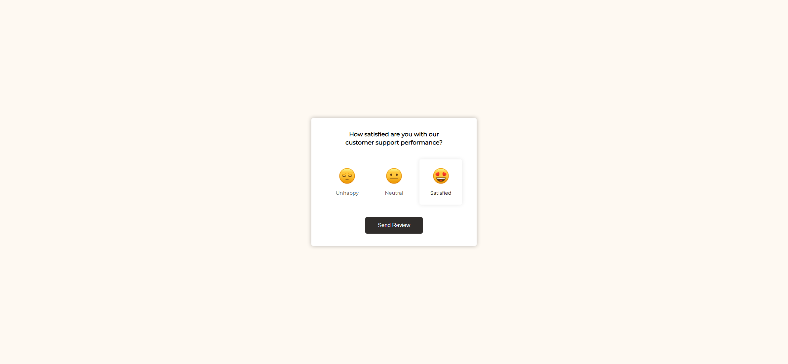
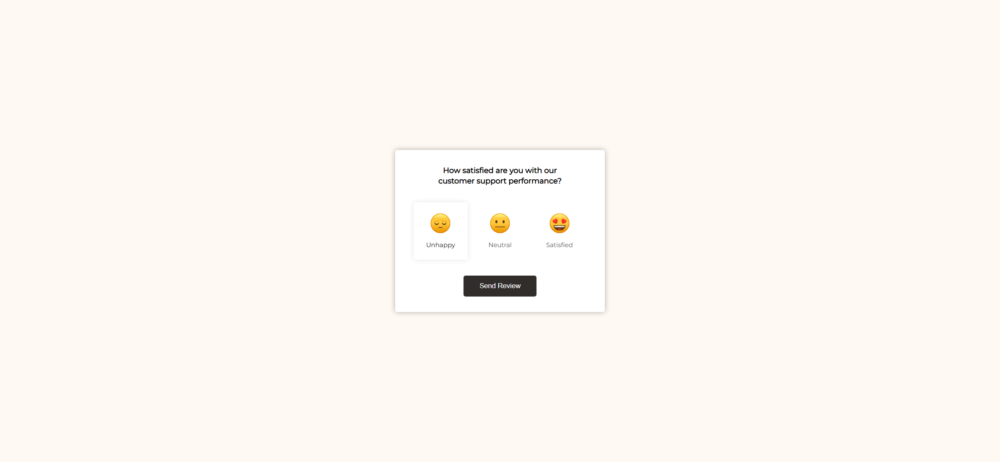
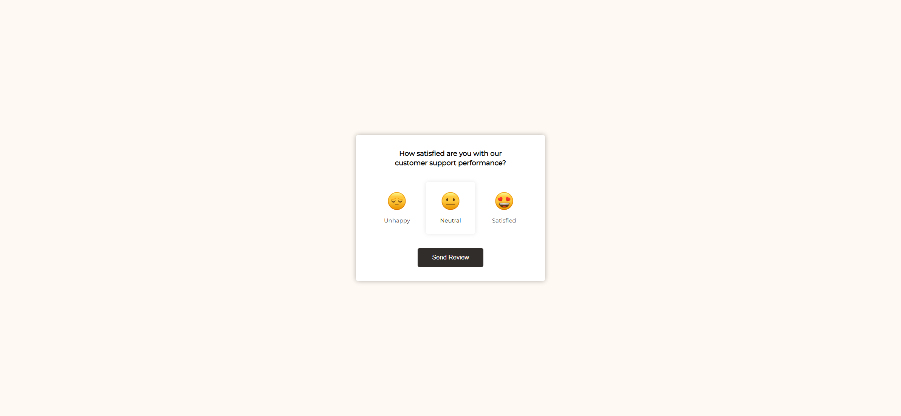
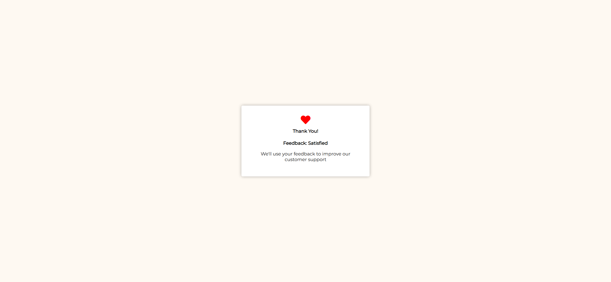

# Task Description: Implement a Feedback Webpage

Your job is to design a webpage that allows users to provide feedback on customer support performance. The webpage should have a rating system with three options: Unhappy, Neutral, and Satisfied. Users can select one of these options and then submit their feedback. Upon submission, a thank you message should be displayed.

The provided screenshots are rendered under a resolution of 1920x1080.

## Initial Webpage

The initial webpage should look like this:

## Resources

- `resource1.png` is used for the "Unhappy" rating image.
- `resource2.png` is used for the "Neutral" rating image.
- `resource3.png` is used for the "Satisfied" rating image.
- The text content for the feedback prompt is: "How satisfied are you with our customer support performance?"
- The text content for the thank you message is: "Thank You! Feedback: {selectedRating} We'll use your feedback to improve our customer support"

## Layout and Styling

- Use the Google Font "Montserrat" for the entire webpage.
- The ratings should be displayed in a flex container with the class name `ratings-container`.
- Each rating option should have a class name `rating` and should be clickable.
- The selected rating should have an additional class name `active`.
- The "Send Review" button should have a class name `btn`.

## Interactions

### Rating Selection

- When a rating is clicked, it should become active, and any previously active rating should become inactive.
- Use class name `rating` for each rating element.
- Use class name `active` for the selected rating element.

### Submit Feedback

- When the "Send Review" button is clicked, the main container should display a thank you message.
- Use ID `send` for the "Send Review" button.
- Use ID `panel` for the main container.

## Screenshots of Interactions

### Unhappy Rating Selected

### Neutral Rating Selected

### Satisfied Rating Selected

### Review Sent

## Animations

- When a rating is hovered over or selected, it should have a box shadow and a slightly darker text color.
- The "Send Review" button should have a slight scale-down effect when clicked.

By following this description, you should be able to re-implement the webpage with the same functionality and appearance as shown in the screenshots.
