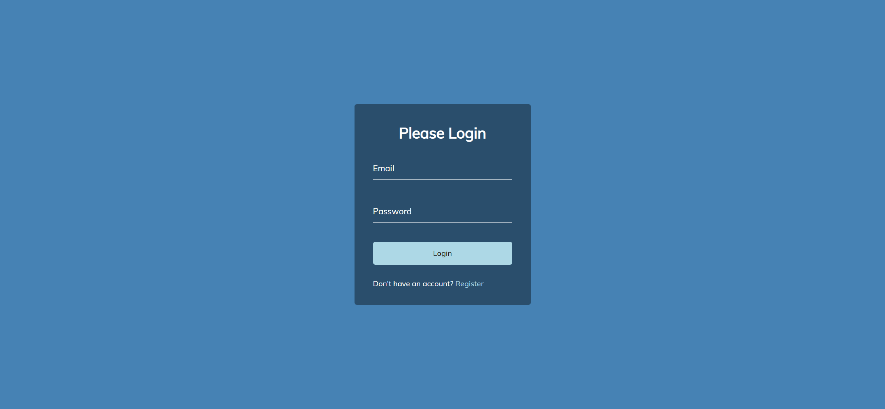
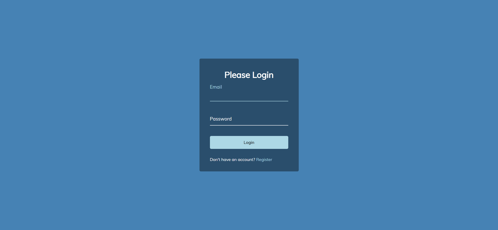
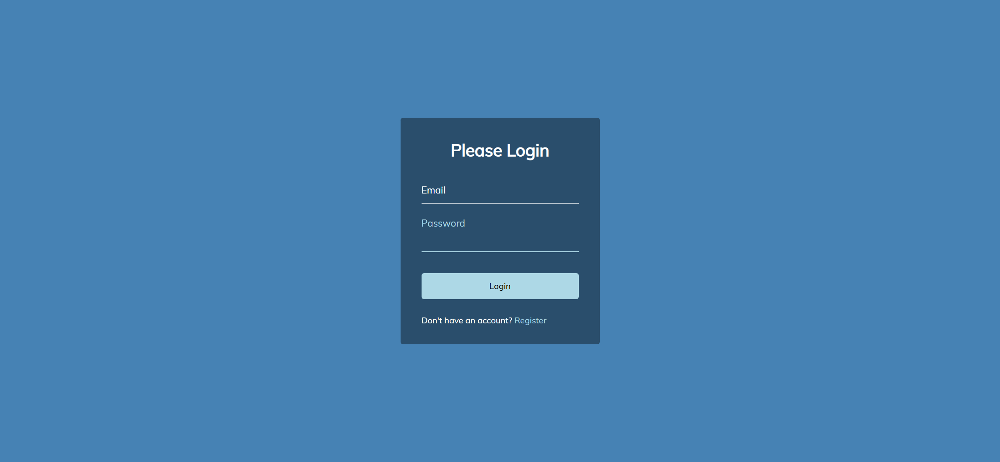
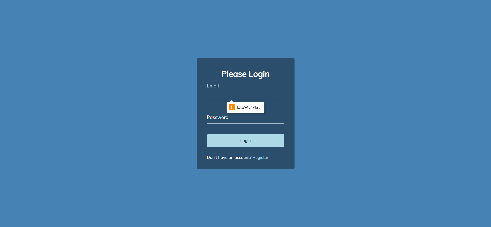

# Task Description: Re-implement the Form Input Wave Webpage

Your job is to design a webpage that mimics the functionality and appearance of the provided Form Input Wave webpage. The webpage includes a login form with animated labels for the input fields. Below are the detailed instructions and resources you need to re-implement the webpage.

## Initial Webpage

The initial webpage should look like this:

### Resources

1. **Font**: The webpage uses the 'Muli' font from Google Fonts.
   - URL: `https://fonts.googleapis.com/css?family=Muli&display=swap`
   
2. **Background Color**: The background color of the webpage is `steelblue`.

3. **Text Content**:
   - The main heading text is: `Please Login`
   - The button text is: `Login`
   - The paragraph text is: `Don't have an account? Register`

### Layout and Styling

- The webpage should be centered both vertically and horizontally.
- The container should have a semi-transparent background with padding and rounded corners.
- The input fields should have a bottom border that changes color when focused or valid.
- The labels should animate upwards when the input fields are focused or valid.

### Detailed Instructions

1. **Container**:
   - Use class name `container` for the main container.
   
2. **Heading**:
   - Use an `h1` tag for the heading with the text `Please Login`.
   
3. **Form**:
   - Use a `form` tag to wrap the input fields and button.

4. **Form Control**:
   - Use class name `form-control` for the div wrapping each input and label.
   
5. **Input Fields**:
   - Use `input` tags for the email and password fields.
   
6. **Labels**:
   - Use `label` tags for the email and password labels.
   - The labels should be absolutely positioned and should animate upwards when the input fields are focused or valid.
   - Use a `span` tag for each letter in the label to create the wave effect.

7. **Button**:
   - Use class name `btn` for the login button.
   - The button should scale down slightly when clicked.
   
8. **Paragraph**:
   - Use class name `text` for the paragraph containing the register link.
   - The link should have a light blue color and no text decoration.

### Animations

- The labels should animate upwards when the input fields are focused or valid. Each letter in the label should have a transition delay to create a wave effect.

### Interactions

1. **Focus on Email Input**:
   - When the email input field is focused, the label should animate upwards.
   - Screenshot: 

2. **Focus on Password Input**:
   - When the password input field is focused, the label should animate upwards.
   - Screenshot: 

3. **Click Login Button**:
   - When the login button is clicked, it should scale down slightly.
   - Screenshot: 

### Element Identifiers

- Use class name `container` for the main container.
- Use class name `form-control` for the div wrapping each input and label.
- Use class name `btn` for the login button.
- Use class name `text` for the paragraph containing the register link.

Follow these instructions to re-implement the webpage accurately. Good luck!
