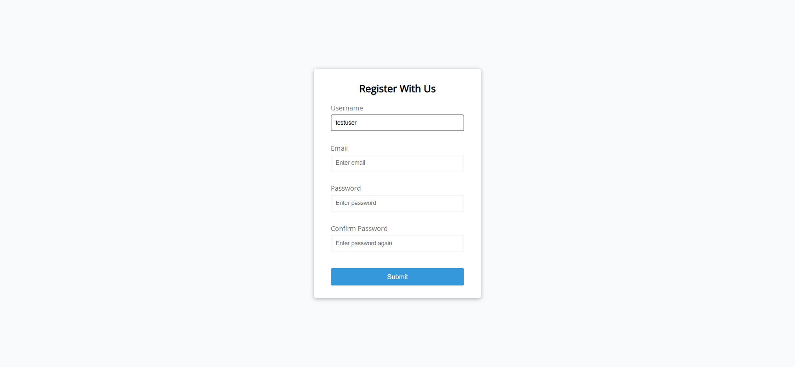
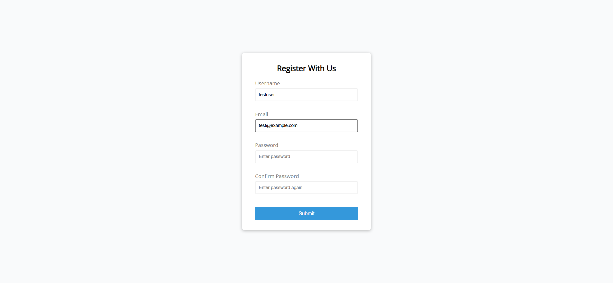
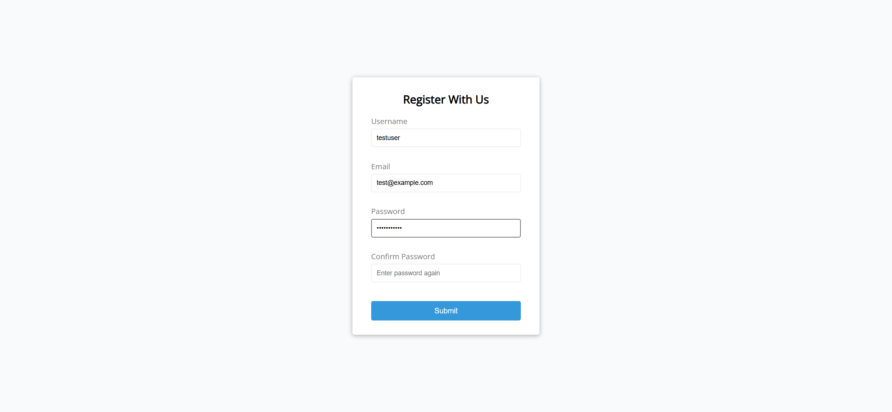
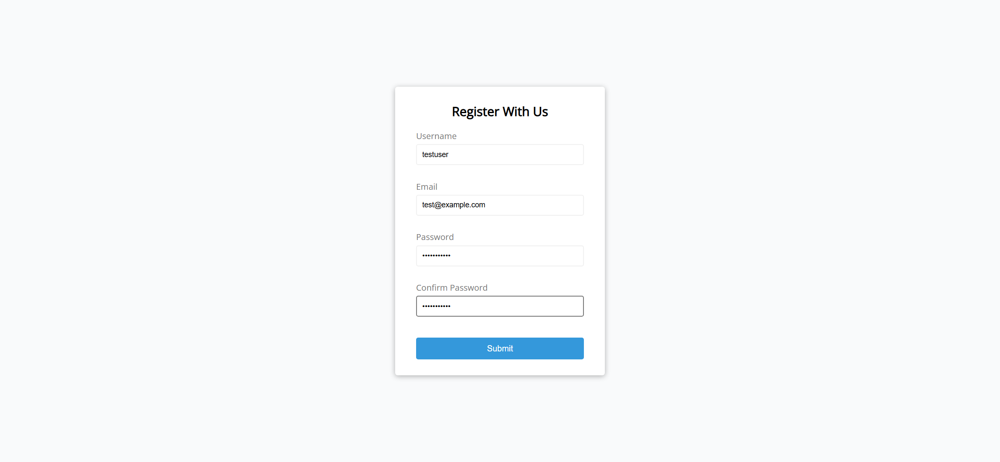
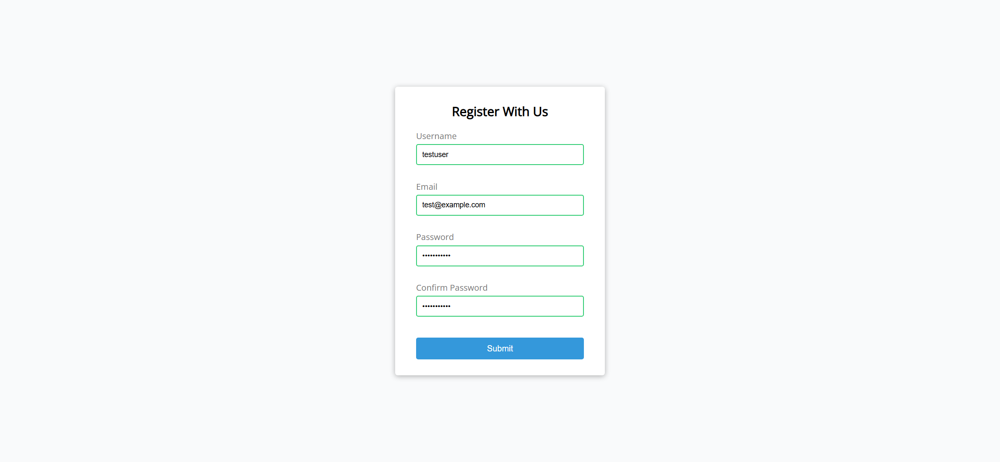

# Task Description: Form Validator Webpage

Your job is to design a webpage that includes a form validator. The form should validate user inputs for username, email, password, and password confirmation. Below are the detailed instructions to re-implement the webpage.

## Initial Webpage

The initial webpage should look like this:

This screenshot is rendered under a resolution of 1920x1080.

## Layout and Styling

1. **Container**: 
   - Use a `div` with class `container` to wrap the form.
   
2. **Form**:
   - Use a `form` element with class `form` and id `form`.
   
3. **Heading**:
   - Use an `h2` element with the text "Register With Us".
   
4. **Form Controls**:
   - Each input field should be wrapped in a `div` with class `form-control`.
   - Use a `label` element for each input field.
   - Use `input` elements for username, email, password, and password confirmation.
   - Use `small` elements to display error messages.
   
5. **Button**:
   - Use a `button` element with the text "Submit".

## Form Validation

1. **Username**:
   - Use ID `username` for the username input field.
   - Placeholder text: "Enter username".
   - Validate that the username is between 3 and 15 characters.

2. **Email**:
   - Use ID `email` for the email input field.
   - Placeholder text: "Enter email".
   - Validate that the email is in a valid format.

3. **Password**:
   - Use ID `password` for the password input field.
   - Placeholder text: "Enter password".
   - Validate that the password is between 6 and 25 characters.

4. **Password Confirmation**:
   - Use ID `password2` for the password confirmation input field.
   - Placeholder text: "Enter password again".
   - Validate that the password confirmation matches the password.

## Error and Success States

1. **Error State**:
   - Add class `error` to the `form-control` div when there is an error.
   - Display the error message in the `small` element.
   
2. **Success State**:
   - Add class `success` to the `form-control` div when the input is valid.

## Interactions

1. **Fill Username**:
   - Fill the username input with "testuser".
   - The webpage should look like this after filling the username:

   

2. **Fill Email**:
   - Fill the email input with "test@example.com".
   - The webpage should look like this after filling the email:

   

3. **Fill Password**:
   - Fill the password input with "password123".
   - The webpage should look like this after filling the password:

   

4. **Fill Password Confirmation**:
   - Fill the password confirmation input with "password123".
   - The webpage should look like this after filling the password confirmation:

   

5. **Submit Form**:
   - Click the submit button.
   - The webpage should look like this after submitting the form:

   

## Resources

- **Fonts**: Use "Open Sans" font from Google Fonts.
- **Text Content**:
  - Heading: "Register With Us"
  - Username placeholder: "Enter username"
  - Email placeholder: "Enter email"
  - Password placeholder: "Enter password"
  - Password confirmation placeholder: "Enter password again"
  - Button text: "Submit"

Follow these instructions to re-implement the form validator webpage. Good luck!
