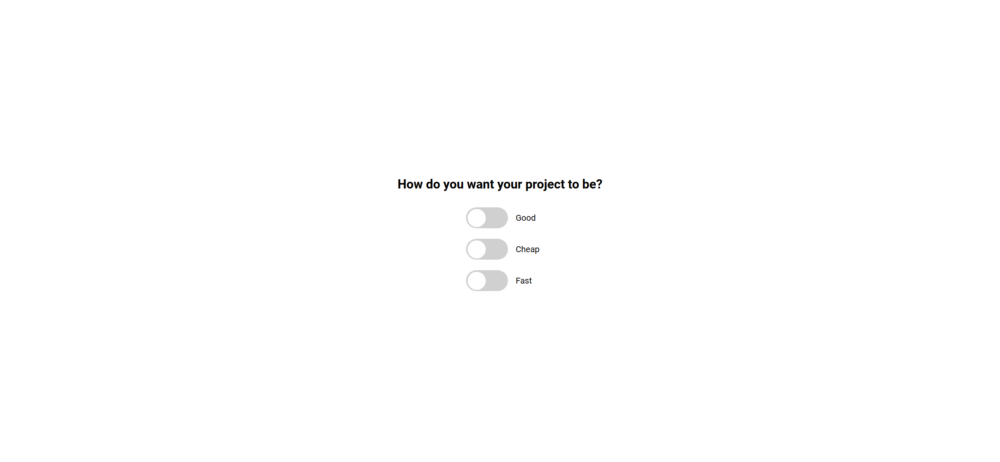
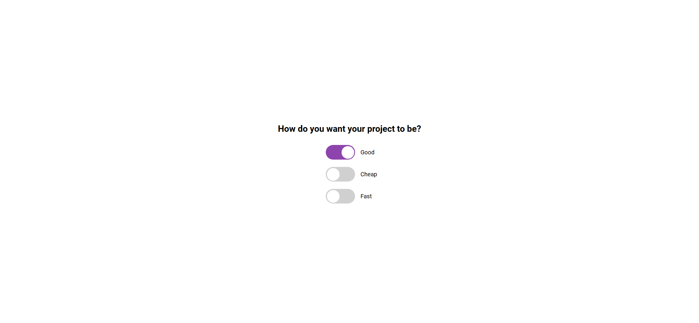
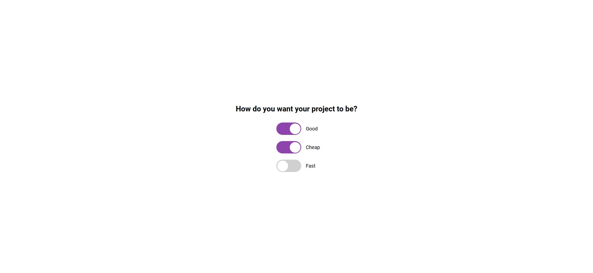
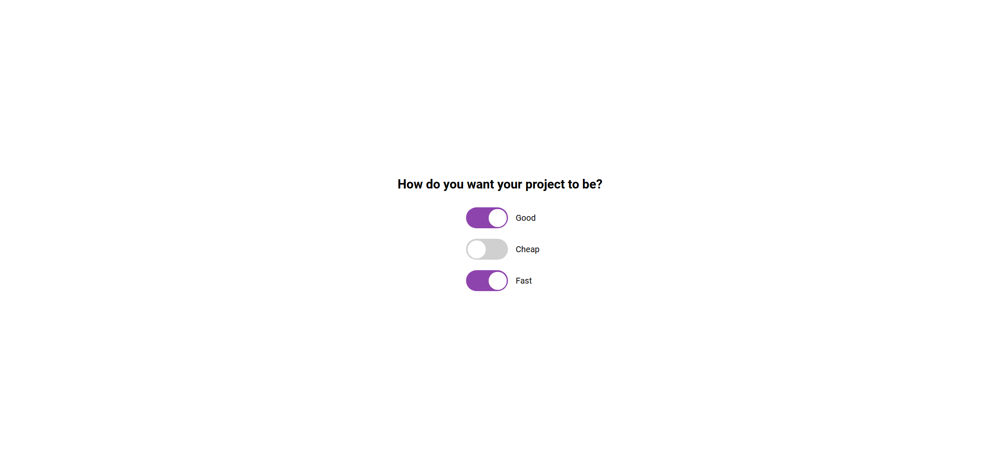
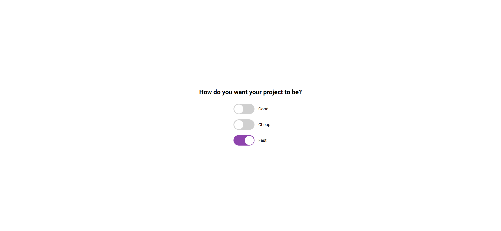

Your job is to design a webpage that allows users to select their project preferences among three options: Good, Cheap, and Fast. The initial webpage should look like this:

### Requirements:

1. **HTML Structure**:
    - The webpage should have a title "Good, Cheap, Fast".
    - There should be a heading `<h2>` with the text "How do you want your project to be?".
    - There should be three toggle switches labeled "Good", "Cheap", and "Fast".

2. **CSS Styling**:
    - Use the Google Font 'Roboto' for the entire webpage.
    - The body should be centered both vertically and horizontally, with no overflow and no margin.
    - Each toggle switch should be contained within a `div` with the class `toggle-container`.
    - The toggle switches should be styled to look like sliders with a ball that moves when toggled.
    - The ball inside the slider should animate smoothly between the on and off positions.
    
3. **JavaScript Functionality**:
    - Use JavaScript to ensure that only two out of the three options can be selected at any given time.
    - If all three options are selected, the last selected option should uncheck one of the previously selected options based on a specific logic:
        - If "Good" is the last selected, uncheck "Fast".
        - If "Cheap" is the last selected, uncheck "Good".
        - If "Fast" is the last selected, uncheck "Cheap".

### Detailed Steps:

2. **CSS**:
    - Import the 'Roboto' font from Google Fonts.
    - Style the body to use the 'Roboto' font and center its content.
    - Style the toggle switches and their containers as described above.
    - Use keyframe animations `slideOn` and `slideOff` to animate the ball inside the slider.

3. **JavaScript**:
    - Select all toggle elements and add an event listener for the `change` event.
    - Implement the `doTheTrick` function to handle the logic of unchecking one of the previously selected options if all three are selected.

### Interaction Screenshots:

- After clicking on "Good":

  

- After clicking on "Cheap":

  

- After clicking on "Fast":

  

- After clicking on "Good" again to see the toggle logic in action:

  

### Additional Notes:
- The provided screenshots are rendered under a resolution of 1920x1080.
- Ensure that the toggle switches are interactive and follow the described logic.
- Use the following IDs and class names for elements:
  - Use ID `good` for the "Good" toggle input.
  - Use ID `cheap` for the "Cheap" toggle input.
  - Use ID `fast` for the "Fast" toggle input.
  - Use class name `toggle` for all toggle inputs.
  - Use class name `label` for all toggle labels.
  - Use class name `toggle-container` for the containers of each toggle switch.
