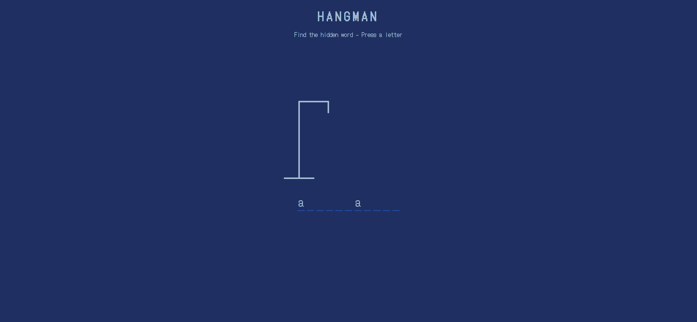
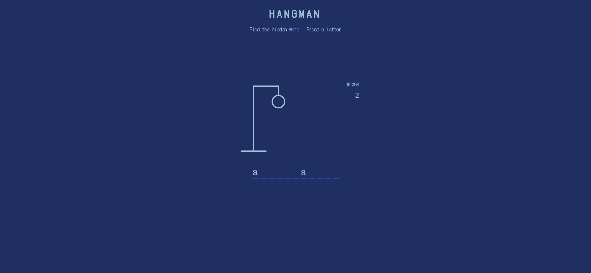
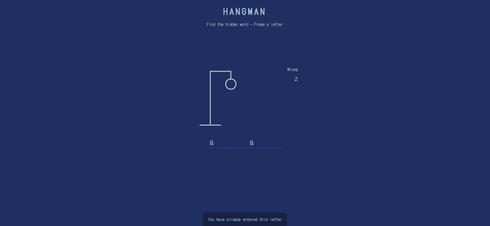
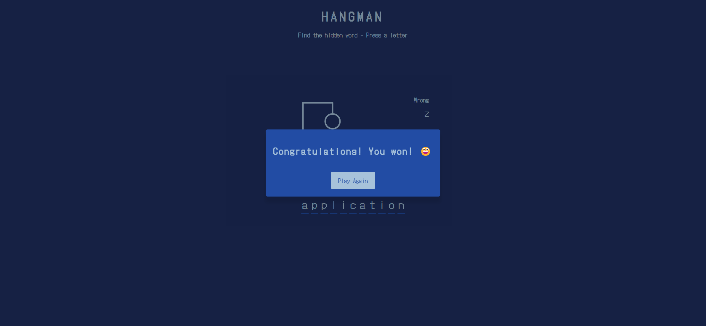

# Hangman Game Webpage

Your task is to re-implement a Hangman game webpage. The webpage should allow users to guess letters to find a hidden word. The game will notify users of correct and incorrect guesses, and display a winning or losing message accordingly. Below are the details and resources you need to recreate the webpage.

## Initial Webpage
The initial webpage should look like this:


## Resources
- **Font**: The webpage uses the "DotGothic16" font from Google Fonts. Import it using the following URL:
  ```css
  @import url("https://fonts.googleapis.com/css2?family=DotGothic16&display=swap");
  ```
- **Text Content**:
  - The main heading text is "Hangman".
  - The subheading text is "Find the hidden word - Press a letter".
  - The notification message is "You have already entered this letter".
  - The popup messages for winning and losing are "Congratulations! You won! 😃" and "Unfortunately you lost. 😕" respectively.
  - The button text in the popup is "Play Again".

## Layout and Styling
- **Font Family**: Use "DotGothic16", sans-serif for all text.
- **SVG Hangman Figure**: The hangman figure is drawn using SVG elements. Initially, only the rod is visible, and the figure parts (head, body, arms, legs) are hidden.
- **Wrong Letters Container**: This container should be positioned at the top right of the game container.
- **Word Container**: This container should be centered at the bottom of the game container.
- **Popup Container**: The popup container should be centered and hidden initially. It should display a message and a "Play Again" button when the game ends.
- **Notification Container**: The notification container should appear at the bottom of the screen when a duplicate letter is entered.

## Interactions
- **Correct Letter**: When a correct letter is pressed, it should be revealed in the word container.
  
- **Incorrect Letter**: When an incorrect letter is pressed, it should be added to the wrong letters container, and a part of the hangman figure should be revealed.
  
- **Duplicate Letter**: When a duplicate letter is pressed, the notification container should appear with the message "You have already entered this letter".
  
- **Winning the Game**: When all letters of the word are guessed correctly, a popup should appear with the message "Congratulations! You won! 😃".
  
- **Losing the Game**: When all parts of the hangman figure are revealed, a popup should appear with the message "Unfortunately you lost. 😕" and reveal the word.
- **Play Again**: Clicking the "Play Again" button should reset the game with a new word.

## Element IDs and Class Names
- Use ID `word` for the word container.
- Use ID `wrong-letters` for the wrong letters container.
- Use ID `play-button` for the "Play Again" button.
- Use ID `popup-container` for the popup container.
- Use ID `notification-container` for the notification container.
- Use class name `figure-part` for the parts of the hangman figure (head, body, arms, legs).
- Use class name `letter` for each letter in the word container.

## Screen Resolution
The provided screenshots are rendered under a resolution of 1920x1080.

## Resouce words
The words for the game are:
```javascript
const words = [
  "application",
  "programming",
  "interface",
  "wizard",
  "element",
  "prototype",
  "callback",
  "undefined",
  "arguments",
  "settings",
  "selector",
  "container",
  "instance",
  "response",
  "console",
  "constructor",
  "token",
  "function",
  "return",
  "length",
  "type",
  "node",
];
```


## Animations
- The notification container should slide up from the bottom when a duplicate letter is entered and slide back down after 2 seconds.

Recreate the webpage according to the above description and ensure all interactions and styles match the provided details.
