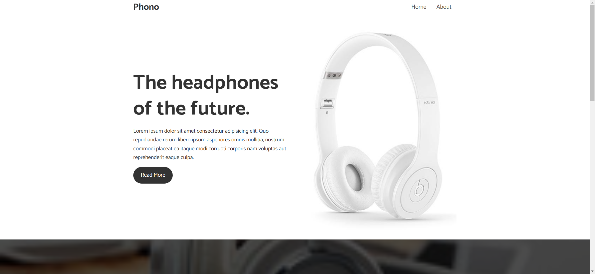
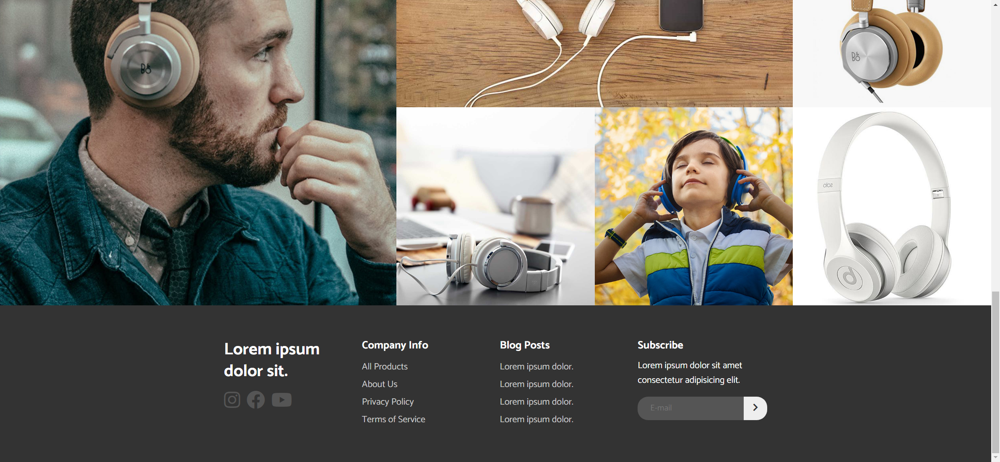

# Task Description for Re-implementing the Headphones Product Page

Your job is to design a webpage that mimics the provided Headphones Product Page. The webpage should be responsive and include various sections such as a navigation bar, showcase, large text section, gallery, and footer. The provided screenshots are rendered under a resolution of 1920x1080.

## Initial Webpage
The initial webpage should be:


## Resources
- **Font**: Use the "Catamaran" font from Google Fonts.
- **Icons**: Use Font Awesome icons from the CDN link provided in the HTML.
- **Images**:
  - `resource1.jpg` for the showcase section.
  - `resource2.jpg`, `resource3.jpg`, `resource4.jpg`, `resource5.jpg`, `resource6.jpg`, `resource7.jpg` for the gallery section.
  - Background image for the large text section: `https://i.ibb.co/1RS1dqC/section-b.jpg`.

## Sections and Elements

### Navigation Bar
- Use class `navbar` for the navigation bar.
- Use class `logo` for the logo text "Phono".
- Use class `nav` for the navigation links.
- The navigation links should include "Home" and "About".

### Showcase Section
- Use ID `home` for the showcase section.
- Use class `section-showcase` for the section.
- The section should contain a heading with the text "The headphones of the future."
- The section should contain a paragraph with the following text:
  ```
  Lorem ipsum dolor sit amet consectetur adipisicing elit. Quo
  repudiandae rerum libero ipsum asperiores omnis mollitia, nostrum
  commodi placeat ea itaque modi corrupti corporis nam voluptas aut
  reprehenderit eaque culpa.
  ```
- Use class `btn` for the "Read More" button.
- The button should link to the "About" section.

### Large Text Section
- Use ID `about` for the large text section.
- Use class `section-large-text` for the section.
- The section should contain an overlay with class `overlay`.
- The inner content should use class `section-large-text-inner`.
- The section should contain:
  - A heading with the text "Loud & Clear".
  - A subheading with the text "People Aren't Hearing All the Music".
  - A paragraph with the following text:
    ```
    Lorem ipsum dolor sit amet consectetur adipisicing elit. Dicta
    repudiandae laboriosam quia, error tempore porro ducimus voluptate
    laborum nostrum iure.
    ```

### Gallery Section
- Use class `section-gallery` for the gallery section.
- The gallery should contain images with class `big`.

### Footer Section
- Use class `section-footer` for the footer section.
- The footer should contain four columns:
  1. A heading with the text "Lorem ipsum dolor sit."
     
     - Social media links to Instagram, Facebook, and YouTube using Font Awesome icons.
  2. A column titled "Company Info" with links to:
     - All Products
     - About Us
     - Privacy Policy
     - Terms of Service
  3. A column titled "Blog Posts" with links to:
     - Lorem ipsum dolor.
     - Lorem ipsum dolor.
     - Lorem ipsum dolor.
     - Lorem ipsum dolor.
  4. A column titled "Subscribe" with a paragraph:
     ```
     Lorem ipsum dolor sit amet consectetur adipisicing elit.
     ```
     - An email subscription form with ID `email` for the input field and class `submit` for the submit button.

## Interactions
1. **Scroll the Page**:
   - The page should scroll to the bottom.
   - Screenshot after scrolling: 


## Additional Notes
- Make sure the webpage is responsive and adjusts correctly on smaller screens as described in the CSS media queries.
