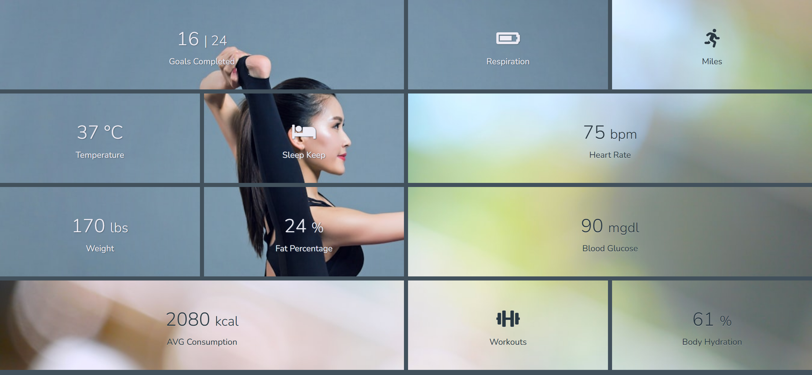
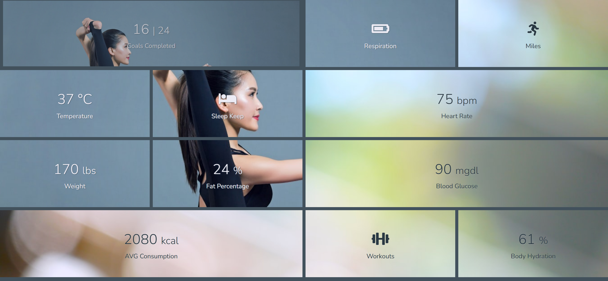
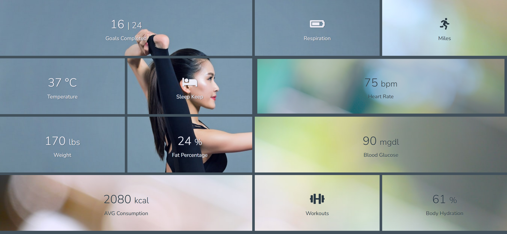
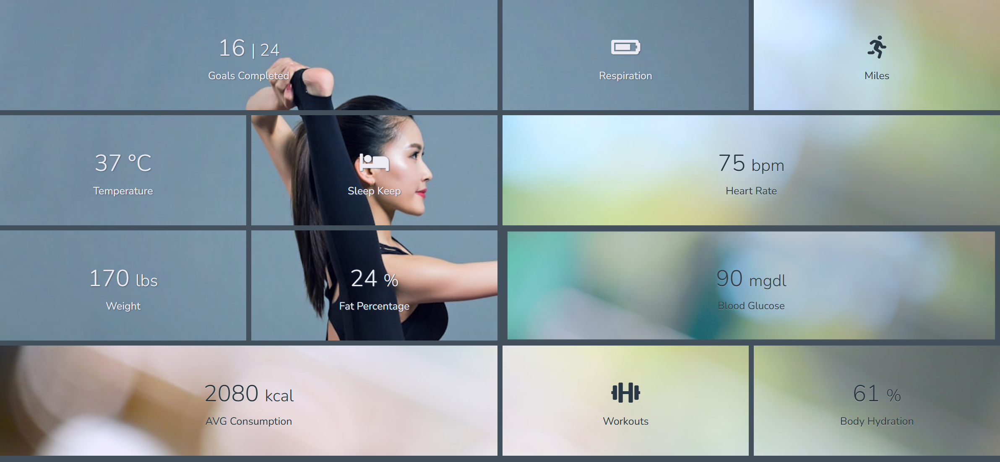

# Task Description: Health Dashboard Webpage

Your job is to design a webpage that displays a health dashboard with various health metrics. The webpage should be responsive and visually appealing, using a grid layout to organize the metrics. The initial webpage should look like this:

## Layout and Design

2. **Grid Layout**
   - Use a CSS Grid layout to organize the metrics.
   
4. **Hover Effects**
   - When hovering over the first cell, the appearance should change as shown below:
     
   - When hovering over the sixth cell, the appearance should change as shown below:
     
   - When hovering over the ninth cell, the appearance should change as shown below:
     

## Content

The content of each grid item is as follows:

1. **First Cell**
   - Background image: `resource1.png`
   - Text: "16 | 24" and "Goals Completed"

2. **Second Cell**
   - Background image: `resource1.png`
   - Icon: `<i class="fas fa-battery-three-quarters"></i>`
   - Text: "Respiration"

3. **Third Cell**
   - Background image: `resource2.png`
   - Icon: `<i class="fas fa-running"></i>`
   - Text: "Miles"

4. **Fourth Cell**
   - Background image: `resource1.png`
   - Text: "37 °C" and "Temperature"

5. **Fifth Cell**
   - Background image: `resource1.png`
   - Icon: `<i class="fas fa-bed"></i>`
   - Text: "Sleep Keep"

6. **Sixth Cell**
   - Background image: `resource2.png`
   - Text: "75 bpm" and "Heart Rate"

7. **Seventh Cell**
   - Background image: `resource1.png`
   - Text: "170 lbs" and "Weight"

8. **Eighth Cell**
   - Background image: `resource1.png`
   - Text: "24 %" and "Fat Percentage"

9. **Ninth Cell**
   - Background image: `resource2.png`
   - Text: "90 mgdl" and "Blood Glucose"

10. **Tenth Cell**
    - Background image: `resource2.png`
    - Text: "2080 kcal" and "AVG Consumption"

11. **Eleventh Cell**
    - Background image: `resource2.png`
    - Icon: `<i class="fas fa-dumbbell"></i>`
    - Text: "Workouts"

12. **Twelfth Cell**
    - Background image: `resource2.png`
    - Text: "61 %" and "Body Hydration"

## Additional Details

- Use the Font Awesome library for icons.
- The provided screenshots are rendered under a resolution of 1920x1080.
- For elements that can be interacted with (hover effects), use the following CSS selectors:
  - First cell: `.container > div:nth-of-type(1)`
  - Sixth cell: `.container > div:nth-of-type(6)`
  - Ninth cell: `.container > div:nth-of-type(9)`
  - Tenth cell: `.container > div:nth-of-type(10)`
  - Twelfth cell: `.container > div:nth-of-type(12)`

## Resources

- **Font**: [Nunito](https://fonts.googleapis.com/css2?family=Nunito:wght@300;400&display=swap)
- **Icons**: [Font Awesome](https://cdnjs.cloudflare.com/ajax/libs/font-awesome/5.15.1/css/all.min.css)
- **Background Images**:
  - `resource1.png` for `.bg1` class elements
  - `resource2.png` for `.bg2` class elements

Ensure that your implementation matches the provided screenshots and adheres to the specified design and layout guidelines.
