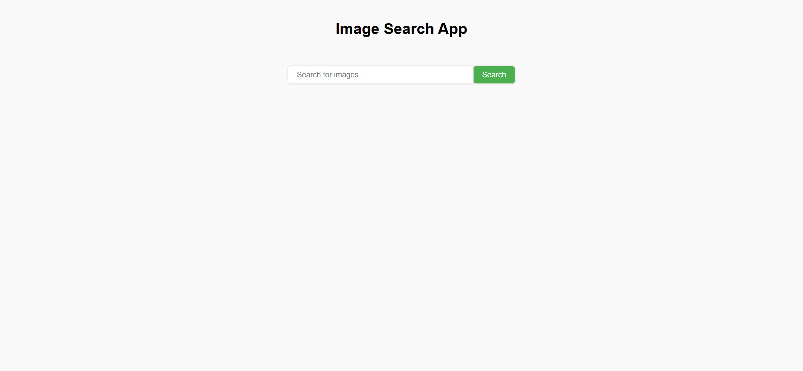
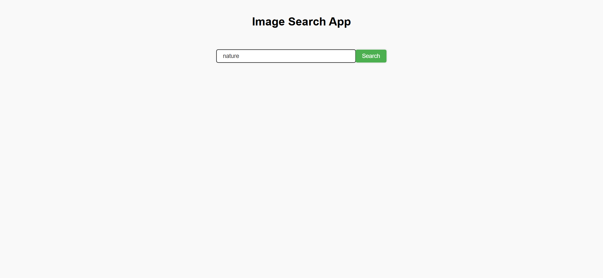
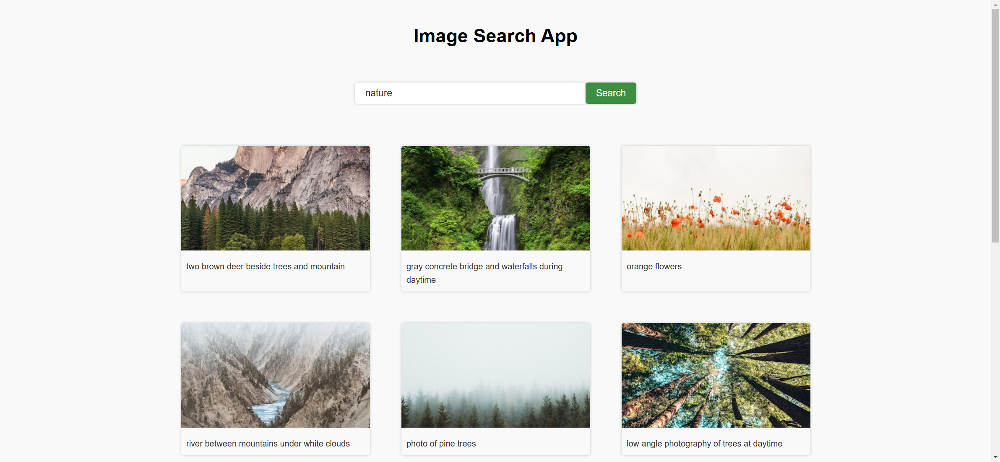

Your job is to design a webpage that functions as an Image Search App. The webpage allows users to search for images using the Unsplash API and displays the results in a grid format. Below are the detailed instructions to re-implement the webpage.

### Initial Webpage
The initial webpage should be as shown below:

### Layout and Styling
1. **Background and Font**:
   - Use the font family `Arial, Helvetica, sans-serif` for the entire webpage.

2. **Header**:
   - The header should contain the text "Image Search App".
   
3. **Form**:
   - The form should be centered using flexbox.
   
4. **Search Results**:
   - The search results should be displayed in a flexbox container with class `search-results`.
   

### Functionality
1. **Search Function**:
   - Use the Unsplash API to fetch images based on the search query.
   - The API endpoint is `https://api.unsplash.com/search/photos?page=${page}&query=${inputData}&client_id=${accessKey}`.
   - accessKey = "RZEIOVfPhS7vMLkFdd2TSKGFBS4o9_FmcV1Nje3FSjw";
   - Display the fetched images in the search results container.
   - Each image should be wrapped in a div with class `search-result`, containing an image element and a link to the image's Unsplash page.

2. **Event Listeners**:
   - Add an event listener to the form to handle the submit event. Prevent the default form submission, reset the page number to 1, and call the search function.
   - Add an event listener to the show more button to load more images when clicked.

### Interaction Screenshots
1. **After Entering Search Term**:
   

2. **After Clicking Search Button**:
   

### Notes
- The provided screenshots are rendered under a resolution of (1920, 1080).
- Ensure to use the IDs and class names as specified for elements to ensure proper functionality and styling.
