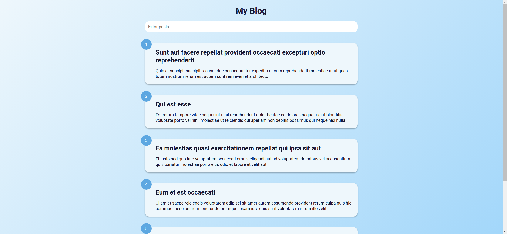
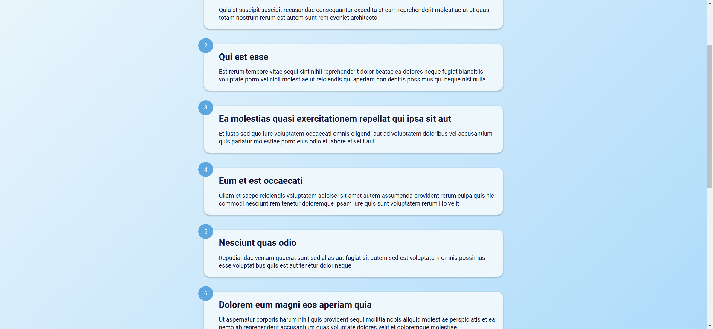

Your job is to design a webpage that functions as a blog post viewer with filtering and infinite scrolling capabilities. The webpage should fetch posts from an external API and display them in a styled format. Below are the detailed requirements and resources needed to re-implement the webpage.

### Initial Webpage
The initial webpage should look like this:

### Layout and Styling
- Use the Google Font `Roboto`.

### HTML Structure
- The main title of the page should be "My Blog".
- There should be an input field for filtering posts with the placeholder "Filter posts...".
  - Use class name `filter` for the input field.
  - Use ID `filter` for the input field.
- A container to hold the posts.
  - Use ID `posts-container` for the container.
- A loader with three bouncing circles to indicate loading more posts.
  - Use class name `loader` for the loader.
  - Use class name `circle` for each circle within the loader.

### CSS Styling
- The input field should be styled with padding, border-radius, and no border.
- Each post should have a light background, box-shadow, and rounded corners.
  - Use class name `post` for each post.
- Each post should display a number in a circle at the top-left corner.
  - Use class name `number` for the number circle.
- The loader should be positioned at the bottom and should have an animation for the circles.
  - Use class name `show` to display the loader.

### JavaScript Functionality
- Fetch posts from the API `https://jsonplaceholder.typicode.com/posts` with a limit of 5 posts per page.
- Display the posts with their titles and bodies capitalized.
- Implement infinite scrolling to load more posts when the user scrolls to the bottom.
- Implement filtering functionality to filter posts based on the input field.
  - Use ID `filter` for the input field.
  - Use class name `post-title` for the post titles.
  - Use class name `post-body` for the post bodies.

### External Resources
- Google Font: `https://fonts.googleapis.com/css2?family=Roboto:wght@400;700&display=swap`
- API: `https://jsonplaceholder.typicode.com/posts`

### Screenshots
The provided screenshots are rendered under a resolution of 1920x1080.

#### After Filtering

#### After Scrolling to Load More Posts

### Animations
- The loader circles should have a bouncing animation.

### Interactions
- The input field should filter posts based on the input text.
  - Use ID `filter` for the input field.
- Scrolling to the bottom of the page should load more posts.

By following the above description, you should be able to re-implement the webpage with the same functionality and appearance.
