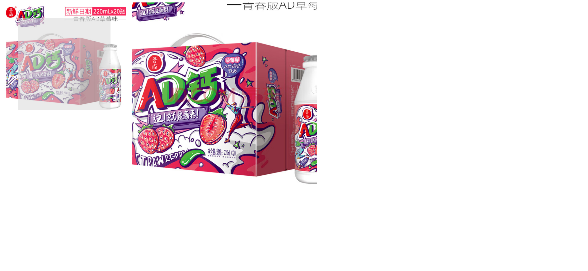

# Task Description: Implement a Webpage with a Magnifying Glass Feature

Your job is to design a webpage that implements a magnifying glass feature similar to the one found on the JD.com official website. The webpage should allow users to hover over an image to see a magnified version of it. Below are the detailed instructions and resources needed to re-implement the webpage.

## Initial Webpage

The initial webpage should look like this:

This screenshot is rendered under a resolution of 1920x1080.

## Elements and Layout

1. **Container for Normal Image**
    - Use a `div` with ID `normal`.
    - Inside this `div`, place an `img` element with ID `nimg` and source `ad钙.jpg`.
    
2. **Magnifying Glass Overlay**
    - Inside the `normal` div, add another `div` with ID `move`.
    - Initially, this `div` should be hidden and positioned absolutely within the `normal` div.
    - Use a background color of gainsboro and set its opacity to 0.6.
    
3. **Container for Magnified Image**
    - Use a `div` with ID `big`.
    - Initially, this `div` should be hidden and positioned relatively.
    - Inside this `div`, place an `img` element with ID `bimg` and source `大ad钙.jpg`.

## Interactions

### Hover Over Image

When the user hovers over the `normal` div, the `move` div and the `big` div should become visible. The magnified image should appear as shown below:

## Resources

- `ad钙.jpg`: This image is used as the normal image.
- `大ad钙.jpg`: This image is used as the magnified image.

## JavaScript Functionality

- Implement the mouse hover, move, and out effects using JavaScript.
- Use the IDs `normal`, `nimg`, `move`, `big`, and `bimg` to manipulate the DOM elements.

By following these instructions, you should be able to re-implement the webpage with the magnifying glass feature. Good luck!
