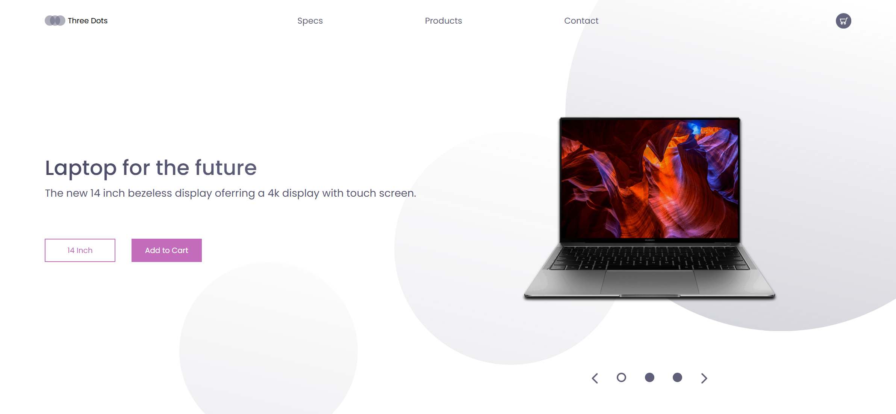

# Task Description: Re-implement the Laptop UI Webpage

Your job is to design a webpage that mimics the provided design and functionality. The webpage should be responsive and include specific elements and interactions as described below. The provided screenshots are rendered under a resolution of 1920x1080.

## Initial Webpage

The initial webpage should look like this:

### Header

1. **Logo Container**:
   - Contains an SVG logo with three circles.
   - Use class name `logo-container` for the container.
   - Use class name `logo` for the text "Three Dots".

2. **Navigation Links**:
   - Contains three links: "Specs", "Products", and "Contact".
   - Use class name `nav-links` for the unordered list.
   - Use class name `nav-link` for each link.

3. **Cart Icon**:
   - Contains an SVG icon representing a cart.
   - Use class name `cart` for the container.

### Main Section

1. **Presentation Section**:
   - Contains an introduction and a cover image.
   - Use class name `presentation` for the section.

2. **Introduction**:
   - Contains a heading and a paragraph.
   - Use class name `introduction` for the container.
   - Use class name `intro-text` for the text container.
   - Heading text: "Laptop for the future".
   - Paragraph text: "The new 14 inch bezeless display offering a 4k display with touch screen."

3. **Call to Action (CTA) Buttons**:
   - Two buttons: "14 Inch" and "Add to Cart".
   - Use class name `cta` for the container.
   - Use class name `cta-select` for the "14 Inch" button.
   - Use class name `cta-add` for the "Add to Cart" button.

4. **Cover Image**:
   - Displays an image of a laptop.
   - Use class name `cover` for the container.
   - Image source: `resource1.png`.

5. **Laptop Select Icons**:
   - Contains five SVG icons for selecting different laptops.
   - Use class name `laptop-select` for the container.

### Background Circles

1. **Big Circle**:
   - Use class name `big-circle` for the SVG element.

2. **Medium Circle**:
   - Use class name `medium-circle` for the SVG element.

3. **Small Circle**:
   - Use class name `small-circle` for the SVG element.

### Resources

- **Fonts**: Use the Poppins font from Google Fonts.
- **Images**: 
  - `resource1.png` is used for the cover image of the laptop.
- **Text Content**:
  - Heading: "Laptop for the future"
  - Paragraph: "The new 14 inch bezeless display offering a 4k display with touch screen."

### Animations

- **Cover Image Animation**:
  - The cover image should have a drop animation that lasts 1.5 seconds and eases in.

### Media Queries

- Ensure the webpage is responsive and adapts to different screen sizes as specified in the CSS file.

By following the above description, you should be able to re-implement the webpage accurately.
