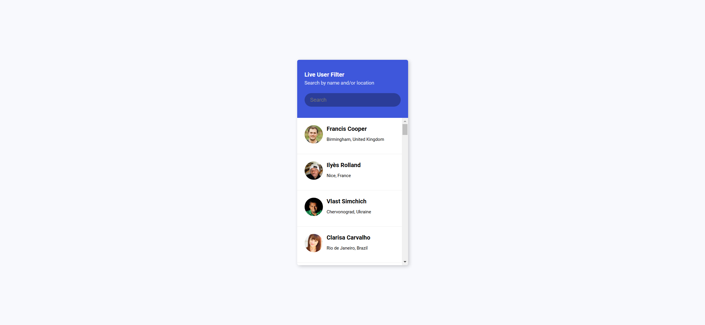
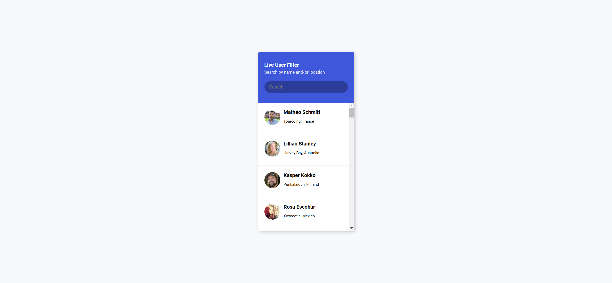
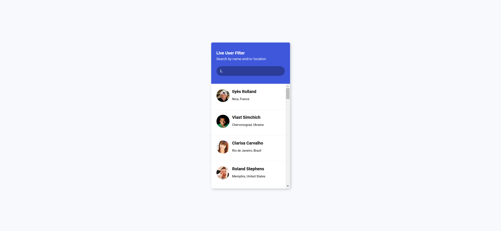

Your job is to design a webpage that implements a live user filter. The webpage should fetch user data from an API and allow users to filter the displayed list by typing into a search input. Below are the detailed requirements and resources needed to re-implement the webpage.

### Initial Webpage
The initial webpage should look like this:

### Layout and Styling
- Use the Google Font `Roboto` with weights 400 and 700.
- The body should have a background color of `#f8f9fd`, use the `Roboto` font, and be centered both vertically and horizontally.
- The main container should have a border-radius of 5px, a box-shadow, and a width of 300px.
- The header should have a background color of `#3e57db`, white text, and padding of 30px 20px.
- The search input in the header should have a semi-transparent black background, white text, and rounded corners.
- The user list should have a white background, no list style, and a maximum height of 400px with vertical scrolling enabled.
- Each user list item should be displayed as a flex container with padding of 20px.
- User images should be circular with a size of 50px by 50px.
- User information should be displayed next to the image with a margin-left of 10px.
- The user list items should have a bottom border except for the last item.
- Hidden user list items should not be displayed.

### HTML Structure
- The main container should have a class `container`.
- The header should have a class `header`.
- The title should have a class `title` and the subtitle should have a class `subtitle`.
- The search input should have an ID `filter`.
- The user list should have an ID `result` and a class `user-list`.
- Each user list item should have a class `user-info` for the user information section.

### JavaScript Functionality
- Fetch user data from the API `https://randomuser.me/api?results=50`.
- Populate the user list with the fetched data.
- Implement a live filter that hides or shows user list items based on the search input.

### Interaction and Screenshots
The provided screenshots are rendered under a resolution of 1920x1080.

1. **Initial Webpage**: The initial state of the webpage.
   

2. **After Data Load**: The state of the webpage after the user data has been loaded.
   

3. **After Search**: The state of the webpage after searching for the name 'Ava'.
   

### Interaction Steps
1. **Initial State**: Load the webpage.
2. **Wait for Data**: Wait for the user data to load (approximately 5 seconds).
3. **Search for 'Ava'**: Type 'Ava' into the search input and wait for the filter to apply (approximately 3 seconds).

### Additional Notes
- Use the ID `filter` for the search input element.
- Use the ID `result` for the user list element.
- Use the class name `user-list` for the user list element.
- Use the class name `user-info` for the user information section within each list item.
- The search term to be used for filtering is 'Ava'.

By following these instructions, you should be able to re-implement the webpage with the same functionality and appearance as shown in the screenshots.
