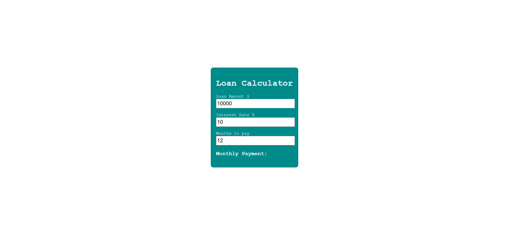
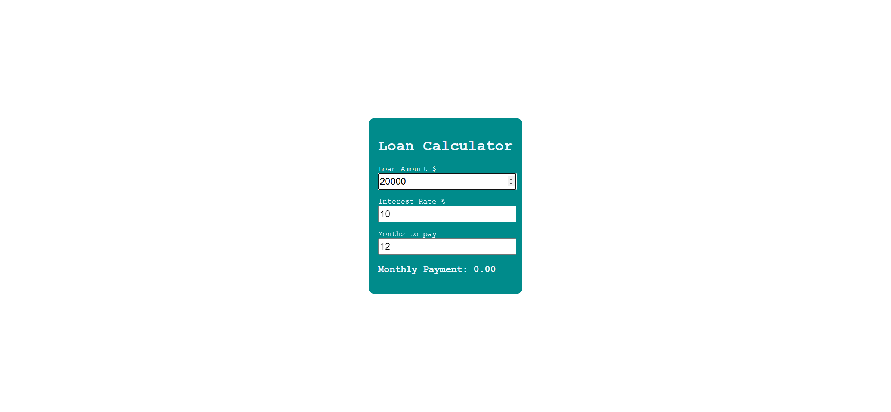
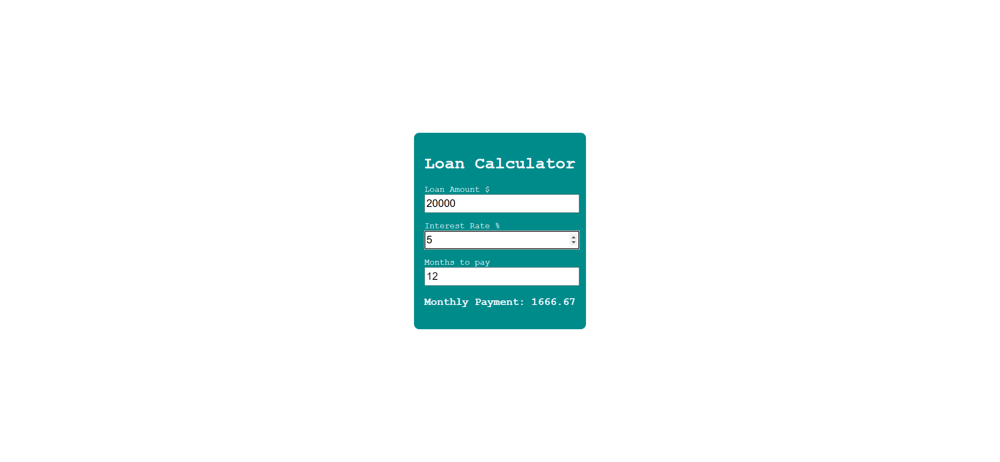
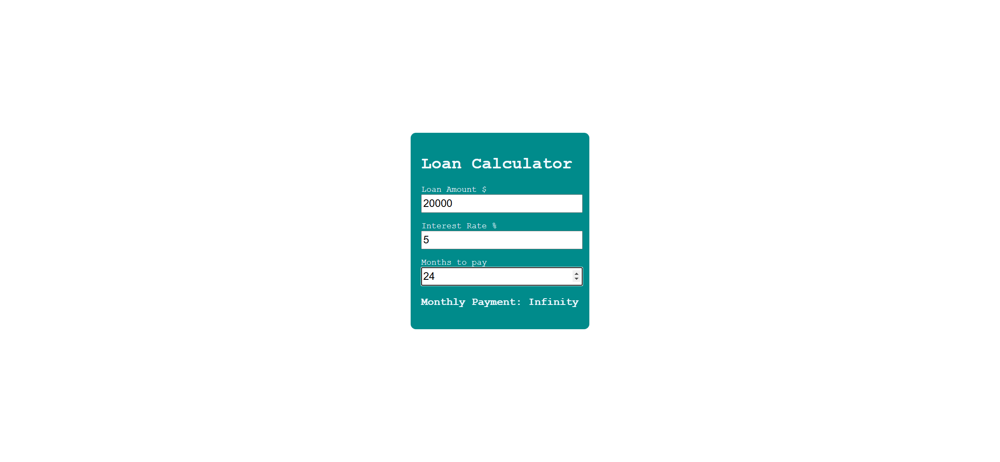

# Loan Calculator Webpage Implementation Task

Your task is to design a webpage that functions as a loan calculator. The webpage should allow users to input the loan amount, interest rate, and the number of months to pay off the loan. Based on these inputs, the webpage will calculate and display the monthly payment. Below are the detailed requirements and resources to help you re-implement the webpage.

## Initial Webpage

The initial webpage should look like this:

This screenshot is rendered under a resolution of 1920x1080.

## Layout and Styling

- The webpage should have a centered container with a dark cyan background and white text.
- The body of the webpage should use the font family 'Courier New', Courier, monospace.

  

## HTML Structure

- The main container should have the class `container`.
- The input fields for loan amount, interest rate, and months to pay should have the class `input`.
- The input fields should also have the following IDs:
  - Loan Amount: `loan-amount`
  - Interest Rate: `interest-rate`
  - Months to Pay: `months-to-pay`
- The paragraph displaying the monthly payment should have the ID `payment`.

## JavaScript Functionality

- Implement a function named `calculateLoan` that will be triggered whenever any of the input fields change.
- This function should:
  - Retrieve the values from the input fields.
  - Calculate the interest and monthly payment.
  - Update the text content of the paragraph with ID `payment` to display the calculated monthly payment.

## Interaction Details

The webpage should allow users to interact with the input fields to change the loan amount, interest rate, and months to pay. Below are the interactions and their expected outcomes:

1. **Change Loan Amount**
   - Change the loan amount to 20000.
   - The webpage should look like this after changing the loan amount:

   

2. **Change Interest Rate**
   - Change the interest rate to 5%.
   - The webpage should look like this after changing the interest rate:

   

3. **Change Months to Pay**
   - Change the months to pay to 24.
   - The webpage should look like this after changing the months to pay:

   

## Resources

- The text content for the initial webpage is as follows:
  - Title: "Loan Calculator"
  - Loan Amount Label: "Loan Amount $"
  - Interest Rate Label: "Interest Rate %"
  - Months to Pay Label: "Months to pay"
  - Monthly Payment Label: "Monthly Payment:"

- The CSS file `style.css` should be used for styling the webpage.

## Summary

To summarize, your task is to create a loan calculator webpage with the specified layout, styling, and functionality. Ensure that the input fields and the monthly payment text are updated dynamically based on user interactions. Use the provided screenshots as a reference to verify your implementation.
