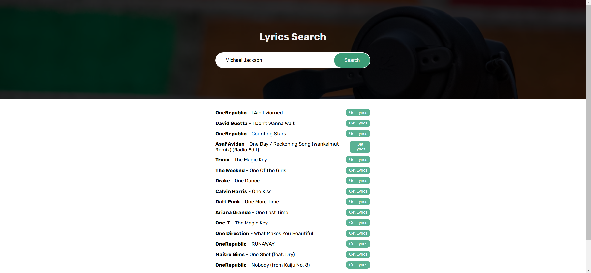
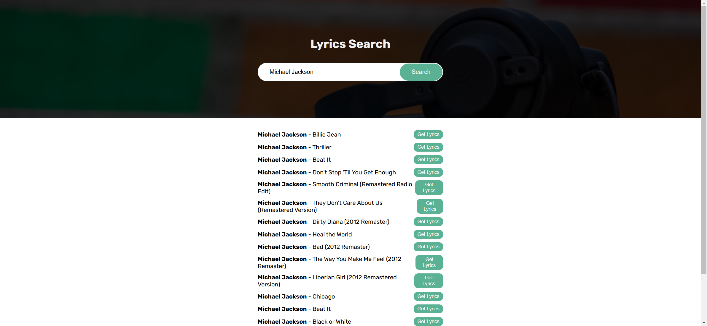

Your job is to design a webpage that allows users to search for song lyrics. The webpage should have a search bar where users can enter the name of an artist or a song, and a button to initiate the search. The results will be displayed below the search bar. The initial webpage should be as shown below:

### Requirements:

1. **Header Section:**
    - The header should have a background image from the URL: `bg.png`.
    - The header should contain a title with the text "Lyrics Search".
    - The header should contain a form with an input field and a button.
    - The input field should have the placeholder text "Enter artist or song name...".
    - The button should have the text "Search".
    - Use the font family "Rubik" from Google Fonts.

2. **Form:**
    - Use ID `form` for the form element.
    - Use ID `search` for the input element.
    - The button should be styled to change color on hover and scale down slightly when clicked.

3. **Results Section:**
    - Use ID `result` for the div that will display the search results.
    - Initially, this div should contain the text "Results will be displayed here".

4. **More Section:**
    - Use ID `more` for the div that will display pagination buttons (if any).

5. **Styling:**
    - Ensure the webpage is responsive and looks good on different screen sizes.

6. **JavaScript Functionality:**
    - Use the provided JavaScript file to handle the search functionality.
    - When the form is submitted, prevent the default form submission.
    - Fetch search results from the API `https://api.lyrics.ovh/suggest/{searchTerm}`.
    - Display the search results in the `result` div.
    - If there are pagination links, display them in the `more` div.
    - When a "Get Lyrics" button is clicked, fetch the lyrics from the API `https://api.lyrics.ovh/v1/{artist}/{songTitle}` and display them in the `result` div.
    - If an error occurs, display a toast notification with the error message.

### Interaction Steps:

1. **Enter Search Term:**
    - Enter the search term "Michael Jackson" in the input field.
    - The webpage should look like this after entering the search term:
    
    

2. **Click Search Button:**
    - Click the search button to initiate the search.
    - The webpage should look like this after clicking the search button:
    
    

### Notes:
- The provided screenshots are rendered under a resolution of 1920x1080.
- Ensure that the elements have the correct IDs and class names as specified for auto-testing.
