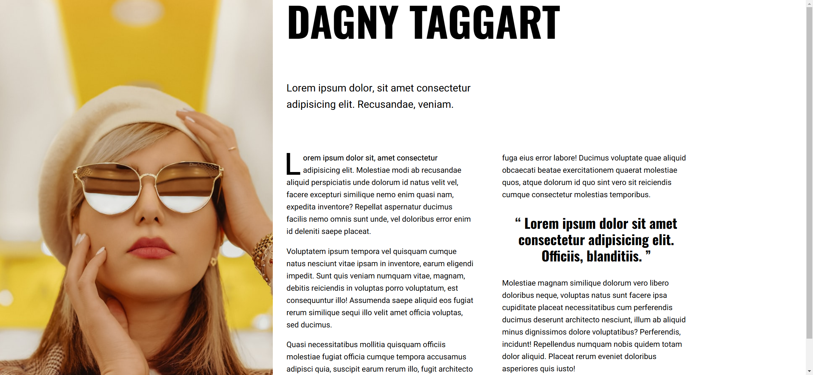

Your task is to design a magazine-style webpage based on the provided description and resources. The webpage should be responsive and visually appealing, following the layout and styles described below.

## Initial Webpage Layout

The initial webpage should look like this:



## Resources

1. **Image**: `resource1.png` is used as the main article image. The image depicts a woman wearing sunglasses.
2. **Fonts**: 
   - "Heebo" for body text
   - "Oswald" for headings and blockquotes
3. **Text Content**:
   - **Main Heading**: "Dagny Taggart"
   - **Lead Paragraph**: 
     ```
     Lorem ipsum dolor, sit amet consectetur adipisicing elit. Recusandae, veniam.
     ```
   - **Article Body**:
     ```
     Lorem ipsum dolor sit, amet consectetur adipisicing elit. Molestiae modi ab recusandae aliquid perspiciatis unde dolorum id natus velit vel, facere excepturi similique nemo enim quasi nam, expedita inventore? Repellat aspernatur ducimus facilis nemo omnis sunt unde, vel doloribus error enim id deleniti saepe placeat.

     Voluptatem ipsum tempora vel quisquam cumque natus nesciunt vitae ipsam in inventore, earum eligendi impedit. Sunt quis veniam numquam vitae, magnam, debitis reiciendis in voluptas porro voluptatum, est consequuntur illo! Assumenda saepe aliquid eos fugiat rerum similique sequi illo velit amet officia voluptas, sed ducimus.

     Quasi necessitatibus mollitia quisquam officiis molestiae fugiat officia cumque tempora accusamus adipisci quia, suscipit earum rerum illo, fugit architecto fuga eius error labore! Ducimus voluptate quae aliquid obcaecati beatae exercitationem quaerat molestiae quos, atque dolorum id quo sint vero sit reiciendis cumque consectetur molestias temporibus.
     ```
   - **Blockquote**:
     ```
     Lorem ipsum dolor sit amet consectetur adipisicing elit. Officiis, blanditiis.
     ```
   - **Continuation of Article Body**:
     ```
     Molestiae magnam similique dolorum vero libero doloribus neque, voluptas natus sunt facere ipsa cupiditate placeat necessitatibus cum perferendis ducimus deserunt architecto nesciunt, illum ab aliquid minus dignissimos dolore voluptatibus? Perferendis, incidunt! Repellendus numquam nobis quidem totam dolor aliquid. Placeat rerum eveniet doloribus asperiores quis iusto!
     ```

## Layout and Styling

- **Fonts**: Import the fonts from Google Fonts using the following URL:
  ```
  @import url("https://fonts.googleapis.com/css2?family=Heebo:wght@100..900&family=Oswald:wght@300..700&&display=swap");
  ```

### Body and Text Elements

- Use the font family "Heebo" for the body text and "Oswald" for headings and blockquotes.

### Images

- Ensure images are displayed as block elements and do not exceed the maximum width of their container.

### Headings and Blockquotes

- Center-align blockquotes and add quotation marks before and after the text.

### Article Layout

- Use a grid layout for the article.

### Responsive Design

- For screens wider than `50em`, adjust the grid layout to have two columns, with the image occupying the first column and spanning multiple rows.

These screenshots were rendered under a resolution of 1920x1080.

## Element Identifiers

- Use class name `article-main-image` for the main article image.
- Use class name `lead` for the lead paragraph.
- Use class name `article-body` for the main content of the article.
- Use class name `flow` for the container that manages vertical spacing between elements.

By following this description, you should be able to re-implement the webpage accurately.
