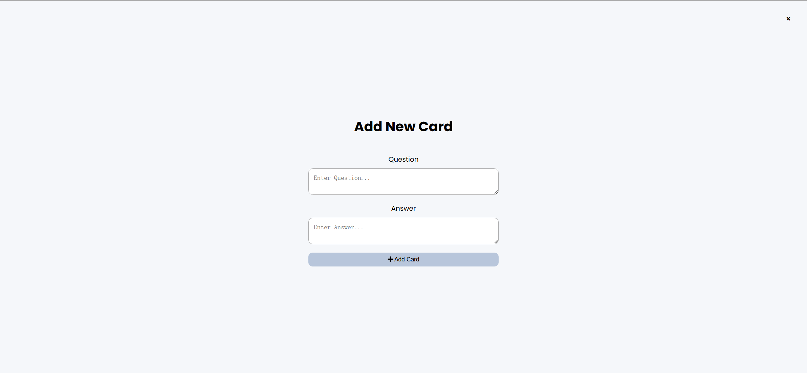
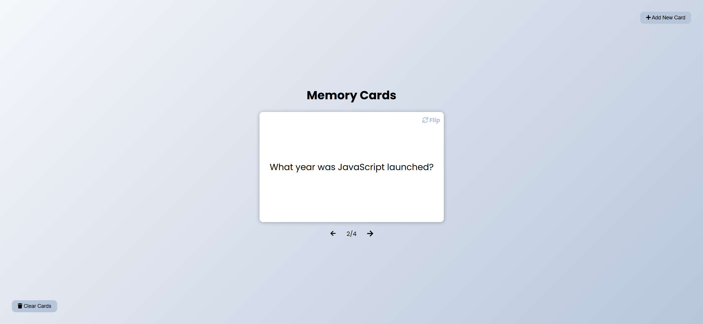
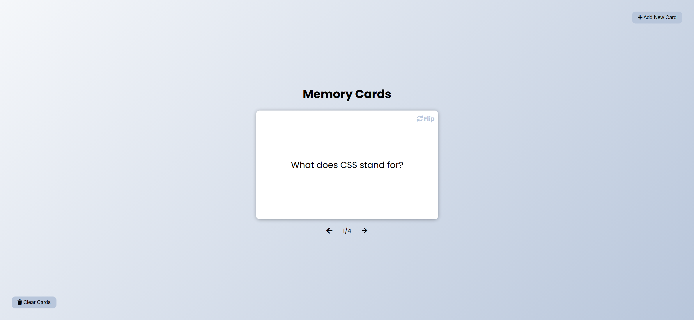
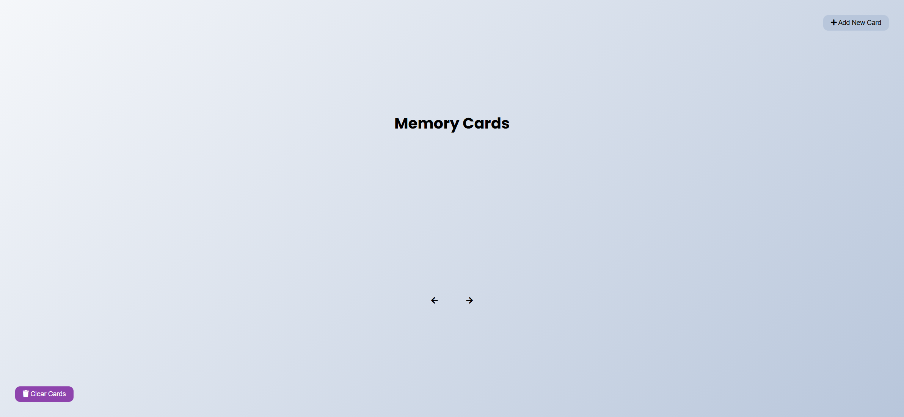

# Task Description: Memory Cards Webpage

Your job is to design a webpage that allows users to create, navigate, and clear memory cards. The webpage should have the following functionalities and design elements:

## Initial Webpage

The initial webpage should look like this:

### Resources

- **Font Awesome**: Used for icons in buttons. Link: `https://cdnjs.cloudflare.com/ajax/libs/font-awesome/5.15.1/css/all.min.css`
- **Google Fonts (Poppins)**: Used for the font family. Link: `https://fonts.googleapis.com/css2?family=Poppins:wght@200;400;700&display=swap`

### Layout and Elements

1. **Clear Cards Button**:
   - Use class `clear btn` and ID `clear`.
   - Icon: `<i class="fas fa-trash"></i>`
   - Positioned at the bottom left corner.

2. **Header**:
   - Contains the title "Memory Cards".
   - A button to add new cards:
     - Use class `btn` and ID `show`.
     - Icon: `<i class="fas fa-plus"></i>`
     - Positioned at the top right corner.

3. **Cards Container**:
   - Use ID `cards-container`.
   - Initially empty.

4. **Navigation**:
   - Contains previous and next buttons:
     - Previous button: Use class `nav-button` and ID `prev`. Icon: `<i class="fas fa-arrow-left"></i>`
     - Next button: Use class `nav-button` and ID `next`. Icon: `<i class="fas fa-arrow-right"></i>`
   - A paragraph to show the current card index: Use ID `current`.

5. **Add New Card Form**:
   - Use ID `add-container`.
   - Contains:
     - A header with the title "Add New Card" and a close button:
       - Use class `btn btn-small btn-ghost` and ID `hide`.
       - Icon: `<i class="fas fa-times"></i>`
     - A form with two text areas for question and answer:
       - Question: Use ID `question`.
       - Answer: Use ID `answer`.
     - A button to add the card:
       - Use class `btn btn-margin` and ID `add-card`.
       - Icon: `<i class="fas fa-plus"></i>`

### Interactions

1. **Add New Card Form**:
   - Clicking the "Add New Card" button should display the form.
   - The form should look like this:

     

2. **Adding a Card**:
   - Fill in the question and answer fields and click the "Add Card" button.
   - The new card should be added to the cards container.
   - The card should look like this:

     

3. **Navigating Cards**:
   - Clicking the next button should navigate to the next card.
   - Clicking the previous button should navigate to the previous card.
   - The navigation should look like this:

     
     

4. **Clearing Cards**:
   - Clicking the "Clear Cards" button should remove all cards from the container.
   - The cleared state should look like this:

     

### Additional Details

- The provided screenshots are rendered under a resolution of 1920x1080.
- The cards should have a flipping animation when clicked, showing the answer on the back.
- The cards should have a smooth transition when navigating between them.
- Ensure that the form and buttons have appropriate hover and focus states for better user experience.

By following this description, you should be able to re-implement the Memory Cards webpage with all the specified functionalities and design elements.
