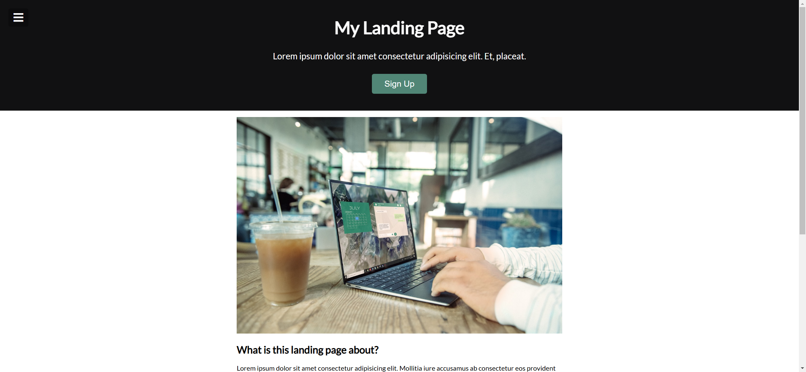
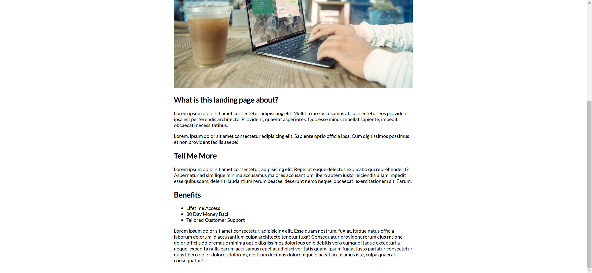
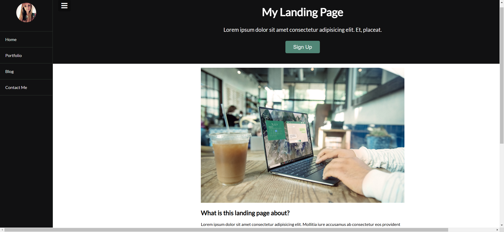
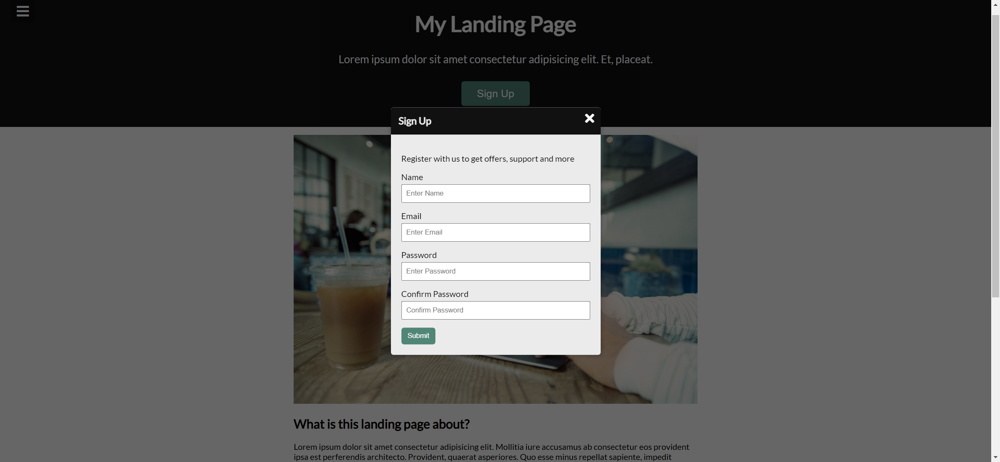
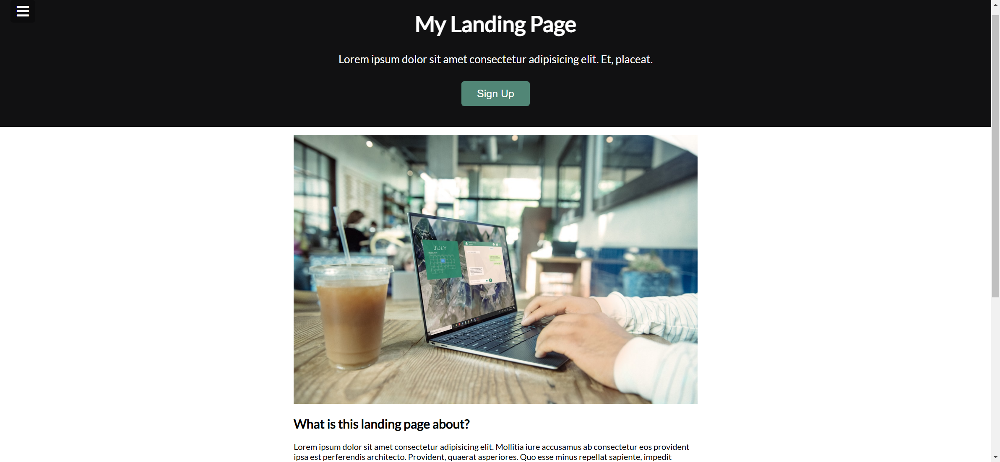

# Task Description for Re-implementing the Webpage

Your job is to design a webpage that includes a navigation menu, a landing page header, a content section, and a modal form. The webpage should be interactive with a toggleable navigation menu and a modal form that can be opened and closed. Below are the detailed instructions and resources needed to re-implement the webpage.

## Initial Webpage

The initial webpage should look like this:



### Resources

1. **Images**:
   - `resource1.jpg`: Used for the user logo in the navigation bar.
   - `resource2.png`: Used as an image in the content section.

2. **Fonts and Icons**:
   - Font: `Lato` from Google Fonts.
   - Icons: Font Awesome icons from `https://cdnjs.cloudflare.com/ajax/libs/font-awesome/5.15.1/css/all.min.css`.

### Layout and Elements

1. **Navigation Bar**:
   - Use ID `navbar` for the navigation bar.
   - The navigation bar should contain a logo image (`resource1.jpg`) and a list of links: Home, Portfolio, Blog, Contact Me.
   - The navigation bar should be hidden initially and slide in from the left when toggled.

2. **Header**:
   - The header should contain a toggle button with ID `toggle` to open/close the navigation bar.
   - The header should have a title "My Landing Page" and a paragraph with the text:
     ```
     Lorem ipsum dolor sit amet consectetur adipisicing elit. Et, placeat.
     ```
   - There should be a "Sign Up" button with ID `open` to open the modal form.

3. **Content Section**:
   - The content section should contain an image (`resource2.png`), headings, and multiple paragraphs of text.
   - The text content for the paragraphs is as follows:
     ```
     Lorem ipsum dolor sit amet consectetur adipisicing elit. Mollitia iure accusamus ab consectetur eos provident ipsa est perferendis architecto. Provident, quaerat asperiores. Quo esse minus repellat sapiente, impedit obcaecati necessitatibus.
     ```
     ```
     Lorem, ipsum dolor sit amet consectetur adipisicing elit. Sapiente optio officia ipsa. Cum dignissimos possimus et non provident facilis saepe!
     ```
     ```
     Lorem ipsum dolor sit amet consectetur, adipisicing elit. Repellat eaque delectus explicabo qui reprehenderit? Aspernatur ad similique minima accusamus maiores accusantium libero autem iusto reiciendis ullam impedit esse quibusdam, deleniti laudantium rerum beatae, deserunt nemo neque, obcaecati exercitationem sit. Earum.
     ```
     ```
     Lorem ipsum dolor sit amet consectetur, adipisicing elit. Esse quam nostrum, fugiat, itaque natus officia laborum dolorum id accusantium culpa architecto tenetur fuga? Consequatur provident rerum eius ratione dolor officiis doloremque minima optio dignissimos doloribus odio debitis vero cumque itaque excepturi a neque, expedita nulla earum accusamus repellat adipisci veritatis quam. Ipsum fugiat iusto pariatur consectetur quas libero dolor dolores dolorem, nostrum ducimus doloremque placeat accusamus iste, culpa quaerat consequatur?
     ```
   - There should be a list of benefits:
     - Lifetime Access
     - 30 Day Money Back
     - Tailored Customer Support

4. **Modal Form**:
   - Use ID `modal` for the modal container.
   - The modal should contain a header with the text "Sign Up" and a paragraph with the text:
     ```
     Register with us to get offers, support and more
     ```
   - The form should have fields for Name, Email, Password, and Confirm Password.
   - Use IDs `name`, `email`, `password`, and `password2` for the respective input fields.
   - The form should have a submit button with the text "Submit".

### Interactions

1. **Toggle Navigation Menu**:
   - Clicking the button with ID `toggle` should toggle the visibility of the navigation bar.
   - The navigation bar should slide in from the left when opened.

2. **Open and Close Modal**:
   - Clicking the button with ID `open` should open the modal.
   - Clicking the button with ID `close` or clicking outside the modal should close the modal.

### Screenshots

The provided screenshots are rendered under a resolution of 1920x1080.

- After scrolling the page:

  

- After toggling the navigation menu:

  

- After opening the modal:

  

- After closing the modal:

  

### Animations

- The modal should have a fade-in animation when it opens.

### Notes

- Ensure that the webpage is responsive and works well on different screen sizes.
- Use appropriate HTML, CSS, and JavaScript to achieve the described functionality and layout.
