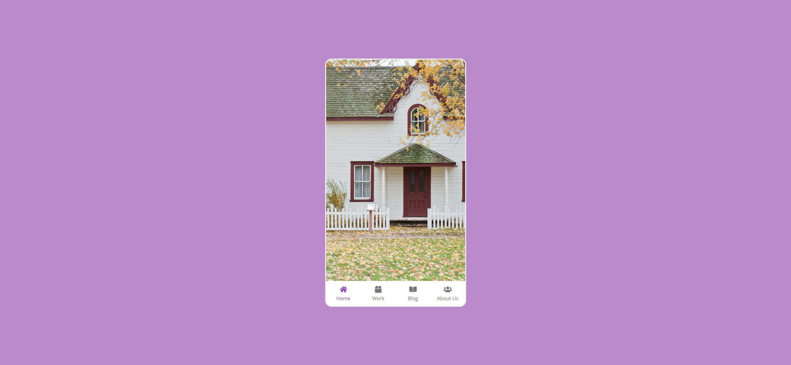

# Task Description: Mobile Tab Navigation Webpage

Your job is to design a webpage that mimics a mobile tab navigation interface. The webpage should have a navigation bar at the bottom with four tabs: Home, Work, Blog, and About Us. Each tab should display different content when clicked. The initial webpage should look like this:

## Requirements

1. **HTML Structure**:
    - Create a `div` with the class `phone` to contain the entire interface.
    - Inside the `phone` div, add four `img` elements with the class `content` to represent the different content for each tab. Use the following images:
        - `resource1.png` for Home
        - `resource2.png` for Work
        - `resource3.png` for Blog
        - `resource4.png` for About Us
    - Add a `nav` element containing an unordered list (`ul`) with four list items (`li`). Each list item should contain an icon and a paragraph (`p`) with the tab name. Use Font Awesome icons for the icons:
        - Home: `<i class="fas fa-home"></i>`
        - Work: `<i class="fas fa-box"></i>`
        - Blog: `<i class="fas fa-book-open"></i>`
        - About Us: `<i class="fas fa-users"></i>`

2. **CSS Styling**:
    - Use the `Open Sans` font from Google Fonts.
    - Center the `phone` div both vertically and horizontally within the viewport.
    - Style the `phone` div with a border, rounded corners, and specific dimensions.
    - Ensure the `content` images are positioned absolutely and cover the entire area of the `phone` div except for the navigation bar at the bottom.
    - Add a transition effect to the `content` images for smooth opacity changes.
    - Style the navigation bar and its items, ensuring the active tab is highlighted.
    
3. **JavaScript Functionality**:
    - Add event listeners to the navigation items to switch the displayed content when a tab is clicked.
    - Ensure only one content image is visible at a time, and the corresponding tab is highlighted.

## Interaction Details

- When the page is first loaded, the Home tab should be active, and the Home content should be displayed.
- Clicking on each tab should display the corresponding content and highlight the tab.

### Screenshots of Interactions

- **Initial Page Load**:
    

- **After Clicking Work Tab**:
    

- **After Clicking Blog Tab**:
    

- **After Clicking About Us Tab**:
    

## Additional Notes

- The provided screenshots are rendered under a resolution of 1920x1080.
- Use the following IDs and class names for elements:
    - Use class name `phone` for the main container.
    - Use class name `content` for the images representing the content of each tab.
    - Use class name `show` for the visible content image.
    - Use class name `active` for the highlighted navigation item.
    - Use class name `fas` for Font Awesome icons.
- Ensure the navigation bar is fixed at the bottom of the `phone` div and does not overlap with the content images.

By following these instructions, you should be able to recreate the mobile tab navigation interface as shown in the screenshots.
