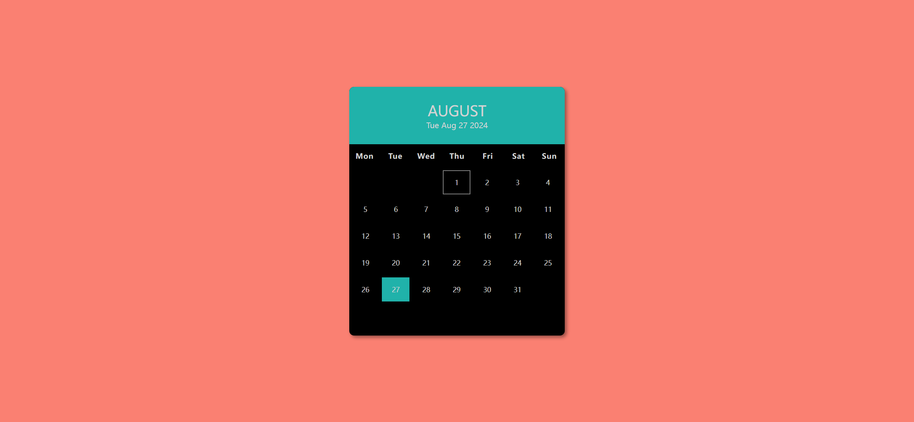

# Task Description: Month Calendar Webpage

Your job is to design a webpage that displays a month calendar. The calendar should highlight the current day and allow users to hover over any day to see a border around it. The initial webpage should be as shown below:

The provided screenshots are rendered under a resolution of 1920x1080.

## Requirements

### HTML Structure

1. **Container**: 
   - Use a `div` with class `container` to wrap the entire calendar.
   
2. **Calendar**:
   - Use a `div` with class `calender` to contain the calendar elements.
   
3. **Month Header**:
   - Use a `div` with class `month` to display the month and current date.
   - Inside the `month` div, use another `div` with class `date` to contain:
     - An `h1` element for the month name.
     - A `p` element for the full date.

4. **Weekdays**:
   - Use a `div` with class `weekdays` to display the days of the week (Mon, Tue, Wed, Thu, Fri, Sat, Sun).

5. **Days**:
   - Use a `div` with class `days` to display the days of the month.

### CSS Styling

1. **General Styles**:
   - Apply a global reset for margin, padding, and box-sizing.
   - Use `sans-serif` as the font-family.

2. **Container**:
   - Center the calendar using flexbox.

3. **Month Header**:
   - Center the content using flexbox.
   - Apply a border-radius to the top corners.

6. **Days**:
   - Use flexbox to wrap the days.
   - Center the content using flexbox.
   - Apply a hover effect to add a gray border and change the cursor to pointer.
   

### JavaScript Functionality

1. **Elements**:
   - Select the `h1` element inside the `date` div for the month name.
   - Select the `p` element inside the `date` div for the full date.
   - Select the `days` div for the days of the month.

2. **Date Calculations**:
   - Get the current month index and the last day of the current month.
   - Calculate the first day of the current month.

3. **Month and Date Display**:
   - Use an array of month names to display the current month.
   - Display the full date in the `p` element.

4. **Days Display**:
   - Loop through the days of the month and display them inside the `days` div.
   - Highlight the current day with the class `today`.

### Interactions

1. **Hover Effects**:
   - When hovering over the current day, a border should appear around it.
   - When hovering over any other day, a border should appear around it.

The hover effects are demonstrated in the following screenshots:

- Hover over the first day of the month:
  

### IDs and Classes

- Use class `container` for the main container.
- Use class `calender` for the calendar container.
- Use class `month` for the month header.
- Use class `date` for the date container.
- Use class `weekdays` for the weekdays container.
- Use class `days` for the days container.
- Use class `today` to highlight the current day.
- Use class `empty` for empty days before the first day of the month.

By following these instructions, you should be able to re-implement the webpage as shown in the provided screenshots.
