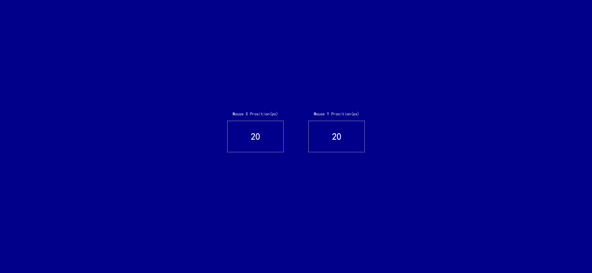
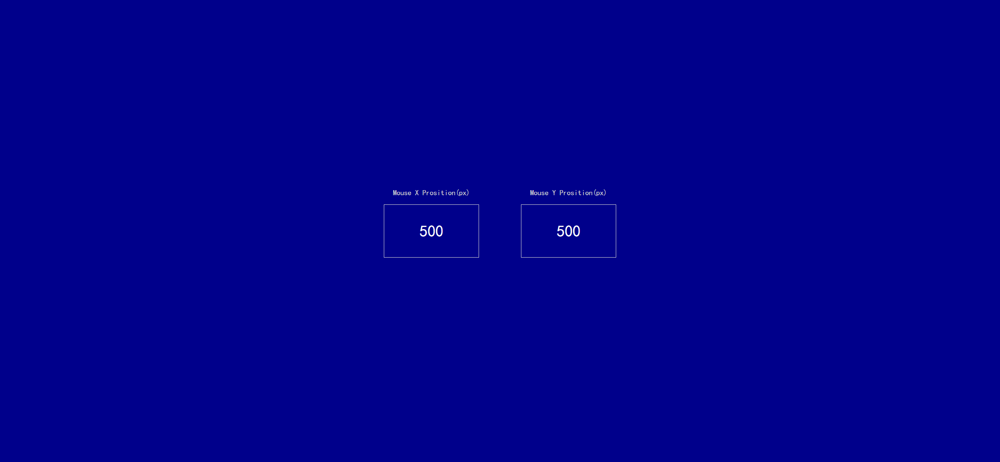

Your job is to design a webpage that dynamically displays the mouse's X and Y positions as you move the mouse around the screen. The initial webpage should be rendered as shown below:

### Requirements:

1. **HTML Structure**:
    - Create a `div` with the class `container` to hold the mouse position elements.
    - Inside the `container`, create two `div` elements with the class `mouse-event`. Each `div` should display a number and a heading (`h4`).

2. **CSS Styling**:
    - The body should have a dark blue background, white text color, and use the cursive font family.
    - Center the content both vertically and horizontally using flexbox.
    - Each `mouse-event` element should have a light gray border, some margin, and a minimum width and height. The text inside should be centered.
    - The `h4` elements inside `mouse-event` should be positioned above their parent `div` and styled with a light gray color.
    
3. **JavaScript Functionality**:
    - Use JavaScript to update the content of the `container` with the current mouse X and Y positions whenever the mouse is moved.
    - The X and Y positions should be displayed inside the `mouse-event` elements.

### Interaction and Screenshots:

- The provided screenshots are rendered under a resolution of 1920x1080.

- The initial state of the webpage is shown in the screenshot `origin.png`. 

- After moving the mouse to update the coordinates, the state is shown in `after_mouse_move.png`.

  

