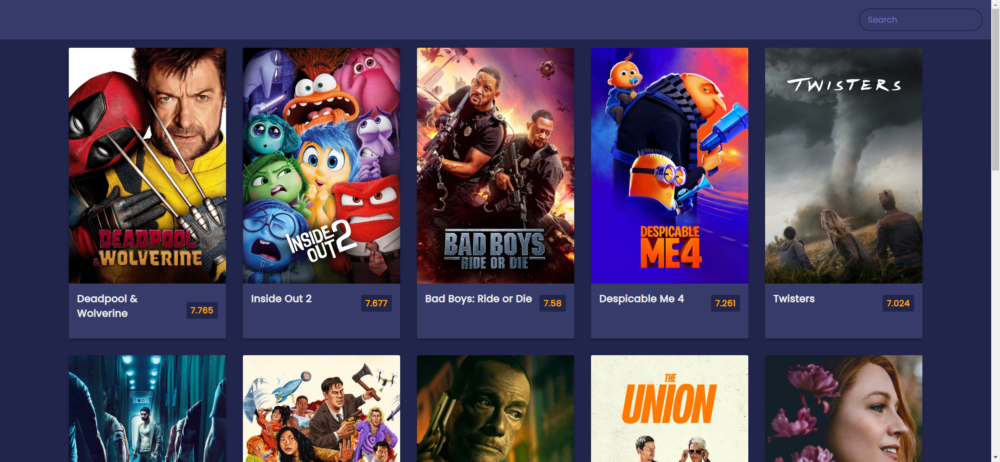
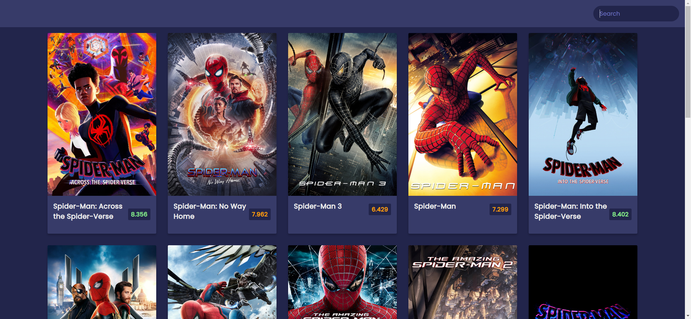
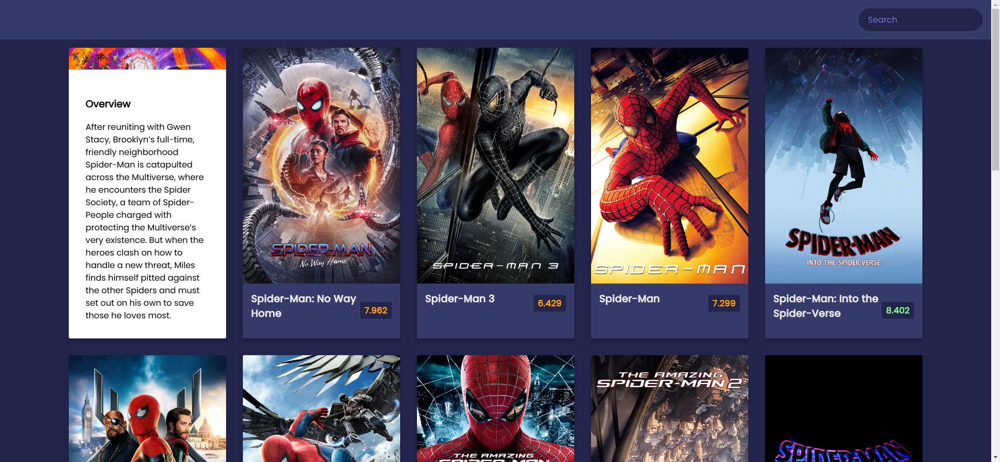

Your job is to design a webpage that displays a list of movies fetched from an API and allows users to search for movies. The webpage should have a search bar, display movie posters, and show movie details on hover. The initial webpage should be as shown below:

The provided screenshots are rendered under a resolution of 1920x1080.

### Requirements:

1. **HTML Structure**:
    - The webpage should have a header containing a search form.
    - The main section should be used to display the list of movies.

2. **CSS Styling**:
    - Use the Google Font 'Poppins' with weights 200 and 400.
    - Define primary and secondary colors using CSS variables:
        - `--primary-color: #22254b`
        - `--secondary-color: #373b69`
    - The body should have a background color of `var(--primary-color)` and use the 'Poppins' font.
    - The header should have padding, be flexibly aligned to the right, and have a background color of `var(--secondary-color)`.
    - The search input should have a transparent background, border, and rounded corners. It should change background color when focused.
    - The main section should use flexbox to wrap and center the movie elements.
    - Each movie element should have a width of 300px, margin, background color, box shadow, and rounded corners.
    - The movie image should take the full width of the movie element.
    - The movie info section should display the title and rating, with different colors for ratings based on their value:
        - Green for ratings >= 8
        - Orange for ratings >= 5
        - Red for ratings < 5
    - The overview section should be hidden by default and slide up when the movie element is hovered over.

3. **JavaScript Functionality**:
    - Fetch the initial list of movies from the API URL: `https://api.themoviedb.org/3/discover/movie?sort_by=popularity.desc&api_key=3fd2be6f0c70a2a598f084ddfb75487c&page=1`
    - Display the movies in the main section.
    - Implement a search functionality that fetches movies based on the search query from the API URL: `https://api.themoviedb.org/3/search/movie?api_key=3fd2be6f0c70a2a598f084ddfb75487c&query=`
    - Clear the search input after submitting the search form.
    - Reload the page if the search input is empty.

4. **Interactions**:
    - When the page loads, it should display the initial list of movies.
    - When a search query is submitted (e.g., 'Spider man'), the page should display the search results. The search results should look like this:

    

    - When hovering over the first movie element, the overview section should slide up and be visible. The hover effect should look like this:

    

### Element Identifiers:
- Use ID `form` for the search form.
- Use ID `search` for the search input.
- Use ID `main` for the main section.
- Use class name `movie` for each movie element.
- Use class name `movie-info` for the movie info section.
- Use class name `overview` for the overview section.
- Use class names `green`, `orange`, and `red` for the rating spans based on the rating value.

### Additional Notes:
- The overview section should have a smooth transition effect when sliding up.
- Ensure that the webpage is responsive and looks good on different screen sizes.
- The search functionality should handle cases where no movies are found.

By following these requirements, you should be able to re-implement the webpage as described. Good luck!
