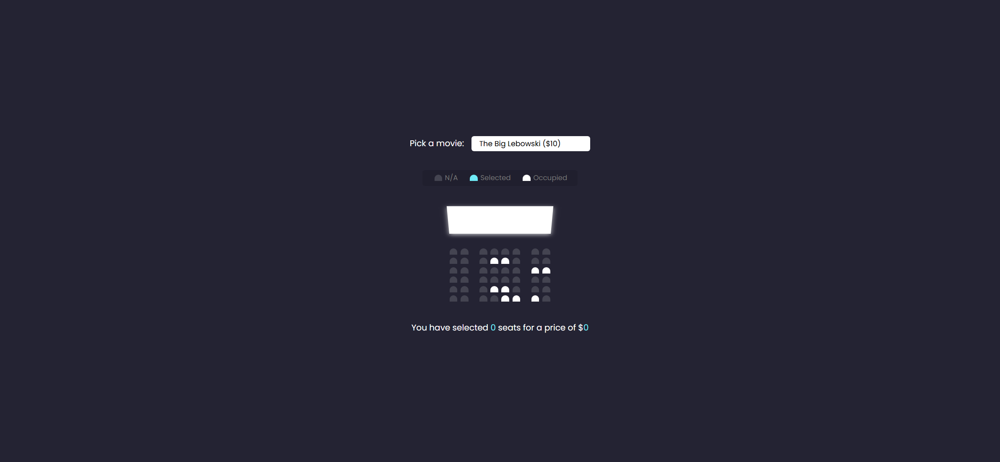
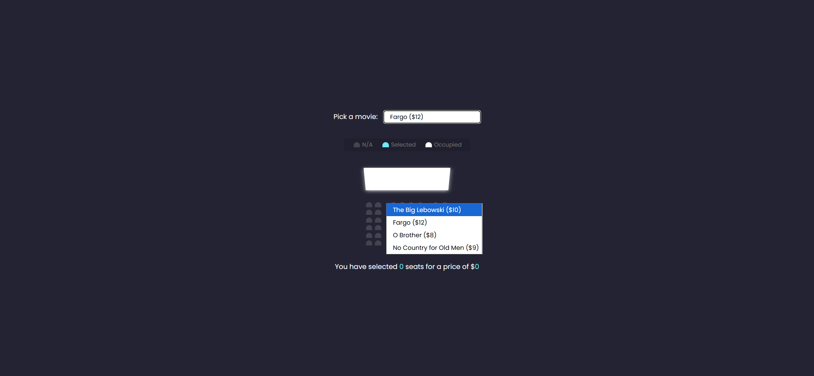
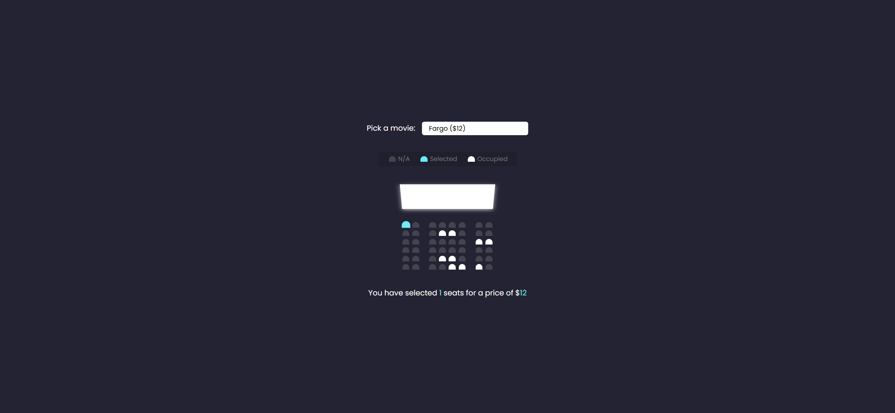

# Movie Seat Booking Webpage

Your task is to design a webpage that allows users to book seats for a movie. The webpage should have the following features and functionalities:

## Initial Webpage

The initial webpage should look like this:



## Layout and Elements

1. **Movie Selection Dropdown**:
   - Use a `div` with class `movie-container`.
   - Inside this `div`, add a `label` with the text "Pick a movie:".
   - Add a `select` element with ID `movie` and name `movie`.
   - The `select` element should have the following `option` elements:
     - `<option value="10">The Big Lebowski ($10)</option>`
     - `<option value="12">Fargo ($12)</option>`
     - `<option value="8">O Brother ($8)</option>`
     - `<option value="9">No Country for Old Men ($9)</option>`

2. **Seat Showcase**:
   - Use a `ul` element with class `showcase`.
   - Inside this `ul`, add `li` elements to showcase seat statuses:
     - An available seat: `<div class="seat"></div><small>N/A</small>`
     - A selected seat: `<div class="seat selected"></div><small>Selected</small>`
     - An occupied seat: `<div class="seat occupied"></div><small>Occupied</small>`

3. **Seat Layout**:
   - Use a `div` with class `container`.
   - Inside this `div`, add a `div` with class `screen` to represent the movie screen.
   - Add multiple `div` elements with class `row` to represent rows of seats.
   - Inside each `row`, add multiple `div` elements with class `seat` to represent individual seats.
   - Some seats should have the class `occupied` to indicate they are already booked.

4. **Selected Seats and Total Price**:
   - Use a `p` element with class `text`.
   - Inside this `p`, add the text: "You have selected <span id="count">0</span> seats for a price of $<span id="total">0</span>".

## Interactions

1. **Select a Movie**:
   - When a user selects a movie from the dropdown, the ticket price should update accordingly.
   - The webpage after selecting a movie should look like this:

     

2. **Select a Seat**:
   - When a user clicks on an available seat, it should toggle to the `selected` state.
   - The webpage after selecting a seat should look like this:

     

3. **Deselect a Seat**:
   - When a user clicks on a selected seat, it should toggle back to the available state.
   - The webpage after deselecting a seat should look like this:

     

## Styling

- The webpage should have a dark background with white text.
- The seats should have different colors for available, selected, and occupied states.
- The movie selection dropdown should have a white background with rounded corners.

## JavaScript Functionality

- The script should handle the following:
  - Populate the UI based on saved data in `localStorage`.
  - Update the selected seat count and total price when seats are selected or deselected.
  - Save the selected movie and seat data to `localStorage`.

## Resources

- The webpage uses the Google Font "Poppins". Include it using the following URL:
  ```css
  @import url("https://fonts.googleapis.com/css?family=Poppins&display=swap");
  ```

## Screenshots

The provided screenshots are rendered under a resolution of 1920x1080.

## IDs and Class Names

- Use ID `movie` for the movie selection dropdown.
- Use class name `movie-container` for the container of the movie selection dropdown.
- Use class name `showcase` for the seat showcase.
- Use class name `container` for the main container of the seat layout.
- Use class name `screen` for the movie screen.
- Use class name `row` for each row of seats.
- Use class name `seat` for each seat.
- Use class name `selected` for selected seats.
- Use class name `occupied` for occupied seats.
- Use ID `count` for the span showing the number of selected seats.
- Use ID `total` for the span showing the total price.

Follow these instructions to re-implement the webpage. Good luck!
