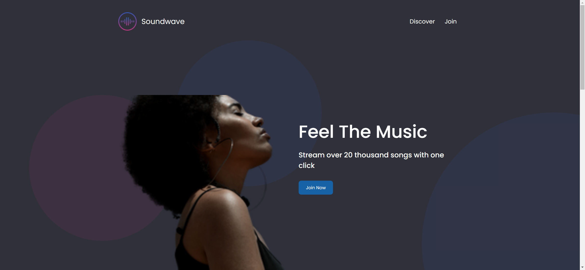
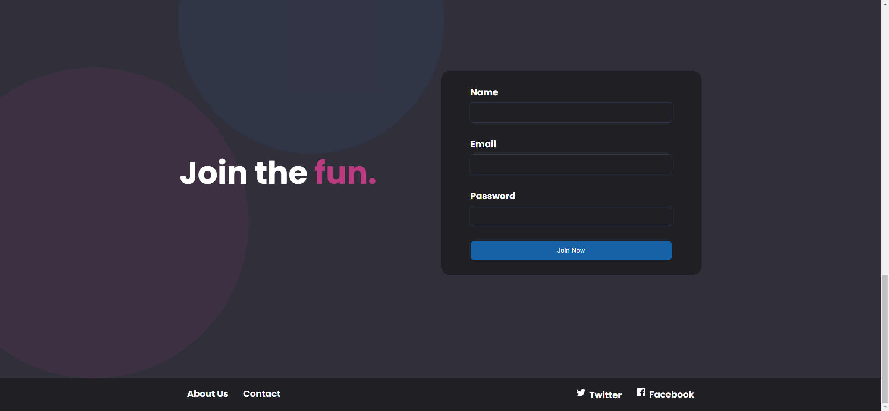
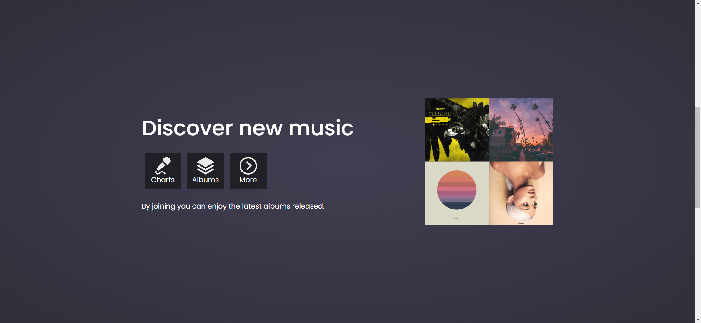

# Task Description: Re-implement the "Soundwave" Webpage

Your job is to design a webpage that replicates the "Soundwave" webpage. The webpage should be responsive and include various sections such as a header, hero section, discover section, join section, and footer. Below are the detailed instructions and resources needed to re-implement the webpage.

## Initial Webpage
The initial webpage should look like this:

## Resources
- **Font**: Use the "Poppins" font from Google Fonts.
- **Images**:
  - `resource1.png`: Used for the brand logo in the header.
  - `resource2.jpg`: Used for the covers image in the discover section.
  - `https://i.ibb.co/t8B5Y8L/landing-page-girl.png`: Used for the lady image in the hero section.

## Layout and Styling
- The webpage should be responsive and adapt to different screen sizes.
- The provided screenshots are rendered under a resolution of 1920x1080.

### Header
- The header should contain a brand logo and navigation links.
- Use class name `main-header` for the header.
- Use class name `brand-logo` for the brand logo.
- Use class name `brand-logo-name` for the brand logo name.
- Use class name `main-nav` for the navigation.
- Navigation links should include "Discover" and "Join".

### Hero Section
- The hero section should contain a call-to-action and an image of a lady.
- Use class name `hero-section` for the hero section.
- Use class name `img-wrapper` for the image wrapper.
- Use class name `lady-image` for the lady image.
- Use class name `call-to-action` for the call-to-action.
- Use class name `title` for the main title.
- Use class name `subtitle` for the subtitle.
- Use class name `btn` for the "Join Now" button.

### Discover Section
- The discover section should contain a title, icons, and a covers image.
- Use ID `discover` for the discover section.
- Use class name `discover-section` for the discover section.
- Use class name `icon-section` for the icon section.
- Use class name `icon` for each icon.
- Use class name `covers-image` for the covers image.

### Join Section
- The join section should contain a title, a form, and decorative circles.
- Use ID `join` for the join section.
- Use class name `join-section` for the join section.
- Use class name `join-text` for the join text.
- Use class name `accent-text` for the accent text.
- Use class name `join-form` for the form.
- Use class name `input-group` for each input group.
- Use class name `btn` for the submit button.

### Footer
- The footer should contain navigation links and social media links.
- Use class name `main-footer` for the footer.
- Use class name `footer-nav` for the footer navigation.
- Use class name `social-link` for the social media links.

## Interactions
### Scroll Page
- Scroll the page to the bottom.

### Click "Discover" Link
- Clicking the "Discover" link should navigate to the discover section.

## Animations
- Describe any animations used in the webpage, such as hover effects on buttons and links.

By following these instructions and using the provided resources, you should be able to re-implement the "Soundwave" webpage accurately.
