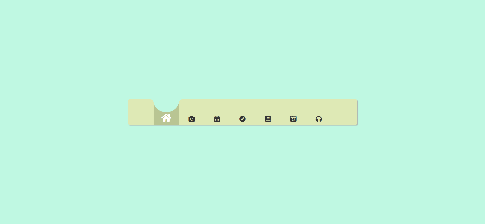
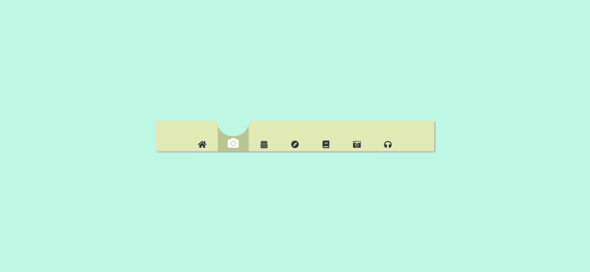

Your task is to design a webpage with a navigation bar that includes interactive icons. The initial webpage should look like this:



### Requirements:

1. **HTML Structure**:
    - Create a `<nav>` element with the class `navbar`.
    - Inside the `<nav>`, create multiple `<a>` elements with the class `navbar-link`. Each `<a>` element should contain an `<i>` element with a specific Font Awesome icon class.
    - The first and last `<div>` elements inside the `<nav>` should have the class `navbar-link` and should be empty.

2. **CSS Styling**:
    - Use the following CSS properties for the elements:
        - `*` selector: Reset margin, padding, and box-sizing.
        - `.navbar-link:first-child` and `.navbar-link:last-child`: Disable pointer events and set border-radius.
        - `.navbar-link.prevElChange` and `.navbar-link.nextElChange`: Add border-radius and transition properties.
        - `.navbar-link::before`: Add a pseudo-element with specific dimensions, background-color, position, and transition properties.
        - `.change.navbar-link::before`: Adjust the top position and transition properties.
        - `.navbar-link i`: Set font-size and color, and add transition properties.
        - `.change.navbar-link i`: Change color to white and increase font-size.
    
3. **JavaScript Interactions**:
    - Add an event listener to each `.navbar-link` element.
    - When a `.navbar-link` is clicked, remove the `change` class from all links and add it to the clicked link.
    - Add the `prevElChange` class to the previous sibling and `nextElChange` class to the next sibling of the clicked link.

4. **Font Awesome**:
    - Include the Font Awesome library for the icons using the following link:
      ```html
      <link
        rel="stylesheet"
        href="https://cdnjs.cloudflare.com/ajax/libs/font-awesome/5.15.4/css/all.min.css"
      />
      ```

### Icons:
- Home icon: `<i class="fas fa-home"></i>`
- Camera icon: `<i class="fas fa-camera"></i>`
- Calendar icon: `<i class="fas fa-calendar-alt"></i>`
- Compass icon: `<i class="fas fa-compass"></i>`
- Book icon: `<i class="fas fa-book"></i>`
- Retro camera icon: `<i class="fas fa-camera-retro"></i>`
- Headphones icon: `<i class="fas fa-headphones"></i>`

### Interaction Screenshots:
- After clicking the camera icon:
  
- After clicking the calendar icon:
  
  
  

### Notes:
- The provided screenshots are rendered under a resolution of 1920x1080.
- Ensure that the elements have the correct class names and IDs as specified to match the interactions.
