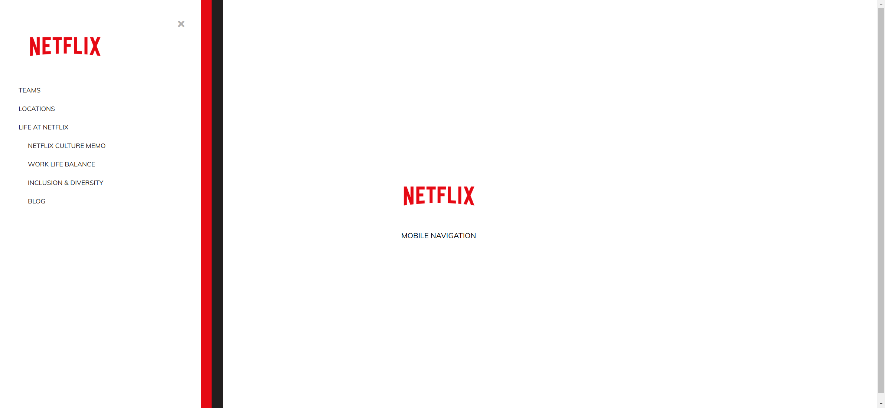

Your task is to design a webpage that mimics the Netflix mobile navigation menu. The webpage should have a button to open the navigation menu and a button to close it. The navigation menu will have a multi-layered background effect with three layers: black, red, and white. Below are the detailed instructions to help you re-implement the webpage.

### Initial Webpage
The initial webpage should look like this:


### Resources
- **Font Awesome**: Used for the icons in the buttons. Include it using the following link:
  ```html
  <link crossorigin="anonymous" href="https://cdnjs.cloudflare.com/ajax/libs/font-awesome/5.14.0/css/all.min.css" integrity="sha512-1PKOgIY59xJ8Co8+NE6FZ+LOAZKjy+KY8iq0G4B3CyeY6wYHN3yt9PW0XpSriVlkMXe40PTKnXrLnZ9+fkDaog==" rel="stylesheet"/>
  ```
- **Google Fonts**: The font 'Muli' is used for the text. Include it using the following link:
  ```html
  @import url('https://fonts.googleapis.com/css?family=Muli&display=swap');
  ```
- **Images**:
  - `resource1.png`: Used for the logo in the initial view.
  - `resource2.png`: Used for the logo inside the navigation menu.

### Layout and Styling
- The webpage should be centered both vertically and horizontally.
- Use the font 'Muli' for all text.
- The navigation menu should slide in from the left when opened and slide out when closed.
- The transition for the sliding effect should be smooth.

### HTML Structure
- Use a button with the class `nav-btn open-btn` for the open button.
- Use a button with the class `nav-btn close-btn` for the close button.
- Use the class `nav` for the navigation menu layers.
- Use the class `logo` for the logo images.
- Use the class `text` for the text "Mobile Navigation".
- Use the class `list` for the navigation list.

### CSS Styling
- Use the provided CSS file `style.css` for styling.
- Ensure the navigation menu layers have the following classes and properties:
  - `nav-black`: Black background, width 60%, max-width 480px, min-width 320px.
  - `nav-red`: Red background, width 95%.
  - `nav-white`: White background, width 95%, padding 40px.
- The navigation menu should be hidden initially and slide in when the `visible` class is added.

### JavaScript Functionality
- Use JavaScript to add the `visible` class to the navigation menu layers when the open button is clicked.
- Use JavaScript to remove the `visible` class from the navigation menu layers when the close button is clicked.

### Interaction Screenshots
- When the navigation menu is opened, it should look like this:
  
- When the navigation menu is closed, it should return to the initial state:
  

### Interaction Details
- The provided screenshots are rendered under a resolution of 1920x1080.
- Use the following IDs and class names for interactive elements:
  - Use class name `open-btn` for the button that opens the navigation menu.
  - Use class name `close-btn` for the button that closes the navigation menu.
  - Use class name `nav` for the navigation menu layers.
  - Use class name `visible` to control the visibility of the navigation menu layers.

By following these instructions, you should be able to re-implement the webpage with the same functionality and appearance.
