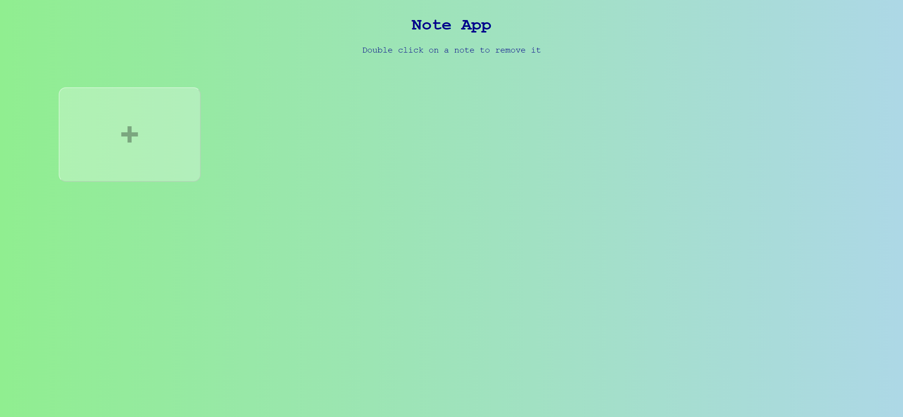
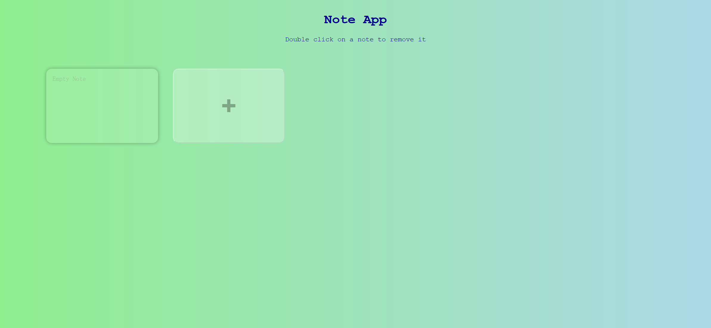
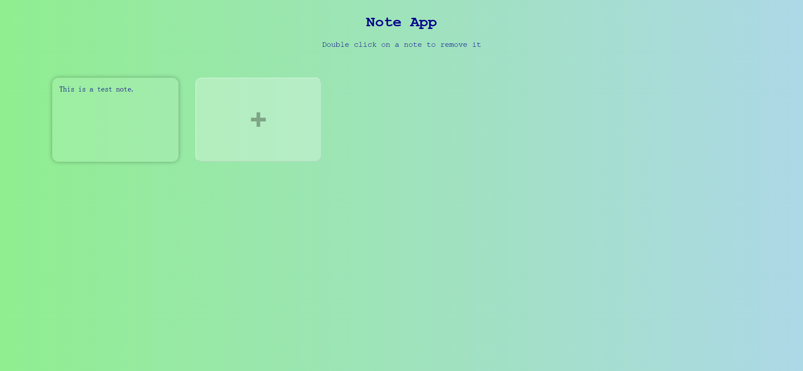
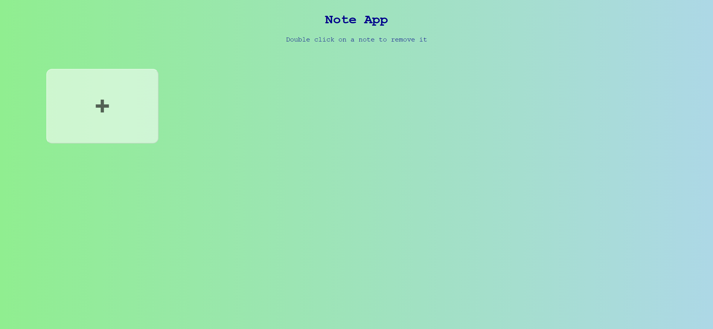

# Task Description: Implement a Note App Webpage

Your job is to design a webpage that functions as a simple note-taking application. The webpage should allow users to add, edit, and delete notes. Below are the detailed requirements and resources to help you re-implement the webpage.

## Initial Webpage

The initial webpage should look like this:

## Layout and Styling

1. **Background and Font**
   - The background should be a linear gradient from light blue to light green.
   - Use the font family `"Courier New", Courier, monospace` for all text.

2. **Heading**
   - The heading text should be "Note App".
   - Use the class name `heading` for the heading element.
   
3. **Information Text**
   - Below the heading, include a paragraph with the text "Double click on a note to remove it".
   - Use the class name `info-text` for this paragraph.
   
4. **App Container**
   - Use the ID `app` for the main container that holds the notes and the add button.
   
5. **Add Note Button**
   - Use the ID `btn` for the add note button.
   - The button should have a smooth transition effect of 300ms.
   
6. **Note Text Area**
   - Use the class name `note` for the text area elements.

## Functionality

1. **Add Note**
   - Clicking the add note button (ID `btn`) should create a new note.
   - The new note should be inserted before the add note button.

2. **Edit Note**
   - Users should be able to type into the note text area to edit the note content.
   - The content should be saved in the local storage.

3. **Delete Note**
   - Double-clicking on a note should prompt the user with a confirmation dialog to delete the note.
   - If confirmed, the note should be removed from the DOM and the local storage.

## Screenshots

The provided screenshots are rendered under a resolution of 1920x1080.

### After Adding a Note

### After Typing in a Note

### After Deleting a Note

## Resources

- The text content "Double click on a note to remove it" is used for the information paragraph.
- The placeholder text "Empty Note" is used for the note text areas.

By following the above description, you should be able to re-implement the Note App webpage with the same functionality and appearance.
