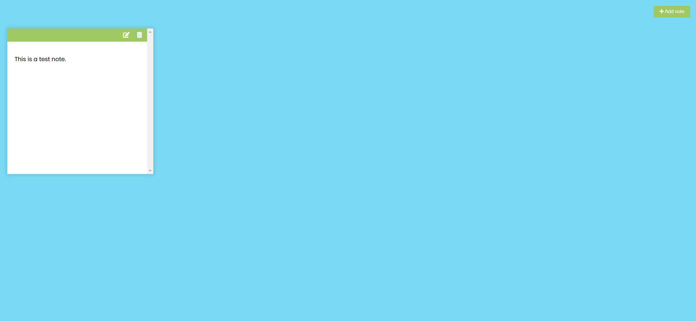

Your job is to design a webpage that functions as a simple notes app. The app allows users to add, edit, and delete notes. The initial webpage should be .

### Requirements

1. **HTML Structure**
    - The webpage should have a button to add new notes. Use the following structure:
      ```html
      <button class="add" id="add">
        <i class="fas fa-plus"></i> Add note
      </button>
      ```
    - Include the Font Awesome library for icons:
      ```html
      <link rel="stylesheet" href="https://cdnjs.cloudflare.com/ajax/libs/font-awesome/5.14.0/css/all.min.css" integrity="sha512-1PKOgIY59xJ8Co8+NE6FZ+LOAZKjy+KY8iq0G4B3CyeY6wYHN3yt9PW0XpSriVlkMXe40PTKnXrLnZ9+fkDaog==" crossorigin="anonymous" />
      ```
    - Include the Marked library for Markdown parsing:
      ```html
      <script src="https://cdnjs.cloudflare.com/ajax/libs/marked/1.2.2/marked.min.js"></script>
      ```

2. **CSS Styling**
    - Use the Google Font "Poppins":
      ```css
      @import url('https://fonts.googleapis.com/css2?family=Poppins:wght@200;400&display=swap');
      ```
    
3. **JavaScript Functionality**
    - Add a new note when the add button is clicked
    

### Interaction Steps

2. **Add Note**: Click the "Add note" button. The webpage should look like this: 
3. **Enter Text**: Enter text in the note's textarea. The webpage should look like this: 
4. **Edit Note**: Click the edit button to toggle between the textarea and the main content. The webpage should look like this: 
5. **Delete Note**: Click the delete button to remove the note. The webpage should look like this: 

### Notes
- The provided screenshots are rendered under a resolution of 1920x1080.
- Ensure that the note elements have the class name `note`.
- Use the ID `add` for the add button.
- Use the class name `edit` for the edit button and `delete` for the delete button.
- The note's textarea should have a class name of `hidden` when not in edit mode.
