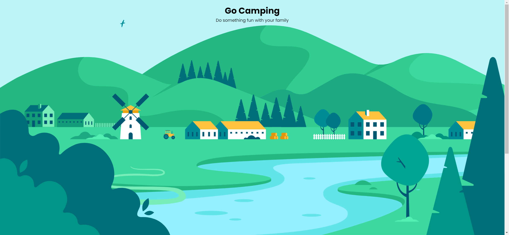
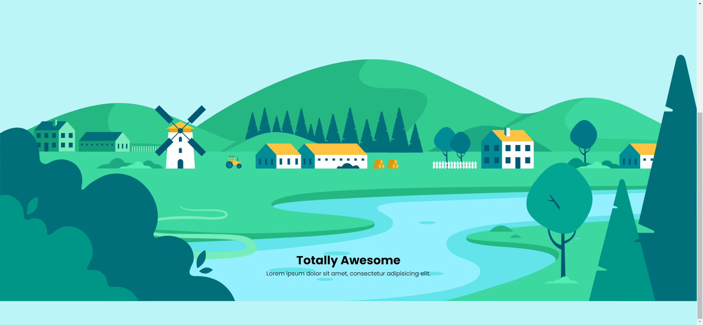

# Task Description: Recreate the "SVG Background" Webpage

Your job is to design a webpage that replicates the "SVG Background" webpage. The webpage features a parallax scrolling effect with SVG graphics and text content. Below are the detailed instructions and resources needed to re-implement the webpage.

## Initial Webpage

The initial webpage should look like this:



## Resources

1. **Fonts**: Use the "Poppins" font from Google Fonts.
   - Import URL: `https://fonts.googleapis.com/css2?family=Poppins:wght@400;700&display=swap`

3. **JavaScript Library**: Use the Rellax.js library for the parallax effect.
   - CDN URL: `https://cdnjs.cloudflare.com/ajax/libs/rellax/1.12.1/rellax.min.js`
   - Integrity: `sha512-f5HTYZYTDZelxS7LEQYv8ppMHTZ6JJWglzeQmr0CVTS70vJgaJiIO15ALqI7bhsracojbXkezUIL+35UXwwGrQ==`

4. **SVG Graphics**: The SVG content is embedded directly in the HTML file.

## Text Content

### Main Heading
- Text: "Go Camping"

### Subheading
- Text: "Do something fun with your family"

### Section Heading
- Text: "Totally Awesome"

### Section Paragraph
- Text: "Lorem ipsum dolor sit amet, consectetur adipisicing elit."

## Layout and Styling

### Body
- Use the "Poppins" font.

### Clouds Animation
- Animation: `cloud-anim 15s alternate-reverse infinite linear`

### Keyframes for Clouds Animation
```css
@keyframes cloud-anim {
  from {
    transform: translateX(0);
  }
  to {
    transform: translateX(-100px);
  }
}
```

## Interaction

The webpage should have a parallax scrolling effect. When the user scrolls down, the background elements should move at different speeds, creating a depth effect.

### Screenshot After Scrolling

The webpage after scrolling should look like this:



## Notes

- The provided screenshots are rendered under a resolution of 1920x1080.
- Ensure that the parallax effect is smooth and the animations are fluid.
- Use the specified IDs and class names for elements to ensure proper functionality and styling.


