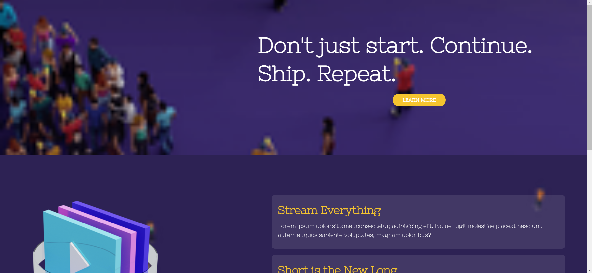
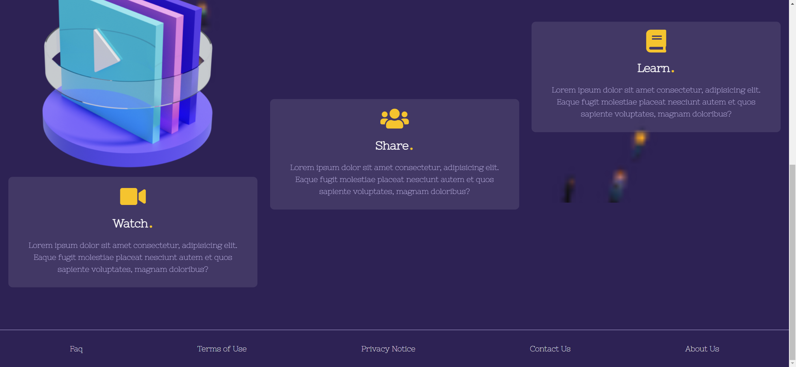

# Task Description for Re-implementing the Parallax Landing Page

Your job is to design a webpage that mimics the functionality and appearance of the provided Parallax Landing Page. The webpage should include parallax scrolling effects, interactive elements, and a responsive design. The provided screenshots are rendered under a resolution of 1920x1080.

## Initial Webpage

The initial webpage should look like this:

### Resources

1. **Fonts**: Use the "Nixie One" font from Google Fonts.
2. **Icons**: Use Font Awesome icons.
3. **Images**:
   - `https://i.ibb.co/PhVR2Vh/bg1.png` for the background of the top section.
   - `https://i.ibb.co/bsX6RV0/bg2.png` for the background of the stream section.
   - `resource1.png` for the play button image in the stream section.

### Sections

1. **Top Section**:
   - Background image: `https://i.ibb.co/PhVR2Vh/bg1.png`
   - Text: "Don't just start. Continue. Ship. Repeat."
   - Button: "Learn More" (use class name `btn`)

2. **Stream Section**:
   - Background image: `https://i.ibb.co/bsX6RV0/bg2.png`
   - Play button image: `resource1.png` (use class name `play`)
   - Two content blocks with the following text:
     - **Block 1**:
       - Heading: "Stream Everything"
       - Paragraph: "Lorem ipsum dolor sit amet consectetur, adipisicing elit. Eaque fugit molestiae placeat nesciunt autem et quos sapiente voluptates, magnam doloribus?"
     - **Block 2**:
       - Heading: "Short is the New Long"
       - Paragraph: "Lorem ipsum dolor sit amet consectetur, adipisicing elit. Eaque fugit molestiae placeat nesciunt autem et quos sapiente voluptates, magnam doloribus?"

3. **Grid Section**:
   - Three content blocks with Font Awesome icons and the following text:
     - **Block 1**:
       - Icon: `fas fa-video`
       - Heading: "Watch."
       - Paragraph: "Lorem ipsum dolor sit amet consectetur, adipisicing elit. Eaque fugit molestiae placeat nesciunt autem et quos sapiente voluptates, magnam doloribus?"
     - **Block 2**:
       - Icon: `fas fa-users`
       - Heading: "Share."
       - Paragraph: "Lorem ipsum dolor sit amet consectetur, adipisicing elit. Eaque fugit molestiae placeat nesciunt autem et quos sapiente voluptates, magnam doloribus?"
     - **Block 3**:
       - Icon: `fas fa-book`
       - Heading: "Learn."
       - Paragraph: "Lorem ipsum dolor sit amet consectetur, adipisicing elit. Eaque fugit molestiae placeat nesciunt autem et quos sapiente voluptates, magnam doloribus?"

4. **Footer**:
   - Links: "Faq", "Terms of Use", "Privacy Notice", "Contact Us", "About Us"

### Interactions

1. **Scroll the Page**:
   - The page should scroll to the bottom.
   - Screenshot after scrolling: 

### Parallax Effect

- Use the Rellax.js library for the parallax effect.
- Apply the `rellax` class to elements that should have the parallax effect.
- Use the `data-rellax-speed` attribute to control the speed of the parallax effect.

### Styling

- Ensure the webpage is responsive and adjusts layout for different screen sizes.

- Ensure all interactive elements have the correct class names or IDs as specified.

