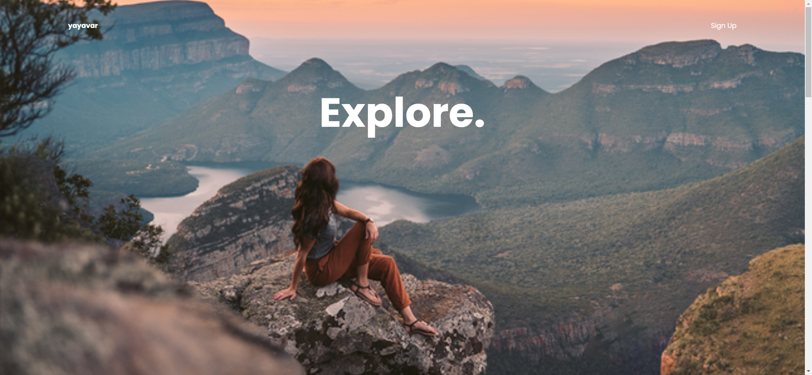
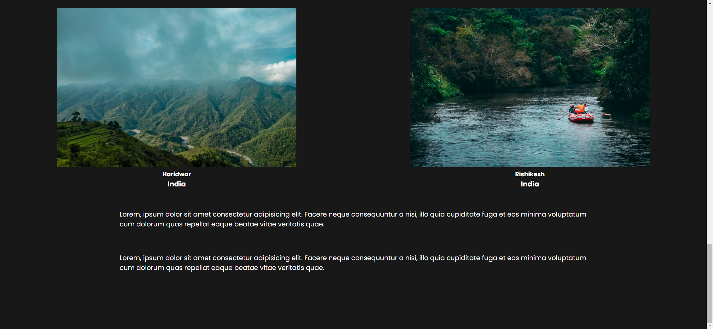

Your job is to design a webpage with a parallax scrolling effect. The webpage should have a navigation bar, a main container with images and text, and a content section with additional images and text. The initial webpage should be . The provided screenshots are rendered under a resolution of 1920x1080.

### Resources
- `resource1.png` is used as the background image in the main container.
- `resource2.png` is used as the girl image in the main container.
- `resource3.png` is used as the rock image in the main container.
- `resource4.jpg` is used as the image for Haridwar in the content section.
- `resource5.jpg` is used as the image for Rishikesh in the content section.
- The text content for the paragraphs in the content section is:
  ```
  Lorem, ipsum dolor sit amet consectetur adipisicing elit. Facere neque
  consequuntur a nisi, illo quia cupiditate fuga et eos minima
  voluptatum cum dolorum quas repellat eaque beatae vitae veritatis
  quae.
  ```

### Structure
1. **Navigation Bar**
   - Use a `nav` element.
   - Inside the `nav`, include an `h4` element with the text "yayavar".
   - Include an `a` element with the class `button` and the text "Sign Up".

2. **Main Container**
   - Use a `div` with the class `container`.
   - Inside the container, include an `h2` element with the class `main-title` and the text "Explore.".
   - Add three `img` elements with the following class names and sources:
     - `background` with `src="resource1.png"`
     - `girl` with `src="resource2.png"`
     - `rock` with `src="resource3.png"`

3. **Content Section**
   - Use a `div` with the class `content`.
   - Inside the content, include a `div` with the class `content-images` containing two `div` elements. Each `div` should have:
     - An `img` element with the respective source (`resource4.jpg` for Haridwar and `resource5.jpg` for Rishikesh).
     - An `h4` element with the respective text ("Haridwar" and "Rishikesh").
     - An `h3` element with the text "India".
   - Include two `p` elements with the class `text` and the provided text content.

### Animations
- Use the GSAP library for animations.
- The animations should include:
  - Moving the rock image (`.rock`) upwards by 300 pixels over 10 seconds.
  - Moving the girl image (`.girl`) upwards by 200 pixels over 10 seconds.
  - Moving the background image (`.background`) from -50 pixels to 0 pixels over 10 seconds.
  - Moving the content section (`.content`) to the top over 10 seconds.
  - Fading in the content images (`.content-images`) over 3 seconds.
  - Fading in the text (`.text`) over 3 seconds.

### Interaction
- The webpage should have a parallax scrolling effect.
- When the user scrolls down, the animations should trigger.
- The final webpage after scrolling should be .

### External Libraries
- Include the GSAP library for animations:
  ```html
  <script crossorigin="anonymous" integrity="sha512-cdV6j5t5o24hkSciVrb8Ki6FveC2SgwGfLE31+ZQRHAeSRxYhAQskLkq3dLm8ZcWe1N3vBOEYmmbhzf7NTtFFQ==" src="https://cdnjs.cloudflare.com/ajax/libs/gsap/3.6.1/gsap.min.js"></script>
  ```
- Include the ScrollMagic library for scroll interactions:
  ```html
  <script src="https://cdnjs.cloudflare.com/ajax/libs/ScrollMagic/2.0.6/ScrollMagic.min.js"></script>
  <script src="https://cdnjs.cloudflare.com/ajax/libs/ScrollMagic/2.0.6/plugins/animation.gsap.js"></script>
  ```

### Styling
- Use the `Poppins` font from Google Fonts.
