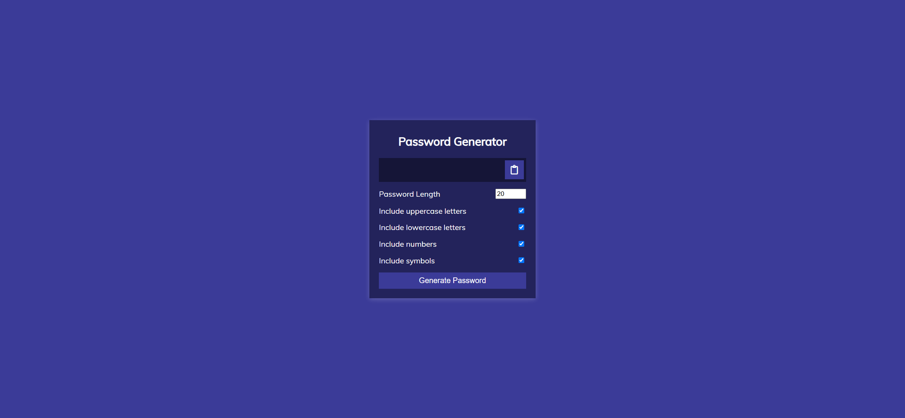
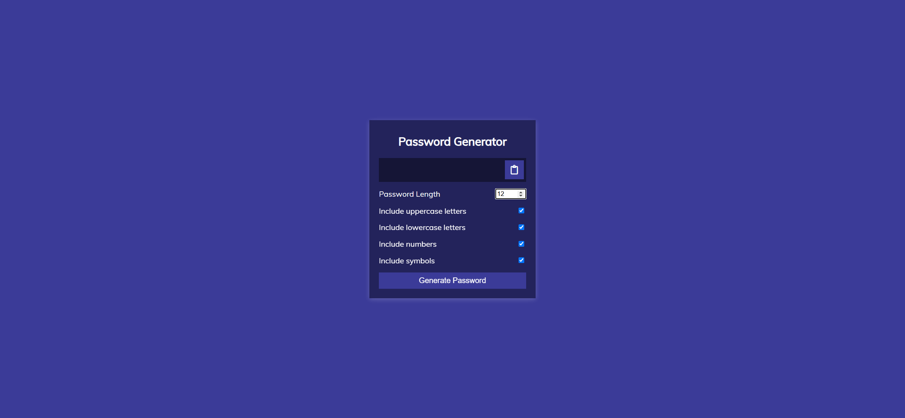
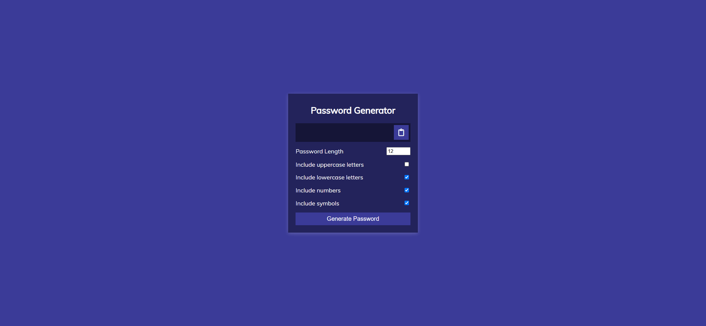
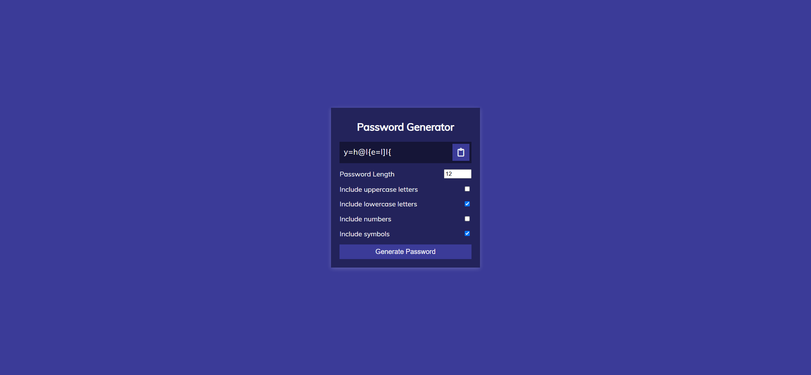

Your job is to design a webpage that functions as a Password Generator. The webpage should allow users to generate a password based on selected criteria such as length, inclusion of uppercase letters, lowercase letters, numbers, and symbols. Below are the detailed instructions to re-implement the webpage.

The initial webpage should be 

### Layout and Styling

1. **Fonts and Icons**
   - Use the Google Font 'Muli' for the entire webpage.
   - Include Font Awesome for the clipboard icon using the following link:
     ```html
     <link rel="stylesheet" href="https://cdnjs.cloudflare.com/ajax/libs/font-awesome/5.14.0/css/all.min.css" integrity="sha512-1PKOgIY59xJ8Co8+NE6FZ+LOAZKjy+KY8iq0G4B3CyeY6wYHN3yt9PW0XpSriVlkMXe40PTKnXrLnZ9+fkDaog==" crossorigin="anonymous" />
     ```

2. **Body**

   - Font family: 'Muli', sans-serif
   - Center the content both vertically and horizontally.

6. **Settings**
   - Each setting should be a flex container with space between the label and the input.

### Functionality

1. **Password Length**
   - Use an input field of type `number` with ID `length`.
   - Set minimum value to `4` and maximum value to `20`.
   - Default value should be `20`.

2. **Checkboxes**
   - Include checkboxes for uppercase letters, lowercase letters, numbers, and symbols.
   - Each checkbox should have an ID: `uppercase`, `lowercase`, `numbers`, `symbols`.
   - By default, all checkboxes should be checked.

3. **Generate Password Button**
   - Use a button with ID `generate` and class `btn btn-large`.
   - Text content: "Generate Password".

4. **Clipboard Button**
   - Use a button with ID `clipboard` and class `btn`.
   - Include a Font Awesome clipboard icon inside the button.

### JavaScript

1. **Event Listeners**
   - Add a click event listener to the clipboard button to copy the generated password to the clipboard.
   - Add a click event listener to the generate button to generate a new password based on the selected criteria.

2. **Password Generation Logic**
   - Use the provided functions to generate random lowercase letters, uppercase letters, numbers, and symbols.
   - Combine these functions to generate a password of the specified length and criteria.

### Screenshots

- After setting the password length to 12: 
- After toggling off uppercase letters: 
- After toggling off numbers: 
- After generating the password: 

### Notes

- The provided screenshots are rendered under a resolution of 1920x1080.
- Do not click the copy button as it has some bugs.
