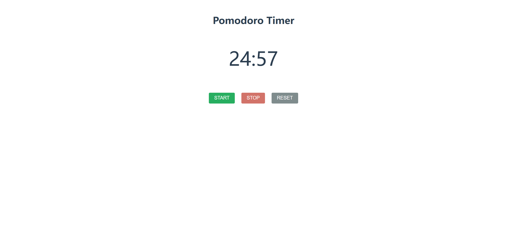

# Task Description: Pomodoro Timer Webpage

Your job is to design a webpage that functions as a Pomodoro Timer. The webpage should have a simple and clean design with a timer display and three control buttons: Start, Stop, and Reset. Below are the detailed instructions to re-implement the webpage.

## Initial Webpage

The initial webpage should look like this:

## Layout and Styling

1. **Container**:
   - Use a `div` with class name `container` to wrap all elements.
   - Use the font family "Roboto", sans-serif.
   
2. **Title**:
   - Use an `h1` element with class name `title` for the title "Pomodoro Timer".
   
3. **Timer Display**:
   - Use a `p` element with class name `timer` and ID `timer` to display the timer.
   - Set the initial text content to "25:00".
   
4. **Buttons**:
   - Use a `div` with class name `button-wrapper` to wrap the buttons.
   - Use three `button` elements with IDs `start`, `stop`, and `reset` respectively.

## Timer Functionality

1. **JavaScript Elements**:
   - Use `getElementById` to get references to the Start, Stop, and Reset buttons, and the Timer display.

2. **Timer Logic**:
   - Initialize a variable `timeLeft` to 1500 (25 minutes in seconds).
   - Create a function `updateTimer` to update the timer display.
   - Create a function `startTimer` to start the countdown.
   - Create a function `stopTimer` to stop the countdown.
   - Create a function `resetTimer` to reset the countdown to 25:00.

3. **Event Listeners**:
   - Add click event listeners to the Start, Stop, and Reset buttons to call the respective functions.

## Interactions and Screenshots

The provided screenshots are rendered under a resolution of 1920x1080.

1. **After Starting the Timer**:
   - When the Start button is clicked, the timer should start counting down.
   - The webpage should look like this after starting the timer:

   

2. **After Stopping the Timer**:
   - When the Stop button is clicked, the timer should stop counting down.
   - The webpage should look like this after stopping the timer:

   

3. **After Resetting the Timer**:
   - When the Reset button is clicked, the timer should reset to 25:00.
   - The webpage should look like this after resetting the timer:

   

## Summary

- Use class name `container` for the main container.
- Use class name `title` for the title.
- Use class name `timer` and ID `timer` for the timer display.
- Use class name `button-wrapper` for the button container.
- Use IDs `start`, `stop`, and `reset` for the Start, Stop, and Reset buttons respectively.

Re-implement the webpage according to the above description to achieve the same functionality and appearance as shown in the screenshots.
