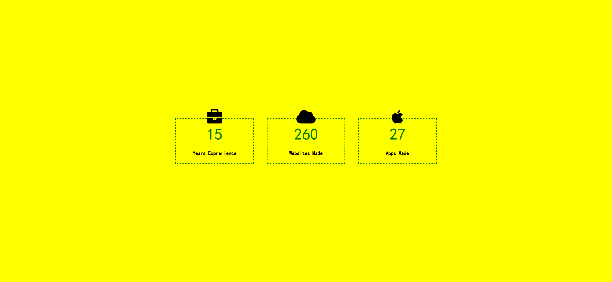

# Task Description: Profile Statistics Webpage

Your job is to design a webpage that displays profile statistics with animated counters. The webpage should look and behave as described below. The provided screenshots are rendered under a resolution of 1920x1080.

## Final Webpage After Counters Finish

After the counters finish incrementing, the webpage should look like this:



## Layout and Styling

1. **Body**:
   - The background color should be yellow.
   - Use the font family `cursive`.
   - The body should be centered both horizontally and vertically.
   - The body should have a flex layout with items centered and aligned in the middle.
   - For screens with a maximum width of 600px, the flex direction should be column.

2. **Stats Container**:
   - Use class name `stats-container` for the container elements.
   - The position should be relative.
   
3. **Icons**:
   - Use class name `icon` for the icon elements.
   - The icons should be positioned absolutely at the top center of each container.
   - The icons should be 3x in size.

4. **Counters**:
   - Use class name `counter` for the counter elements.
   - The counters should be positioned absolutely at the center of each container.
   
5. **Headings**:
   - The headings should be positioned absolutely at the bottom center of each container.
   - The headings should be centered horizontally.

## Content

1. **Years Experience**:
   - Icon: Briefcase (`<i class="fas fa-briefcase fa-3x icon"></i>`)
   - Counter: Starts from 0 and increments to 15.
   - Heading: `Years Experience`

2. **Websites Made**:
   - Icon: Cloud (`<i class="fas fa-cloud fa-3x icon"></i>`)
   - Counter: Starts from 0 and increments to 260.
   - Heading: `Websites Made`

3. **Apps Made**:
   - Icon: Apple (`<i class="fab fa-apple fa-3x icon"></i>`)
   - Counter: Starts from 0 and increments to 27.
   - Heading: `Apps Made`

## Animation

- The counters should start from 0 and increment to their respective values (15, 260, 27) over a period of time.
- The increment should be smooth and should complete within approximately 3 seconds.

## Resources

- Font Awesome for icons: 
  ```html
  <link crossorigin="anonymous" href="https://cdnjs.cloudflare.com/ajax/libs/font-awesome/6.0.0-beta2/css/all.min.css" integrity="sha512-YWzhKL2whUzgiheMoBFwW8CKV4qpHQAEuvilg9FAn5VJUDwKZZxkJNuGM4XkWuk94WCrrwslk8yWNGmY1EduTA==" referrerpolicy="no-referrer" rel="stylesheet"/>
  ```

## JavaScript

- Use JavaScript to implement the counter animation.
- Select all elements with the class `counter`.
- Initialize each counter to 0 and increment it to its target value (`data-ceil` attribute) over a period of time.

## Interaction

- The webpage should automatically start the counter animation when loaded.
