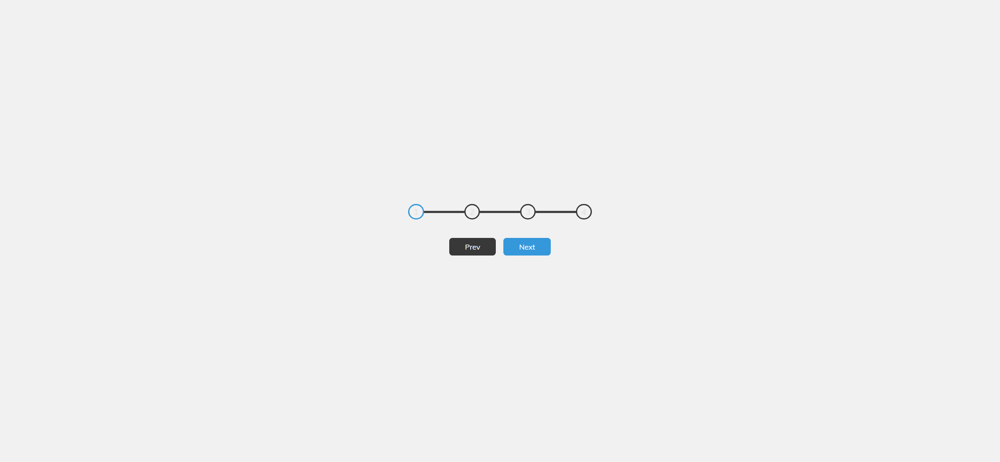
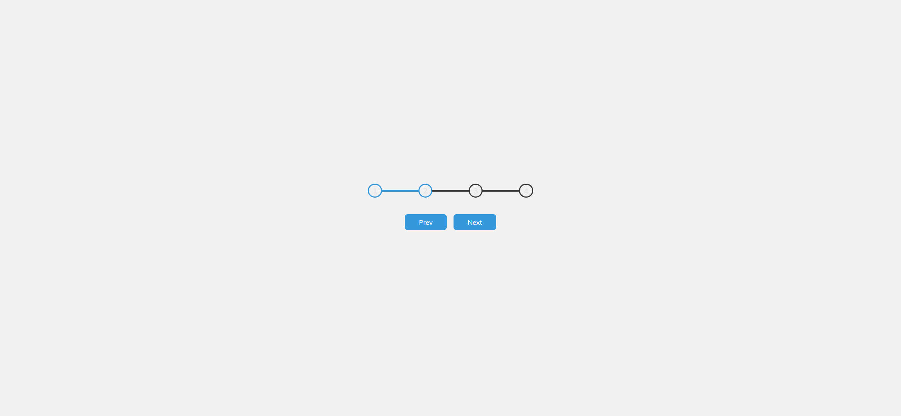

# Task Description: Progress Steps Webpage

Your job is to design a webpage that visually represents progress steps with interactive buttons to navigate through the steps. The webpage should look and function as described below. The provided screenshots are rendered under a resolution of 1920x1080.

## Initial Webpage
The initial webpage should be as shown below:

### Layout and Styling
- Use the font family 'Muli' from Google Fonts.
- The main container should be centered both vertically and horizontally.
- Inside the main container, there should be a progress container and two buttons ("Prev" and "Next").

### Progress Container
- The progress container should be a flex container with space between the items.
- The progress container should contain four circles and a progress bar.
- The circles should be numbered from 1 to 4.
- The progress bar should be positioned behind the circles and should animate smoothly when the progress changes.

### Buttons
- The "Prev" button should be disabled initially.
- When a button is clicked, it should slightly scale down to indicate interaction.

## Interactions
- Clicking the "Next" button should move to the next step, activating the next circle and extending the progress bar.
- Clicking the "Prev" button should move to the previous step, deactivating the current circle and retracting the progress bar.
- The "Prev" button should be disabled when on the first step, and the "Next" button should be disabled when on the last step.

## Screenshots of Interactions
1. After clicking the "Next" button once:
   

2. After clicking the "Next" button twice:
   

3. After clicking the "Prev" button once:
   

## Element Identifiers
- Use ID `progress` for the progress bar.
- Use ID `prev` for the "Prev" button.
- Use ID `next` for the "Next" button.
- Use class name `circle` for the circles.
- Use class name `active` for the active state of the circles.
- Use class name `btn` for the buttons.
- Use class name `container` for the main container.
- Use class name `progress-container` for the progress container.

## Resources
- Google Font: 'Muli' from [Google Fonts](https://fonts.googleapis.com/css?family=Muli&display=swap)
- Text content for the circles: "1", "2", "3", "4"
- Text content for the buttons: "Prev", "Next"

Ensure that the webpage matches the described layout, styling, and interactions. Good luck!
