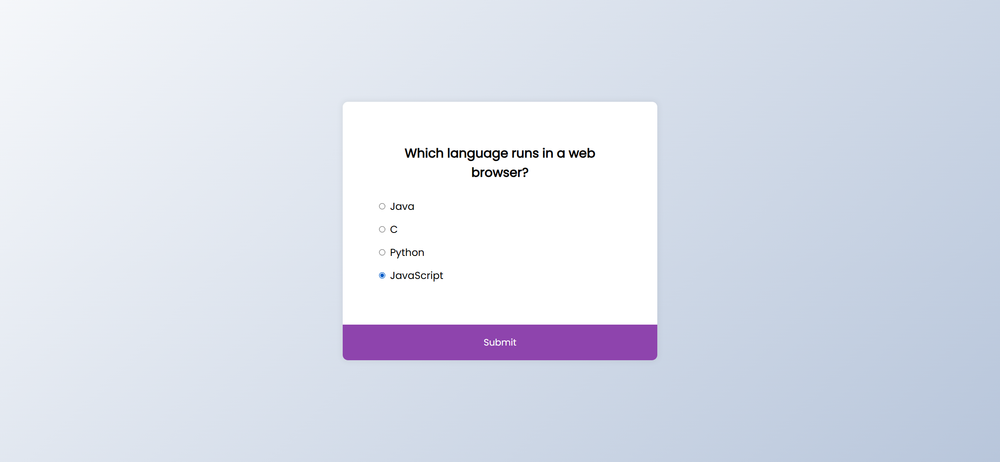
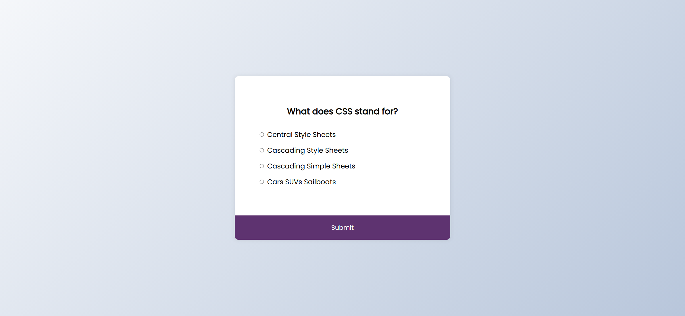
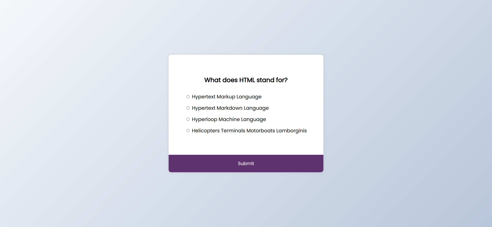
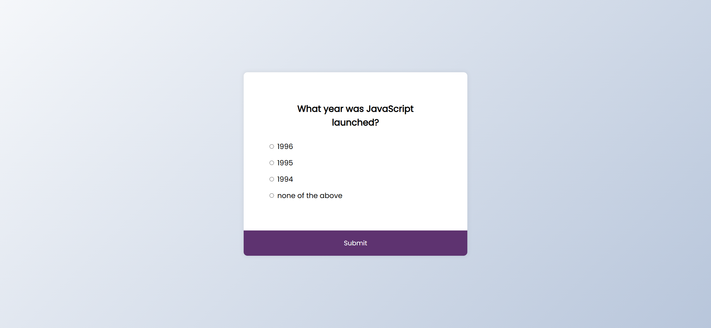
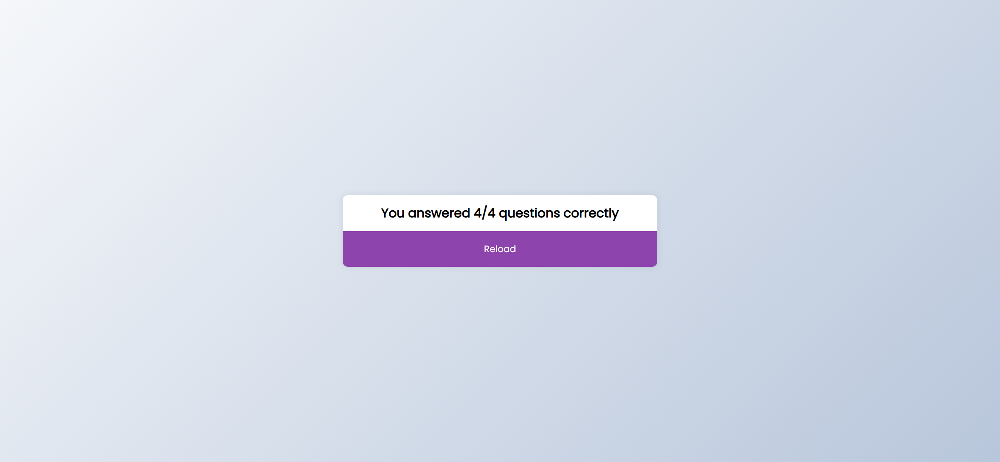

Your job is to design a webpage that functions as a quiz application. The initial webpage should look like this:

The webpage consists of a quiz container with a header displaying the question and a list of possible answers. Below the list of answers, there is a submit button.

### Resources
- The background of the webpage uses a gradient color.
- The font used is 'Poppins' from Google Fonts.
- The quiz questions and answers are provided in the JavaScript file.

### Quiz Questions and Answers
1. **Question:** Which language runs in a web browser?
   - a: Java
   - b: C
   - c: Python
   - d: JavaScript
   - **Correct Answer:** d

2. **Question:** What does CSS stand for?
   - a: Central Style Sheets
   - b: Cascading Style Sheets
   - c: Cascading Simple Sheets
   - d: Cars SUVs Sailboats
   - **Correct Answer:** b

3. **Question:** What does HTML stand for?
   - a: Hypertext Markup Language
   - b: Hypertext Markdown Language
   - c: Hyperloop Machine Language
   - d: Helicopters Terminals Motorboats Lamborghinis
   - **Correct Answer:** a

4. **Question:** What year was JavaScript launched?
   - a: 1996
   - b: 1995
   - c: 1994
   - d: none of the above
   - **Correct Answer:** b

### Interactions
1. **Select Answer for Quiz 1:**
   - Select the answer with ID `d` for the first question.
   - The webpage should look like this after selecting the answer:
     

2. **Submit Answer for Quiz 1:**
   - Click the button with ID `submit` to submit the answer for the first question.
   - The webpage should look like this after submitting the answer:
     

3. **Select and Submit for Quiz 2:**
   - Select the answer with ID `b` for the second question.
   - Click the button with ID `submit` to submit the answer for the second question.
   - The webpage should look like this after submitting the answer:
     

4. **Select and Submit for Quiz 3:**
   - Select the answer with ID `a` for the third question.
   - Click the button with ID `submit` to submit the answer for the third question.
   - The webpage should look like this after submitting the answer:
     

5. **Select and Submit for Quiz 4:**
   - Select the answer with ID `b` for the fourth question.
   - Click the button with ID `submit` to submit the answer for the fourth question.
   - The webpage should look like this after submitting the answer:
     

### Styling
- The quiz container should have a white background, rounded corners, and a shadow effect.
- The submit button should change color on hover and focus.

### IDs and Class Names
- Use ID `quiz` for the quiz container.
- Use ID `question` for the question text.
- Use class name `answer` for the radio input elements.
- Use IDs `a`, `b`, `c`, `d` for the radio input elements corresponding to each answer.
- Use IDs `a_text`, `b_text`, `c_text`, `d_text` for the labels corresponding to each answer.
- Use ID `submit` for the submit button.

The provided screenshots are rendered under a resolution of 1920x1080.
