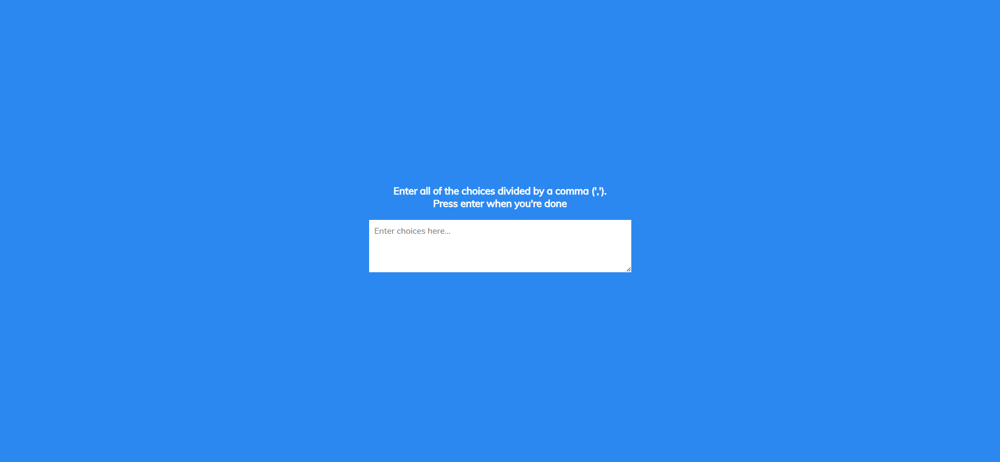
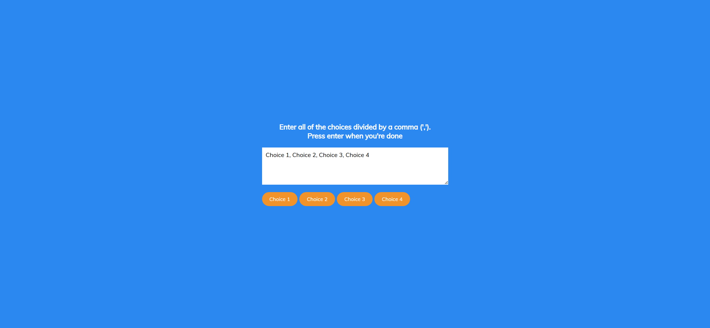
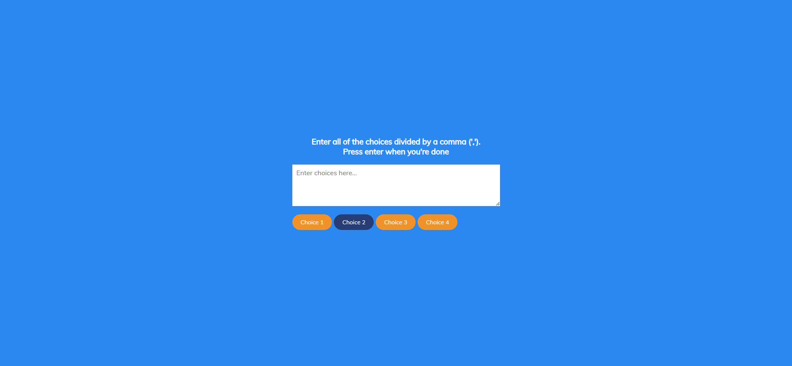

# Task Description: Random Choice Picker Webpage

Your job is to design a webpage that allows users to enter multiple choices separated by commas, and then randomly selects one of the choices when the user presses the Enter key. The initial webpage should look like this:



## Requirements

1. **HTML Structure**:
    - The webpage should have a `div` with the class `container`.
    - Inside the `container`, there should be an `h3` element with the text:
      ```
      Enter all of the choices divided by a comma (','). 
      Press enter when you're done
      ```
    - Below the `h3` element, there should be a `textarea` with the placeholder "Enter choices here..." and the ID `textarea`.
    - Below the `textarea`, there should be a `div` with the ID `tags`.

2. **CSS Styling**:
    - Use the Google Font `Muli`:
      ```css
      @import url('https://fonts.googleapis.com/css?family=Muli&display=swap');
      ```
    - The `textarea` should not have an outline when focused.
    
3. **JavaScript Functionality**:
    - When the user types in the `textarea` and presses the Enter key, the input should be split by commas, and each choice should be displayed as a tag.
    - The tags should be displayed inside the `div` with the ID `tags`.
    - When the Enter key is pressed, the `textarea` should be cleared, and a random selection process should start.
    - During the random selection process, tags should be highlighted and unhighlighted rapidly for a short duration before settling on a final choice.

## Interaction Steps

1. **Entering Choices**:
    - The user enters choices separated by commas in the `textarea`.
    - Example: `Choice 1, Choice 2, Choice 3, Choice 4`
    - The webpage should look like this after entering choices:

    

2. **Random Selection**:
    - When the user presses the Enter key, the choices should be displayed as tags, and the random selection process should start.
    - The tags should be highlighted and unhighlighted rapidly before settling on a final choice.
    - The webpage should look like this after the random selection process:

    

## Additional Notes

- The provided screenshots are rendered under a resolution of 1920x1080.
- Ensure that the `textarea` has the ID `textarea`.
- Ensure that the `div` containing the tags has the ID `tags`.
- Use the class name `tag` for each tag element.
- Use the class name `highlight` for highlighted tags.
- The random selection process involves highlighting and unhighlighting tags rapidly for a short duration before settling on a final choice.
