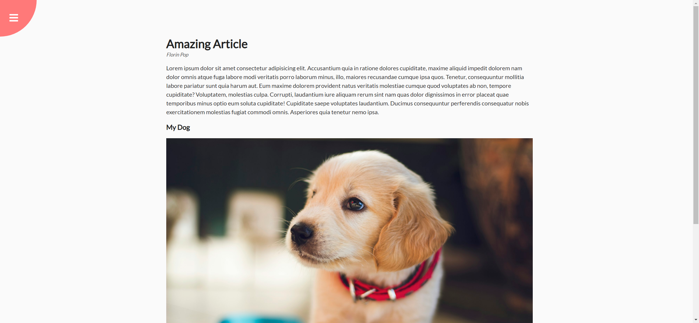
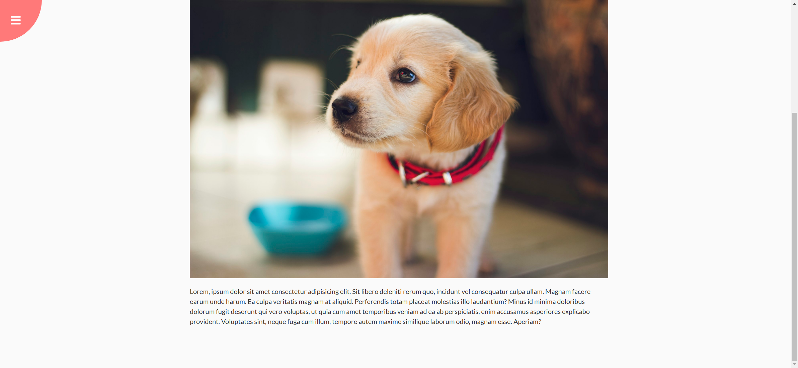
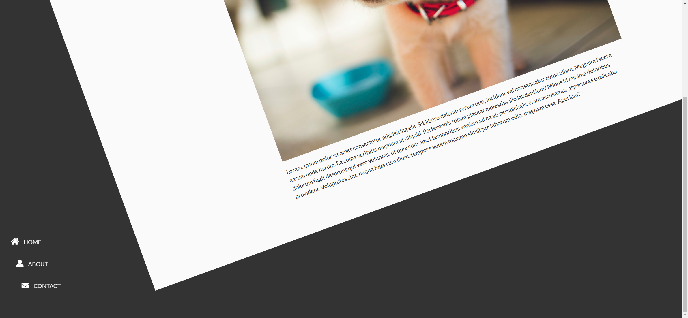

# Task Description: Rotating Navigation Webpage

Your job is to design a webpage that features a rotating navigation menu. The webpage should have the following characteristics and functionalities:

## Initial Webpage

The initial webpage should look like this:



### Layout and Elements

1. **Container**:
   - Use class name `container` for the main container.
   - The container should have a transition effect for transformations.
   
2. **Circle Container**:
   - Use class name `circle-container` for the circle container.
   
3. **Circle**:
   - Use class name `circle` for the circle.
   - The circle should have a transition effect for transformations.
   
4. **Buttons**:
   - Use ID `open` for the open button and `close` for the close button.
   - Both buttons should be positioned absolutely within the circle, with specific positions and rotations as described in the CSS.
   - The buttons should use Font Awesome icons (`fa-bars` for open and `fa-times` for close).

5. **Content**:
   - Use class name `content` for the content section.
   - The content should include a heading (`<h1>`), a small tag for the author name, paragraphs (`<p>`), and an image (``).
   - The image should be sourced from `resource.png` and have an alt text of "doggy".

6. **Navigation**:
   - Use the `<nav>` tag for the navigation menu.
   - The navigation should be positioned fixed at the bottom-left corner.
   - The navigation should contain an unordered list (`<ul>`) with list items (`<li>`) that include Font Awesome icons and links (`<a>`).

### Text Content

- The main heading should be "Amazing Article".
- The author name should be "Florin Pop".
- The first paragraph should be:
  ```
  Lorem ipsum dolor sit amet consectetur adipisicing elit. Accusantium quia in ratione dolores cupiditate, maxime aliquid impedit dolorem nam dolor omnis atque fuga labore modi veritatis porro laborum minus, illo, maiores recusandae cumque ipsa quos. Tenetur, consequuntur mollitia labore pariatur sunt quia harum aut. Eum maxime dolorem provident natus veritatis molestiae cumque quod voluptates ab non, tempore cupiditate? Voluptatem, molestias culpa. Corrupti, laudantium iure aliquam rerum sint nam quas dolor dignissimos in error placeat quae temporibus minus optio eum soluta cupiditate! Cupiditate saepe voluptates laudantium. Ducimus consequuntur perferendis consequatur nobis exercitationem molestias fugiat commodi omnis. Asperiores quia tenetur nemo ipsa.
  ```
- The subheading should be "My Dog".
- The second paragraph should be:
  ```
  Lorem, ipsum dolor sit amet consectetur adipisicing elit. Sit libero deleniti rerum quo, incidunt vel consequatur culpa ullam. Magnam facere earum unde harum. Ea culpa veritatis magnam at aliquid. Perferendis totam placeat molestias illo laudantium? Minus id minima doloribus dolorum fugit deserunt qui vero voluptas, ut quia cum amet temporibus veniam ad ea ab perspiciatis, enim accusamus asperiores explicabo provident. Voluptates sint, neque fuga cum illum, tempore autem maxime similique laborum odio, magnam esse. Aperiam?
  ```

### Interactions

1. **Scroll Page**:
   - The page should be scrollable to reveal more content.
   - After scrolling, the webpage should look like this:
     

2. **Open Button**:
   - Clicking the open button should rotate the container and the circle.
   - The navigation menu should slide in from the left.
   - After clicking the open button, the webpage should look like this:
     

3. **Close Button**:
   - Clicking the close button should revert the container and the circle to their original positions.
   - The navigation menu should slide out to the left.
   - After clicking the close button, the webpage should look like this:
     

### Additional Resources

- **Font Awesome**: Used for icons in buttons and navigation menu.
  ```html
  <link rel="stylesheet" href="https://cdnjs.cloudflare.com/ajax/libs/font-awesome/5.14.0/css/all.min.css" integrity="sha512-1PKOgIY59xJ8Co8+NE6FZ+LOAZKjy+KY8iq0G4B3CyeY6wYHN3yt9PW0XpSriVlkMXe40PTKnXrLnZ9+fkDaog==" crossorigin="anonymous" />
  ```
- **Google Fonts**: Used for the Lato font.
  ```css
  @import url('https://fonts.googleapis.com/css?family=Lato&display=swap');
  ```

### Notes

- The provided screenshots are rendered under a resolution of 1920x1080.
- Ensure that all transitions and animations are smooth and visually appealing.
- Pay attention to the positioning and styling of elements to match the provided screenshots accurately.
