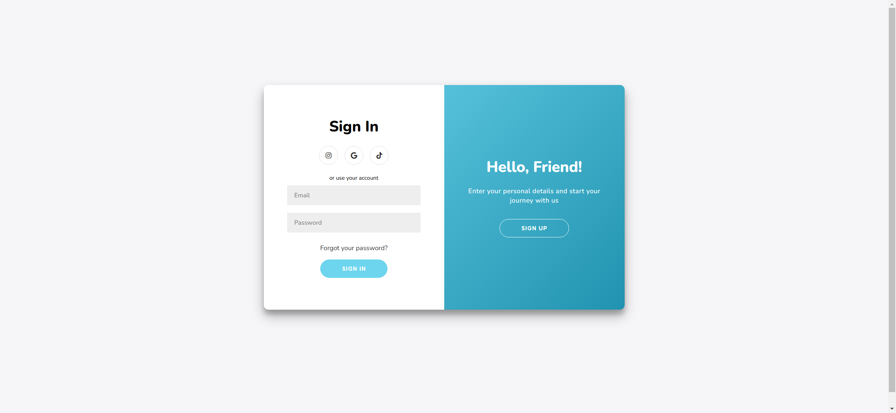
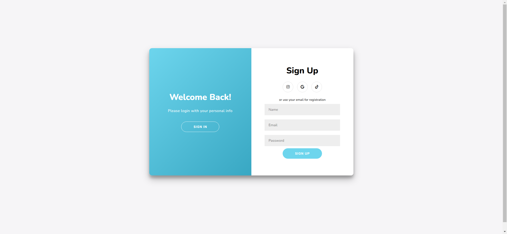

# Task Description: Sliding Sign In & Sign Up Form

Your job is to design a webpage that features a sliding sign-in and sign-up form. The webpage should have a modern, clean design with smooth animations for transitioning between the sign-in and sign-up forms. Below are the detailed requirements and resources needed to re-implement the webpage.

## Initial Webpage
The initial webpage should look like this:

## Resources
- **Fonts**: Use the "Nunito" font from Google Fonts.
- **Icons**: Use Font Awesome icons for social media links.

## HTML Structure
- The webpage should have a container with the class `container`.
- Inside the container, there should be three main divs:
  - `form-container sign-up-container`: Contains the sign-up form.
  - `form-container sign-in-container`: Contains the sign-in form.
  - `overlay-container`: Contains the overlay with two panels.

### Sign-Up Form
- Use the class `sign-up-container` for the sign-up form container.
- The form should have:
  - A heading with the text "Sign Up".
  - Social media icons for Instagram, Google, and TikTok.
  - A span with the text "or use your email for registration".
  - Input fields for Name, Email, and Password.
  - A button with the text "Sign Up" and an `onclick` event that returns false.

### Sign-In Form
- Use the class `sign-in-container` for the sign-in form container.
- The form should have:
  - A heading with the text "Sign In".
  - Social media icons for Instagram, Google, and TikTok.
  - A span with the text "or use your account".
  - Input fields for Email and Password.
  - A link with the text "Forgot your password?".
  - A button with the text "Sign In" and an `onclick` event that returns false.

### Overlay
- Use the class `overlay-container` for the overlay container.
- Inside the overlay, there should be two panels:
  - `overlay-panel overlay-left`: Contains a heading with the text "Welcome Back!", a paragraph, and a button with the text "Sign In" and the ID `signIn`.
  - `overlay-panel overlay-right`: Contains a heading with the text "Hello, Friend!", a paragraph, and a button with the text "Sign Up" and the ID `signUp`.

## CSS Styling
- Use the provided `style.css` file for styling.
- The main colors and gradients should be defined as CSS variables.
- The body should have a background color of `#f6f5f7` and use the "Nunito" font.
- The container should have a white background, rounded corners, and a box shadow.
- The forms should be centered and have a clean, modern look.
- Buttons should have a hover effect that changes the background color.
- The overlay should have a gradient background and smooth animations for sliding.

## JavaScript Functionality
- The `signUpButton` and `signInButton` should toggle the class `right-panel-active` on the container to trigger the sliding animations.

## Interaction Screenshots
- After clicking the "Sign Up" button, the webpage should look like this:
  
- After clicking the "Sign In" button, the webpage should look like this:
  

## Notes
- The provided screenshots are rendered under a resolution of 1920x1080.
- Ensure that the animations are smooth and the transitions between the forms are seamless.
- Use the IDs and class names as specified to ensure proper functionality and styling.

By following the above instructions, you should be able to re-implement the sliding sign-in and sign-up form webpage successfully.
