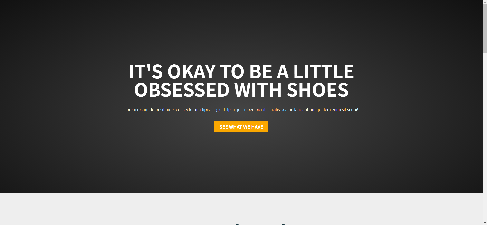
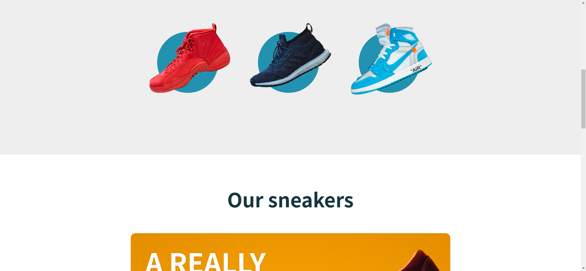
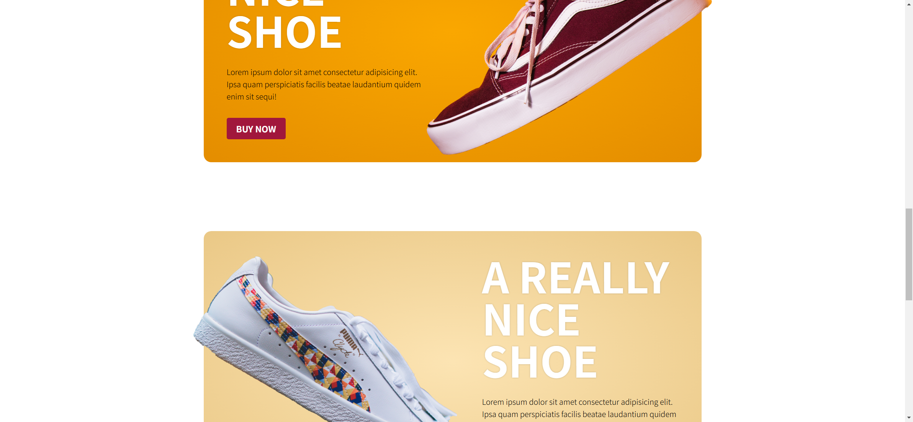
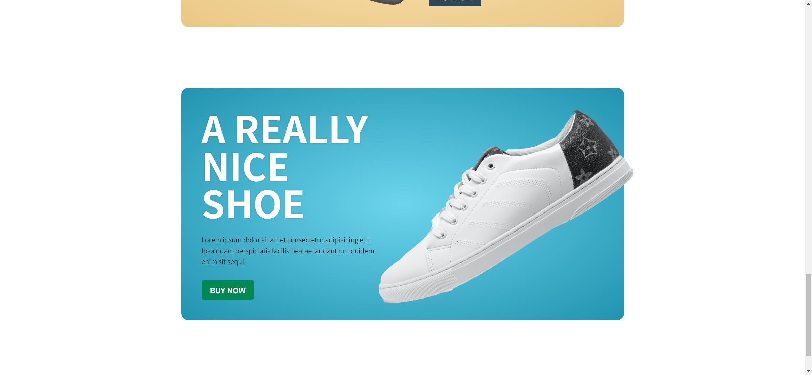

Your job is to design a webpage for "Great Sneakers Inc." that showcases a modern landing page with a hero section, featured sneakers, and a section for various products. The webpage should be responsive and visually appealing. Below are the detailed instructions and resources needed to re-implement the webpage.

The initial webpage should be 

### General Layout and Styling
- Use the font family `Noto Sans JP` from Google Fonts.
- The `spacing` class should add a top margin to its direct children.

### Hero Section
- Use the class `hero` for the hero section.
- The background should be a radial gradient with a background image of a shoe.
- The primary title should use the class `primary-title` .
- The hero section should contain a primary title with the text "It's okay to be a little obsessed with shoes".
- Below the title, include a paragraph with the text:
  ```
  Lorem ipsum dolor sit amet consectetur adipisicing elit. Ipsa quam
  perspiciatis facilis beatae laudantium quidem enim sit sequi!
  ```
- Include a button with the class `btn` and the text "See what we have".

### Featured Sneakers Section
- Use the class `featured` for the featured sneakers section.
- The section title should use the class `section-title`
- Each featured item should use the class `featured__item` and be a block element with centered text, a relative position, and a scale transform effect on hover.
- Each featured item should contain an image with the class `featured__img` and a paragraph with the class `featured__details`.
- The paragraph should include a span with the class `price` and the text "$99" followed by "shoe name".
- Use the following images for the featured items:
  - `resource1.png`
  - `resource2.png`
  - `resource3.png`

### Our Products Section
- Use the class `our-products` for the products section.
- The section title should use the class `section-title` and have the same styling as the featured section title.
- Each product should use the class `product` and have a radial gradient background, padding of 3rem, a border-radius of 1rem, and centered text.
- Each product should contain an image with the class `product__image`, a title with the class `product__title`, a description with the class `product__description`, and a button with the class `btn`.
- The product description should be:
  ```
  Lorem ipsum dolor sit amet consectetur adipisicing elit. Ipsa quam
  perspiciatis facilis beatae laudantium quidem enim sit sequi!
  ```
- Use the following images for the products:
  - `resource4.png` for the red shoe
  - `resource5.png` for the white shoe
  - `resource6.png` for the blue shoe
  
  

### Screenshots
The provided screenshots are rendered under a resolution of 1920x1080.

- After scrolling 1/4 of the page: 
- After scrolling another 1/4 of the page: 
- After scrolling another 1/4 of the page: 

### Interactions
- The button with the class `btn` should have a hover effect that scales the button to 1.1 times its size and reduces its opacity to 0.9.
- The featured items should scale to 1 on hover.
- The featured details should have an opacity transition effect on hover.
