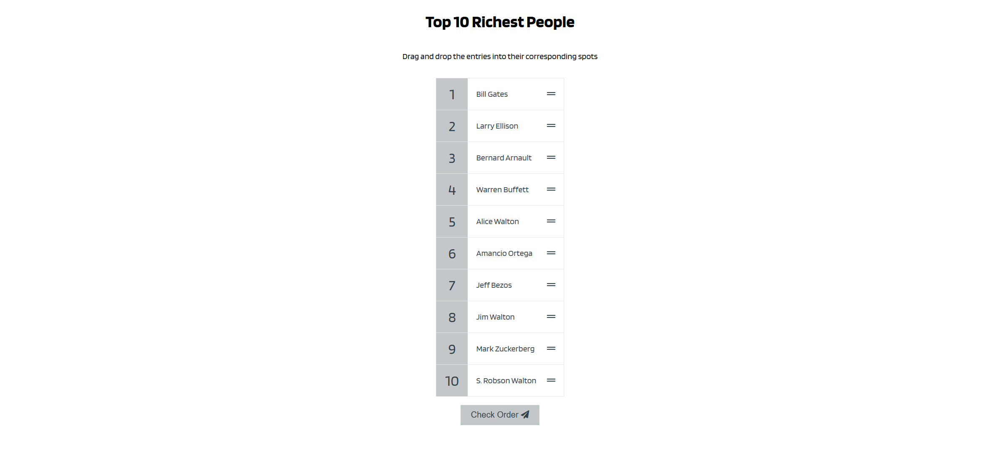
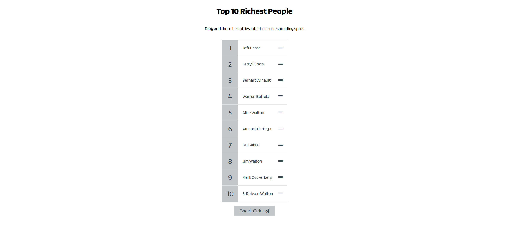
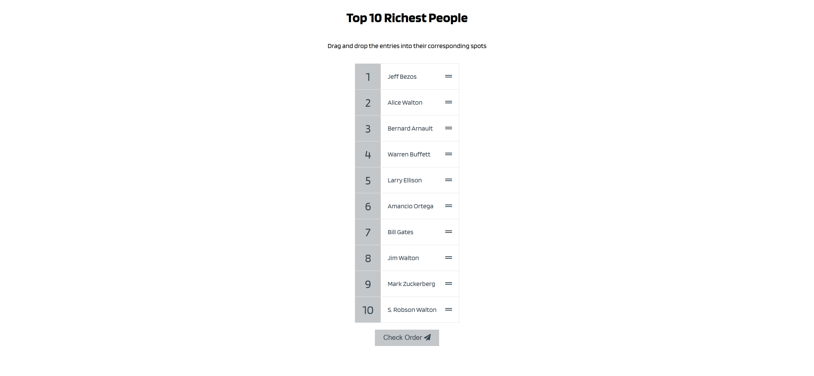
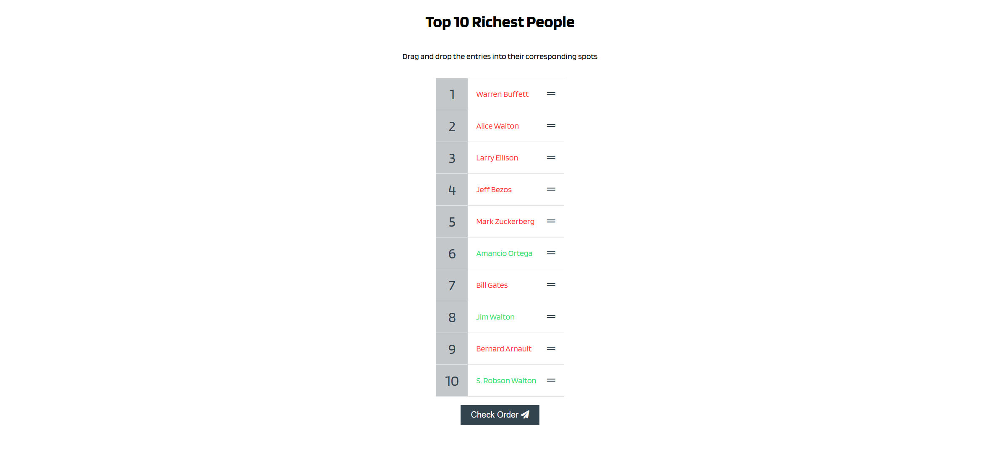

Your job is to design a webpage that allows users to drag and drop items to sort them in the correct order. The webpage will display a list of the top 10 richest people, and users will need to arrange them in the correct order. The initial webpage should be as shown below:

### Requirements:

1. **HTML Structure:**
    - The webpage should have a title "Top 10 Richest People".
    - Below the title, there should be a paragraph with the text "Drag and drop the entries into their corresponding spots".
    - There should be an unordered list with the class `draggable-list` and the ID `draggable-list`.
    - Each list item should have a span with the class `number` displaying the position number, and a div with the class `draggable` containing the person's name and a grip icon.
    - There should be a button with the class `check-btn` and the ID `check` that says "Check Order" and includes a paper plane icon.

2. **CSS Styling:**
    - Use the Google Font "Blinker" for the webpage.
    - The `draggable-list` should have a border and no list style.
    - Each list item should have a flex layout and a background color.
    - The `number` span should have a fixed size, centered content, and a background color.
    - The `draggable` div should have a cursor pointer, padding, and a flex layout.
    - The `check-btn` should have a background color, no border, and a pointer cursor. It should change color on hover and scale down on active.

3. **JavaScript Functionality:**
    - The list should be initialized with the following names in this order:
        1. Bill Gates
        2. Larry Ellison
        3. Bernard Arnault
        4. Warren Buffett
        5. Alice Walton
        6. Amancio Ortega
        7. Jeff Bezos
        8. Jim Walton
        9. Mark Zuckerberg
        10. S. Robson Walton
    - The correct order of the richest people is:
        1. Jeff Bezos
        2. Bill Gates
        3. Bernard Arnault
        4. Warren Buffett
        5. Larry Ellison
        6. Amancio Ortega
        7. Mark Zuckerberg
        8. Jim Walton
        9. Alice Walton
        10. S. Robson Walton
    - Users should be able to drag and drop the list items to reorder them.
    - When the "Check Order" button is clicked, the list items should be checked against the correct order. Correctly placed items should have the class `right` and incorrectly placed items should have the class `wrong`.

### Interaction Steps:

2. **After Drag and Drop Actions:**
    - Move the first item to the seventh position:
    
    - Move the second item to the fifth position:
    
    
3. **After Checking the Order:**
    - Click the "Check Order" button to validate the order:
    

### Additional Notes:
- The provided screenshots are rendered under a resolution of 1920x1080.
- Use the following IDs and class names for elements:
    - Use ID `draggable-list` for the unordered list.
    - Use class name `draggable-list` for the unordered list.
    - Use class name `number` for the span displaying the position number.
    - Use class name `draggable` for the div containing the person's name and grip icon.
    - Use ID `check` for the "Check Order" button.
    - Use class name `check-btn` for the "Check Order" button.
