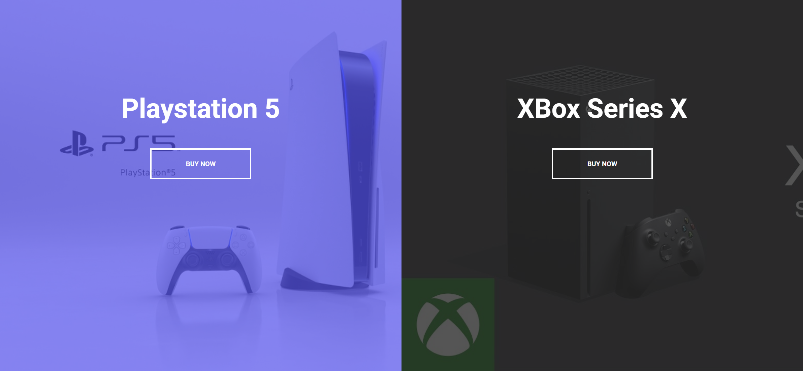
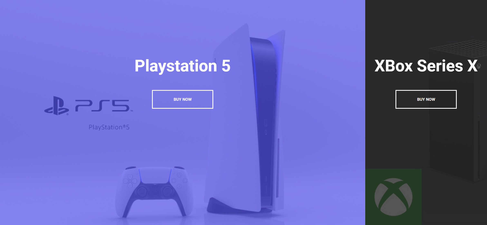
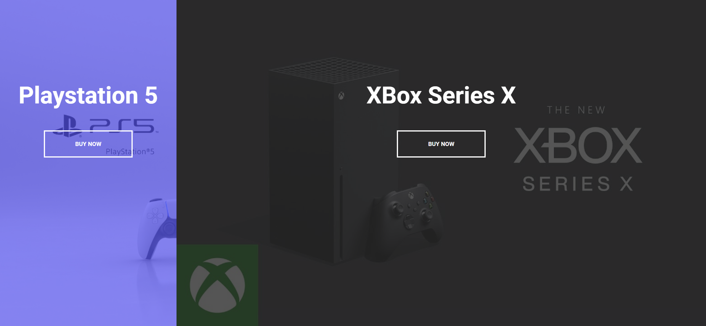

# Task Description: Split Landing Page

Your job is to design a webpage that features a split landing page with two sections: one for Playstation 5 and one for Xbox Series X. The webpage should have interactive elements and animations as described below. The provided screenshots are rendered under a resolution of 1920x1080.

## Initial Webpage
The initial webpage should be as shown below:

## Layout and Styling
- The webpage should be divided into two equal sections, left and right.
- The left section should have a background image `ps.jpg` and the right section should have a background image `xbox.jpg`.

## Fonts
- Use the 'Roboto' font from Google Fonts with weights 400 and 700.

## Text Content
- The left section should have a heading with the text "Playstation 5" and a button with the text "Buy Now".
- The right section should have a heading with the text "XBox Series X" and a button with the text "Buy Now".

## Interactions
### Hover Effects
- When hovering over the left section, it should expand to 75% of the width while the right section shrinks to 25%. The transition should take 1000ms.
  
- When hovering over the right section, it should expand to 75% of the width while the left section shrinks to 25%. The transition should take 1000ms.
  

## Element Identifiers
- Use class name `left` for the left section.
- Use class name `right` for the right section.
- Use class name `btn` for the buttons.
- Use class name `container` for the container that holds both sections.

## Additional Notes
- Ensure that all transitions and animations are smooth and visually appealing.
- The webpage should be responsive and look good on different screen sizes.
