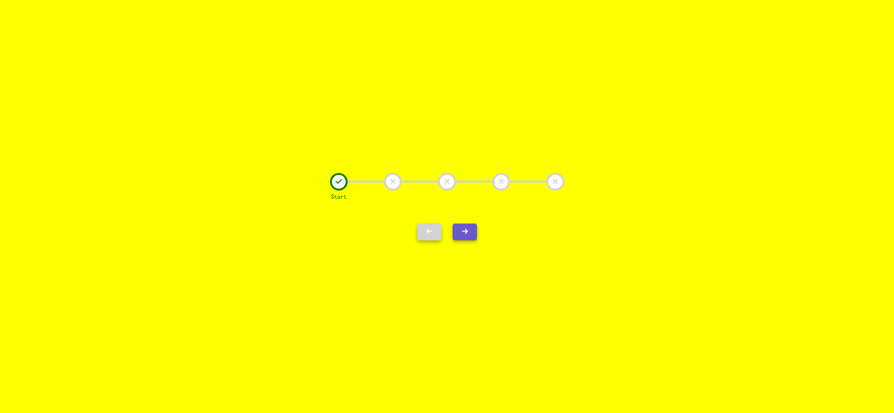

# Task Description: Step Progress Bar Webpage

Your job is to design a webpage that features a step progress bar with interactive buttons to navigate through the steps. The webpage should look and function as described below. The provided screenshots are rendered under a resolution of 1920x1080.

## Initial Webpage

The initial webpage should be:

### Layout and Styling

1. **Background and Container**:
   - The background color of the webpage should be yellow.
   - The content should be centered both vertically and horizontally.
   - Use a container to hold the progress bar and buttons, and center-align the text inside the container.

2. **Progress Bar**:
   - The progress bar should be 500px wide and positioned relative to the container.
   - Use a light gray background bar (`progress-bar-back`) and a green foreground bar (`progress-bar-front`) that indicates progress.
   - The foreground bar should have a transition effect for smooth width changes.

3. **Steps**:
   - Each step should be a white circle with a light gray border and light gray icon (`fas fa-times`).
   - The first step should be marked as checked initially, with a green border and green icon (`fas fa-check`).
   - When a step is checked, display a label below it (e.g., "Start", "Step 1", "Step 2", etc.).

4. **Buttons**:
   - There should be two buttons: "Previous" (`prev`) and "Next" (`next`).
   - The buttons should have a slate blue background, white text, and a box shadow.
   - The "Previous" button should be disabled initially.

### Interactions

1. **Next Button**:
   - Clicking the "Next" button should move to the next step, update the progress bar, and enable the "Previous" button.
   - When the last step is reached, the "Next" button should be disabled.

2. **Previous Button**:
   - Clicking the "Previous" button should move to the previous step, update the progress bar, and enable the "Next" button.
   - When the first step is reached, the "Previous" button should be disabled.

### Screenshots of Interactions

1. **Step 2**:
   - After clicking the "Next" button once, the webpage should look like this:
   
   

2. **Step 3**:
   - After clicking the "Next" button again, the webpage should look like this:
   
   

3. **Back to Step 2**:
   - After clicking the "Previous" button once, the webpage should look like this:
   
   

### Resources

- **Font Awesome**: Used for the icons in the steps.
  - Link: `https://cdnjs.cloudflare.com/ajax/libs/font-awesome/6.0.0-beta2/css/all.min.css`
  - Integrity: `sha512-YWzhKL2whUzgiheMoBFwW8CKV4qpHQAEuvilg9FAn5VJUDwKZZxkJNuGM4XkWuk94WCrrwslk8yWNGmY1EduTA==`
  - Referrer Policy: `no-referrer`

### Element Identifiers

- Use ID `prev` for the "Previous" button.
- Use ID `next` for the "Next" button.
- Use class name `progress-bar-back` for the background progress bar.
- Use class name `progress-bar-front` for the foreground progress bar.
- Use class name `step` for each step circle.
- Use class name `checked` for steps that are marked as completed.

### Text Content

- The text content for the labels below the steps should be:
  - "Start" for the first step.
  - "Step X" for intermediate steps, where X is the step number.
  - "Final" for the last step.

### Animations

- The progress bar (`progress-bar-front`) should have a smooth transition effect for width changes.
- The steps should have a transition effect when they are marked as checked.

By following this description, you should be able to re-implement the webpage with the step progress bar and interactive buttons.
