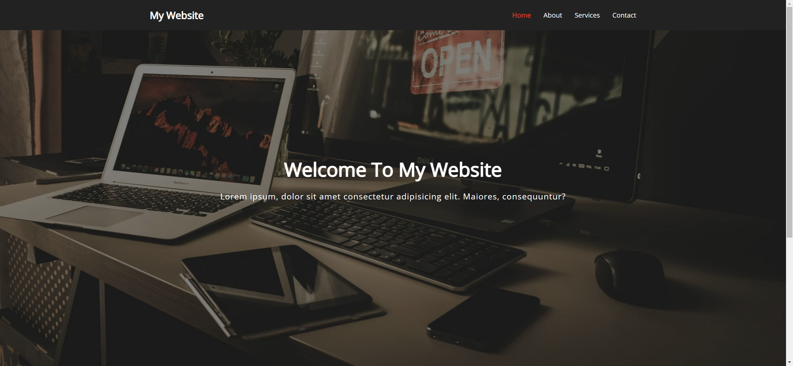
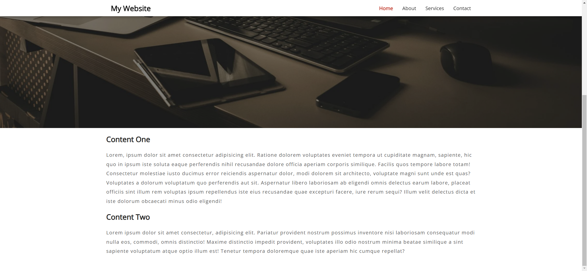

# Task Description: Sticky Navigation Webpage

Your job is to design a webpage with a sticky navigation bar that changes its style when the user scrolls down. The webpage should have a hero section with a background image and some content sections. The initial webpage should be as shown below:



## Requirements

### HTML Structure

1. **Navigation Bar**:
   - Use a `<nav>` element with class `nav`.
   - Inside the `<nav>`, create a `<div>` with class `container`.
   - Inside the container, add an `<h1>` element with class `logo` containing a link to `index.html` with the text "My Website".
   - Add an unordered list `<ul>` with list items `<li>` containing links `<a>` to `#` with the text "Home", "About", "Services", and "Contact". The "Home" link should have an additional class `current`.

2. **Hero Section**:
   - Create a `<div>` with class `hero`.
   - Inside the hero, add a `<div>` with class `container`.
   - Inside the container, add an `<h1>` element with the text "Welcome To My Website".
   - Add a `<p>` element with the text "Lorem ipsum, dolor sit amet consectetur adipisicing elit. Maiores, consequuntur?".

3. **Content Section**:
   
   - Create a `<section>` with class `container content`.
   - Inside the section, add an `<h2>` element with the text "Content One".
   - Add a `<p>` element with the following text:
     ```
     Lorem, ipsum dolor sit amet consectetur adipisicing elit. Ratione dolorem voluptates eveniet tempora ut cupiditate magnam, sapiente, hic quo in ipsum iste soluta eaque perferendis nihil recusandae dolore officia aperiam corporis similique. Facilis quos tempore labore totam! Consectetur molestiae iusto ducimus error reiciendis aspernatur dolor, modi dolorem sit architecto, voluptate magni sunt unde est quas? Voluptates a dolorum voluptatum quo perferendis aut sit. Aspernatur libero laboriosam ab eligendi omnis delectus earum labore, placeat officiis sint illum rem voluptas ipsum repellendus iste eius recusandae quae excepturi facere, iure rerum sequi? Illum velit delectus dicta et iste dolorum obcaecati minus odio eligendi!
     ```
   - Add an `<h3>` element with the text "Content Two".
   - Add a `<p>` element with the following text:
     ```
     Lorem ipsum dolor sit amet consectetur, adipisicing elit. Pariatur provident nostrum possimus inventore nisi laboriosam consequatur modi nulla eos, commodi, omnis distinctio! Maxime distinctio impedit provident, voluptates illo odio nostrum minima beatae similique a sint sapiente voluptatum atque optio illum est! Tenetur tempora doloremque quae iste aperiam hic cumque repellat?
     ```

### CSS Styling

1. **General Styles**:
   - Import the font 'Open Sans' from Google Fonts.
   
2. **Navigation Bar**:
   - Add a transition effect for smooth changes.
   - Style the container inside the nav to display flex, justify content space-between, align items center, and add padding.
   - Style the unordered list to display flex, remove list style, and center align items.
   - Style the links to have white color, no text decoration, padding, and a transition effect.
   - Add an `active` class to change the background color to white, add a box shadow, and change link colors to black.
   - Style the current and hovered links to have a red color and bold font weight.

3. **Hero Section**:
   - Set the hero section to have a background image from the URL `bg.png`.
   - Ensure the background covers the entire section, is centered, and does not repeat.
   - Add a dark overlay using a pseudo-element.
   - Style the hero heading and paragraph with appropriate font sizes and margins.
   
4. **Content Section**:
   - Style the headings and paragraphs with appropriate font sizes, margins, and line heights.

### JavaScript Functionality

1. **Sticky Navigation**:
   - Select the navigation bar using `document.querySelector('.nav')`.
   - Add a scroll event listener to the window that triggers the `fixNav` function.
   - In the `fixNav` function, add the `active` class to the nav if the scroll position is greater than the nav height plus 150 pixels, otherwise remove the `active` class.

### Interaction Screenshots

- After scrolling the page:
  


### Notes

- The provided screenshots are rendered under a resolution of 1920x1080.
- Ensure to use the specified class names and IDs for elements to match the original webpage functionality.
