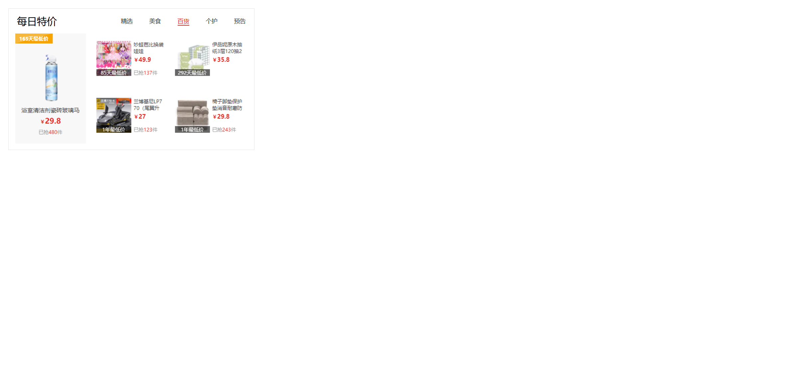

Your task is to design a webpage that features a tab navigation system with content switching based on the selected tab. The webpage should be implemented using HTML, CSS, and JavaScript. Below are the detailed requirements and resources needed to re-implement the webpage.

### Initial Webpage
The initial webpage should look like this:

### Layout and Styling
1. **Container**:
   - Use a `div` with class `tab` to contain the entire tab component.
   
2. **Tab Navigation**:
   - Use a `div` with class `tab-nav` for the navigation bar.
   - Inside the navigation bar, include an `h3` element with the text "每日特价" (Daily Specials) and a `ul` element for the tab items.
   - The `ul` element should use flexbox to justify content flex-end.
   
3. **Tab Content**:
   - Use a `div` with class `tab-content` to contain the tab content.
   - Each content item should be a `div` with class `item`.
   - Initially, only the first content item should be visible (use class `active` for this item), and the rest should be hidden.
   - The active content item should be displayed using `display: block`, while the others should use `display: none`.

### JavaScript Functionality
- Implement event delegation for the tab navigation.
- When a tab is clicked, remove the `active` class from the currently active tab and content item, and add it to the clicked tab and the corresponding content item.
- Use the `data-id` attribute to identify which content item to display.

### Resources
- Images for the tab content:
  - `images/tab00.png`
  - `images/tab01.png`
  - `images/tab02.png`
  - `images/tab03.png`
  - `images/tab04.png`

### Interactions
- Clicking on the "美食" (Food) tab should change the content to the second image:
  
- Clicking on the "百货" (General Merchandise) tab should change the content to the third image:
  
- Clicking on the "个护" (Personal Care) tab should change the content to the fourth image:
  
- Clicking on the "预告" (Preview) tab should change the content to the fifth image:
  

### Additional Notes
- The provided screenshots are rendered under a resolution of 1920x1080.
- Ensure that the tab navigation and content switching are smooth and responsive.
- Use the following class names and IDs for elements:
  - Use class name `tab` for the main container.
  - Use class name `tab-nav` for the navigation bar.
  - Use class name `tab-content` for the content container.
  - Use class name `item` for each content item.
  - Use class name `active` for the active tab and content item.
  - Use `data-id` attribute for the `a` elements to identify the corresponding content item.
