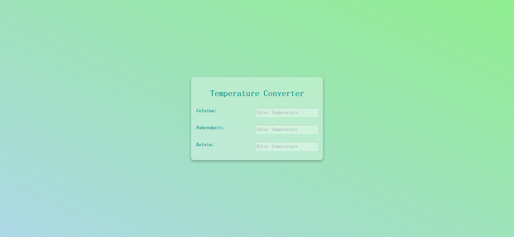

# Task Description: Temperature Converter Webpage

Your job is to design a webpage that functions as a temperature converter. The webpage should allow users to input a temperature value in Celsius, Fahrenheit, or Kelvin, and automatically convert it to the other two units. Below are the detailed requirements and resources needed to re-implement the webpage.

## Initial Webpage

The initial webpage should look like this:

## Layout and Styling

1. **Background and Body:**
   - The background should have a linear gradient.
   - The body should be centered both horizontally and vertically.
   - Use the `monospace` font family.

2. **Container:**
   - Use a semi-transparent white background with rounded corners.
   - Add padding and a box shadow for a subtle 3D effect.
   
4. **Temperature Input Containers:**
   - Each temperature input container should have padding and bold text.
   
5. **Input Fields:**
   - The input fields should be right-aligned, semi-transparent, and have a border color of semi-transparent white.
   - The text color should be dark green, and the placeholder text should be dark gray.

## HTML Structure

- Use the following IDs and class names for elements:
  - Use ID `celsius` for the Celsius input field.
  - Use ID `fahrenheit` for the Fahrenheit input field.
  - Use ID `kelvin` for the Kelvin input field.
  - Use class name `container` for the main container.
  - Use class name `heading` for the heading.
  - Use class name `temp-container` for each temperature input container.
  - Use class name `input` for each input field.

## JavaScript Functionality

- Implement a function `computeTemp(event)` that converts the input temperature to the other two units.
  - When the Celsius input changes, update the Fahrenheit and Kelvin inputs.
  - When the Fahrenheit input changes, update the Celsius and Kelvin inputs.
  - When the Kelvin input changes, update the Celsius and Fahrenheit inputs.

## Interaction Screenshots

The provided screenshots are rendered under a resolution of 1920x1080.

2. **After Inputting Celsius Value:**

   

3. **After Inputting Fahrenheit Value:**

   

4. **After Inputting Kelvin Value:**

   

## Resources

- Font family: `monospace`
