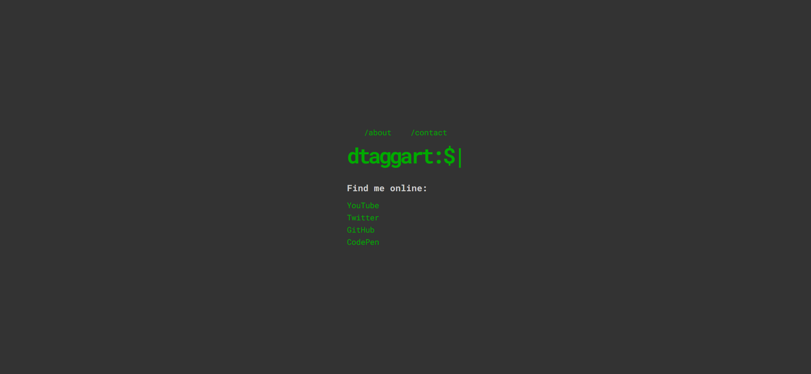
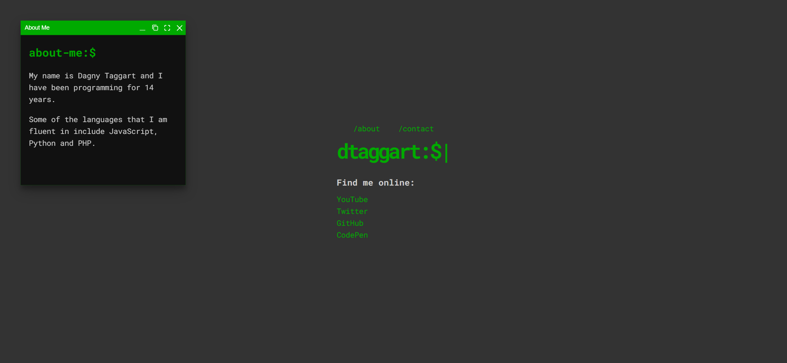
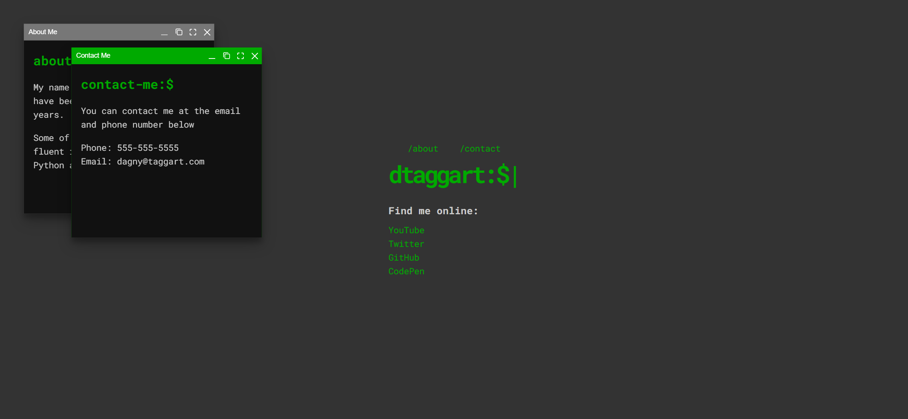

Your job is to design a webpage that mimics a terminal-style landing page with interactive modals. The initial webpage should be . The provided screenshots are rendered under a resolution of 1920x1080.

### General Layout
- The webpage should have a dark background with light text, resembling a terminal interface.
- Use the font "Roboto Mono" from Google Fonts for all text on the page.
- The main container should be centered both vertically and horizontally.

### Navigation
- Create a navigation bar with two links: `/about` and `/contact`.
  - Use ID `about` for the `/about` link.
  - Use ID `contact` for the `/contact` link.
- The navigation bar should be centered and the links should be evenly spaced.

### Main Content
- The main content should include a large heading with the text `dtaggart:$|` where the `|` character should blink.
- Below the heading, include a subheading with the text `Find me online:`.
- Create a list of links to social media platforms: YouTube, Twitter, GitHub, and CodePen.

### Hidden Content
- Create two hidden sections for the modal content:
  - An "About Me" section with ID `about-content` containing:
    - A heading `about-me:$|` with a blinking cursor.
    - Two paragraphs:
      - "My name is Dagny Taggart and I have been programming for 14 years."
      - "Some of the languages that I am fluent in include JavaScript, Python and PHP."
  - A "Contact Me" section with ID `contact-content` containing:
    - A heading `contact-me:$|` with a blinking cursor.
    - A paragraph: "You can contact me at the email and phone number below"
    - A list with:
      - Phone: 555-555-5555
      - Email: dagny@taggart.com

### Interactivity
- Clicking on the `/about` link should open a modal window with the "About Me" content.
  - The modal should have a title "About Me".
  - The modal should be 400px by 400px and centered on the screen.
  - When the modal is focused, its background should change to the terminal text color.
  - When the modal is blurred, its background should change.
- Clicking on the `/contact` link should open a modal window with the "Contact Me" content.
  - The modal should have a title "Contact Me".
  - The modal should be 400px by 400px and positioned slightly offset from the "About Me" modal.
  - When the modal is focused, its background should change to the terminal text color.
  - When the modal is blurred, its background should change.

### Screenshots
- After clicking the `/about` link, the webpage should look like this: 
- After clicking the `/contact` link, the webpage should look like this: 

### Resources
- Font: "Roboto Mono" from Google Fonts.
- CSS for modals: `https://rawcdn.githack.com/nextapps-de/winbox/0.2.0/dist/css/winbox.min.css`
- JavaScript for modals: `https://rawcdn.githack.com/nextapps-de/winbox/0.2.0/dist/js/winbox.min.js`
- Text content for "About Me" section:
  ```
  My name is Dagny Taggart and I have been programming for 14 years.
  Some of the languages that I am fluent in include JavaScript, Python and PHP.
  ```
- Text content for "Contact Me" section:
  ```
  You can contact me at the email and phone number below
  Phone: 555-555-5555
  Email: dagny@taggart.com
  ```

