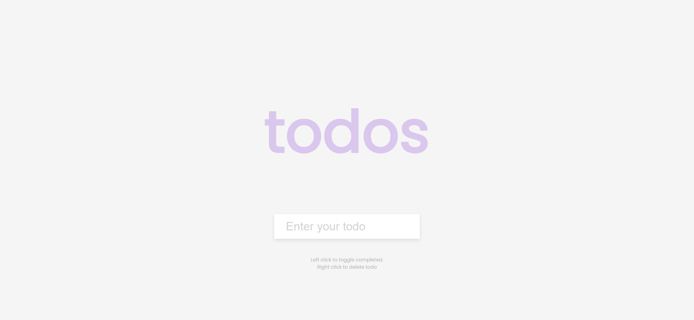
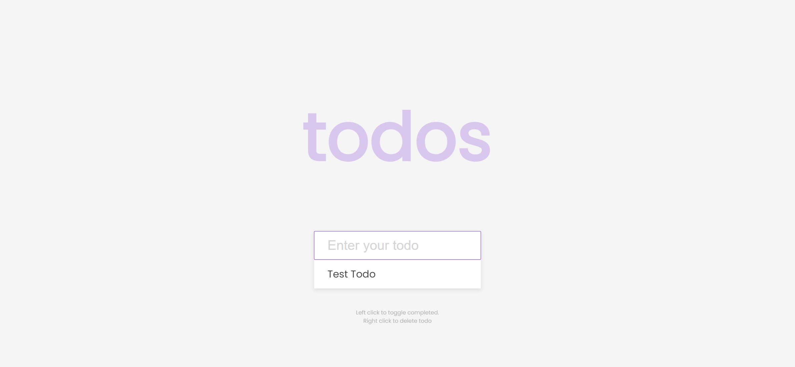
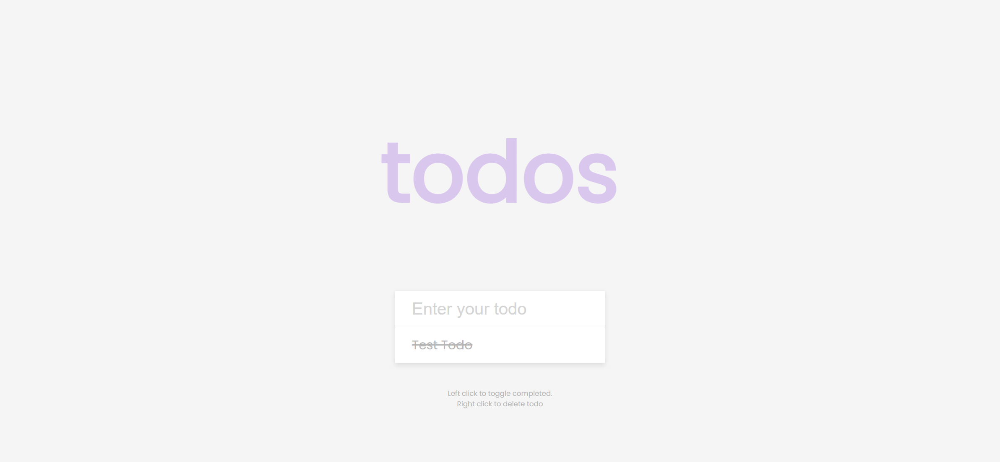

# Task Description: Todo List Webpage

Your job is to design a webpage that functions as a Todo List application. The webpage should allow users to add, toggle, and delete todo items. Below are the detailed requirements and resources needed to re-implement the webpage.

## Initial Webpage
The initial webpage should look like this:


## Resources
- **Font**: Use the 'Poppins' font from Google Fonts.
  ```css
  @import url('https://fonts.googleapis.com/css2?family=Poppins:wght@200;400&display=swap');
  ```
- **Text Content**:
  - The heading text is "todos".
  - The placeholder text for the input field is "Enter your todo".
  - The small text at the bottom is:
    ```
    Left click to toggle completed.
    Right click to delete todo
    ```

## Layout and Styling
- **Body**:
  - Font family: 'Poppins', sans-serif
  - Center the content both vertically and horizontally.
  - Full height of the viewport.


## Functionality
- **Add Todo**:
  - When the form is submitted, a new todo item should be added to the list.
  - The input field should be cleared after adding the todo item.
  - The new todo item should be saved in local storage.

- **Toggle Todo**:
  - When a todo item is clicked, it should toggle between completed and not completed.
  - The state should be saved in local storage.

- **Delete Todo**:
  - When a todo item is right-clicked, it should be deleted.
  - The state should be updated in local storage.

## Interactions
- **Add Todo Item**:
  - Use ID `input` for the input field.
  - Use ID `form` for the form.
  - Use ID `todos` for the unordered list.

- **Toggle Todo Item**:
  - Use class name `todos` for the unordered list.
  - Use class name `completed` for completed todo items.

- **Delete Todo Item**:
  - Use context menu event to delete the todo item.

## Screenshots
The provided screenshots are rendered under a resolution of 1920x1080.

### After Adding a Todo Item


### After Toggling a Todo Item


### After Deleting a Todo Item


