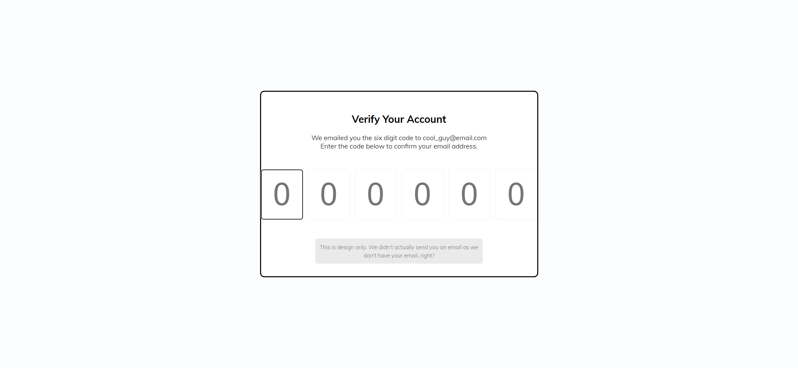
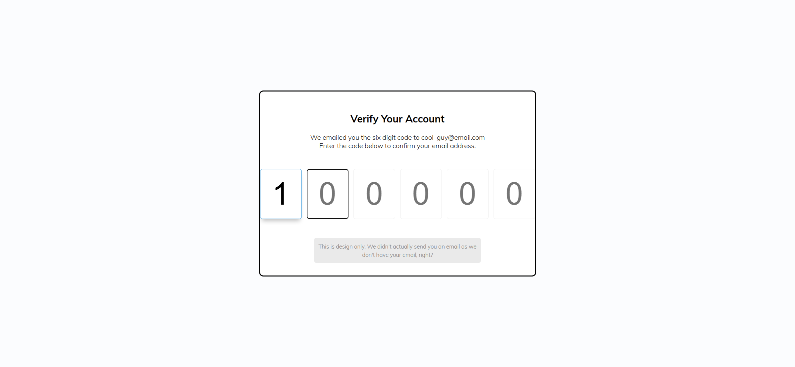
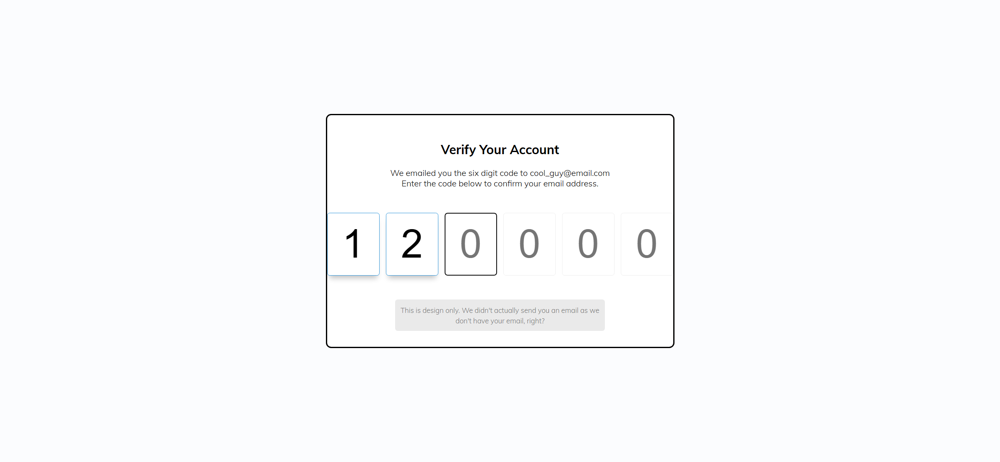

# Task Description: Re-implement the "Verify Account" Webpage

Your job is to design a webpage that allows users to verify their account by entering a six-digit code. The webpage should look and function as described below. The provided screenshots are rendered under a resolution of 1920x1080.

## Initial Webpage

The initial webpage should look like this:



### Layout and Styling

1. **Background and Font:**

   - Use the font family `'Muli', sans-serif` from Google Fonts.

2. **Container:**
   - Use a `div` with class `container` to wrap the content.
   - Center the text inside the container.
   
3. **Heading:**
   
- Use an `h2` element with the text "Verify Your Account".
   
4. **Paragraph:**
   
   - Use a `p` element with the following text:
     ```
     We emailed you the six digit code to cool_guy@email.com
     Enter the code below to confirm your email address.
  ```
   
5. **Code Input Fields:**
   
   - Use a `div` with class `code-container` to wrap the input fields.
   - Inside the `code-container`, add six `input` elements of type `number` with class `code`.
   - Each input field should have a placeholder of `0`, a minimum value of `0`, and a maximum value of `9`.
   - Center the input fields and add a margin of `1%` between them.
   - Remove the default spin buttons for the input fields.

6. **Info Text:**
   - Use a `small` element with class `info` containing the following text:
     ```
     This is design only. We didn't actually send you an email as we don't have your email, right?
     ```

### JavaScript Functionality

- Use JavaScript to handle the input focus and navigation:
  - When a user types a digit (0-9) in an input field, the focus should automatically move to the next input field.
  - When a user presses the `Backspace` key, the focus should move to the previous input field.

### Interaction Steps

1. **Enter First Digit:**
   - The user enters the first digit `1` in the first input field.
   - 

2. **Enter Second Digit:**
   - The user enters the second digit `2` in the second input field.
   - 


### Element Identifiers

- Use class name `container` for the main container.
- Use class name `code-container` for the container wrapping the input fields.
- Use class name `code` for each input field.
- Use class name `info` for the info text.

### Resources

- Google Font: `'Muli', sans-serif` from [Google Fonts](https://fonts.googleapis.com/css?family=Muli:300,700&display=swap).
- Text content:
  ```
  We emailed you the six digit code to cool_guy@email.com
  Enter the code below to confirm your email address.
  ```
  ```
  This is design only. We didn't actually send you an email as we don't have your email, right?
  ```

Re-implement the webpage according to the description above.
