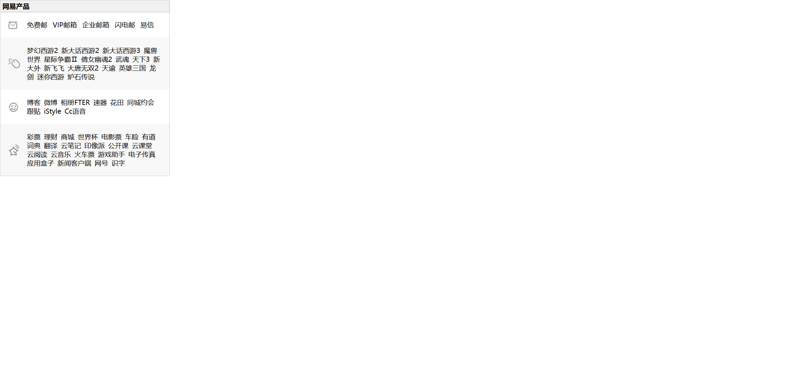

# Task Description for Re-implementing the Webpage

Your job is to design a webpage that lists various products from NetEase. The webpage should be styled and structured as described below. The provided screenshots are rendered under a resolution of 1920x1080.

## Initial Webpage
The initial webpage should look like this:


## Structure and Styling

2. **Header**
   
- The header should contain an `h4` element with the text "网易产品".
   
   - The `title` div should contain an `img` element.
   
4. **Content**
   - The first list item should have a `div` with a class `content` that contains multiple `a` elements with the following text: "免费邮", "VIP邮箱", "企业邮箱", "闪电邮", "易信".
   
6. **Bo Section**
   
- The third list item should have a class `bo`. 
   
7. **Cai Section**
   
   - The fourth list item should have a class `cai bgc`. 

## Images
- Use the following images for the `img` elements in the `title` divs:
  - `./imgs/i6.jpg` for the first list item
  - `./imgs/i7.jpg` for the second list item
  - `./imgs/i8.jpg` for the third list item
  - `./imgs/i9.jpg` for the fourth list item

## JavaScript
- Use the following arrays to dynamically generate the links for the `games`, `bo`, and `cai` sections:
  ```javascript
  const datagames = ['梦幻西游2', '新大话西游2', '新大话西游3', '魔兽世界', '星际争霸Ⅱ', '倩女幽魂2', '武魂', '天下3', '新大外', '新飞飞', '大唐无双2', '天谕', '英雄三国', '龙剑', '迷你西游', '炉石传说'];
  const databo = ['博客', '微博', '相册FTER', '速器', '花田', '同城约会', '跟贴', 'iStyle', 'Cc语音'];
  const datacai = ['彩票', '理财', '商城', '世界杯', '电影票', '车险', '有道词典', '翻译', '云笔记', '印像派', '公开课', '云课堂', '云阅读', '云音乐', '火车票', '游戏助手', '电子传真', '应用盒子', '新闻客户端', '网号', '识字'];
  ```


## Interaction Details
- The `a` elements in the `content` div should be verified to ensure they are present.
- The `a` elements in the `games`, `bo`, and `cai` sections should be dynamically generated and verified to ensure they are present.

## IDs and Classes
- Use class name `wrap` for the main container.
- Use class name `content` for the div containing email links.
- Use class name `games` for the games section.
- Use class name `bo` for the bo section.
- Use class name `cai` for the cai section.

Ensure that all elements and interactions are implemented as described to match the provided screenshots.
