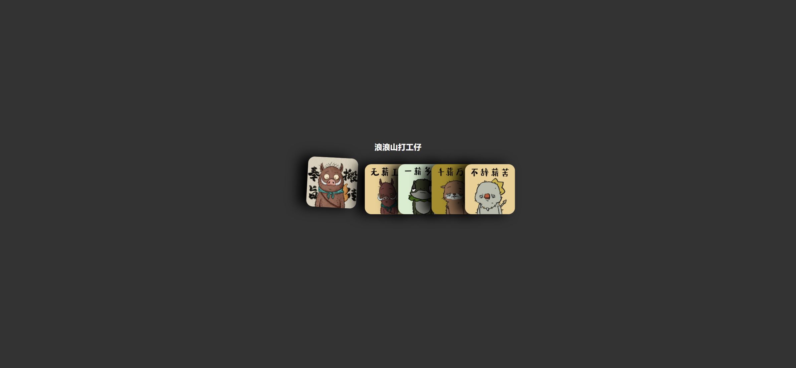

Your task is to design a webpage that mimics the card hover effect seen on CSS-Tricks. The webpage should display a series of cards with images, and when a card is hovered over, it should animate and move slightly. The initial webpage should look like this:

The provided screenshots are rendered under a resolution of 1920x1080.

### Requirements:

1. **HTML Structure**:
    - The webpage should have a title of "仿css-tricks的卡片抽出效果".
    - Include a heading with the text "浪浪山打工仔".
    - Create a container to hold the cards.
    - Each card should contain an image.

2. **CSS Styling**:
    - Apply a dark background color to the body.
    - Center the content both vertically and horizontally.
    - Style the heading to have white text.
    - The container should have padding and use flexbox for layout.
    - Each card should have a fixed width and height, a shadow, rounded corners, and a gradient background.
    - The images inside the cards should cover the entire card area.
    - Cards, except the first one, should overlap slightly to the left.
    - On hover, the cards should animate with a slight rotation and translation.

3. **Images**:
    - Use the following images for the cards:
        - `image/avatar1.jpeg`
        - `image/avatar2.jpeg`
        - `image/avatar3.jpeg`
        - `image/avatar4.jpeg`
        - `image/avatar5.jpeg`

4. **Hover Effects**:
    - When hovering over the first card, it should move up and rotate slightly.
    - When hovering over any other card, it should move up and rotate slightly, and all subsequent cards should move to the right.
    - The hover effects should be smooth and transition over 0.3 seconds.

### Interaction Details:

- **Hover over the first card**:
    - The first card should move up and rotate slightly.
    - 

- **Hover over the second card**:
    - The second card should move up and rotate slightly, and all subsequent cards should move to the right.
    - 

### Specific Element Identifiers:

- Use class name `container` for the container holding the cards.
- Use class name `card` for each card.
- Use the following image paths for the card images:
    - `image/avatar1.jpeg`
    - `image/avatar2.jpeg`
    - `image/avatar3.jpeg`
    - `image/avatar4.jpeg`
    - `image/avatar5.jpeg`

### Additional Notes:

- Ensure that the hover animations are smooth and transition over 0.3 seconds.
- The cards should have a shadow effect to give a 3D appearance.
- The images should fit perfectly within the cards without distortion.

